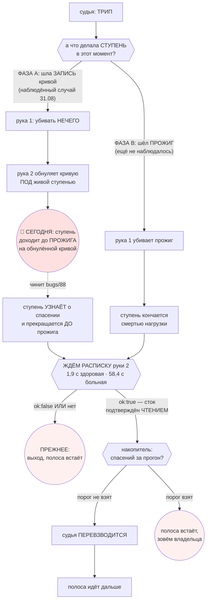

# План 81 — предохранитель переживает спасение, трип становится знанием, полоса идёт дальше

> **Создан:** 2026-08-31 (сессия 71) · **ПЕРЕДЕЛАН В ТОТ ЖЕ ДЕНЬ** — посылка первой редакции
> опровергнута хронологией (`bugs/88`); план переписан ОТ ВЕКТОРА ЦЕЛИ ВНИЗ, а не поправлен.
> **Родитель:** `ideas/17` — **ОДОБРЕНА ВЛАДЕЛЬЦЕМ 2026-08-31 10:40 через контур,
> `interviews/022` Q2 = A** · `plans/55`/`plans/58` (эпик 51) · `bugs/86` · `bugs/88`
> **Статус:** 🟡 Ш1–Ш2 ИСПОЛНЕНЫ · остальное ЖДЁТ `bugs/88` ·
> **Карта:** не нужна до фазы приёмки · **Записей в GPU: 1** (замерная, §3)

---

## 0. ЧТО ИМЕННО ПЕРЕДЕЛАНО И ПОЧЕМУ — читать первым

Первая редакция строила механизм на посылке **«трип случается ВО ВРЕМЯ прожига»**. Сверка трёх
журналов по времени эту посылку опровергла: в единственном живом случае трип был **ДО прожига**
(рука 1: «furnace.exe НЕ НАЙДЕН»), а прожиг пошёл через 3 секунды **после того, как рука 2
обнулила кривую**. Ступень не осталась без вердикта — **она продолжилась на карте, которую
спасение уже вернуло к стоку**. Полная таблица — `bugs/88`.

**Что выжило, что умерло, что появилось:**

| | |
|---|---|
| **ВЫЖИЛ вектор цели** | Он слово владельца, а не мой вывод. Замер его не касается. |
| **УМЕРЛА часть 2 прежней редакции** («трип закрывает СТУПЕНЬ вердиктом `ЗАВИС`») и выведенный из неё критерий «строка документа на каждое спасение» | Оба выведены из мёртвой посылки. Оставить их правкой формулировки значило бы сохранить вывод, потеряв основание. |
| **ПОЯВИЛСЯ другой дефект** — `bugs/88`: спасение портит ту ступень, которую спасает | Отдельным тикетом, а не разделом здесь: план отвечает «как полосе идти ДАЛЬШЕ», тикет — «спасение ЛОМАЕТ ступень». Разные предметы, и в одном документе они начнут врать друг про друга. |
| **ПЕРЕВЕРНУЛСЯ порядок** | Нельзя строить «полоса продолжается после спасения», пока спасение способно испортить ступень: тогда продолжение полосы — это продолжение с ИСПОРЧЕННОЙ ступенью. |

**Ш1 и Ш2 пересужены, а не оставлены по инерции** — и выжили оба, но Ш2 по ДРУГОЙ причине, чем был
задуман: расписка нужна не только судье («можно ли перевзводиться»), но и ДВИЖКУ — знать, что под
ним прошло спасение. Именно этого он в ту ночь не знал.

## 1. Вектор цели (не изменился)

**Слово владельца, дословно:** *«было бы хорошо, чтобы предохранители не останавливали прогон, а
спасали комп от зависания в рамках прогона, чтобы это становилось знанием о том, что край найден,
и чтобы прогон продолжался»*.

**Боль, измеренная 2026-08-31:** первое живое срабатывание отработало безупречно — и вечер
кончился. `ОСТАНОВЛЕНО (fuse-rescue) · закрыто 0 из 20 (0 %) · 143,3 с`.

**Куда хотим (Achieve):** спасение перестаёт быть концом вечера.

**Чего план НЕ делает:** не смягчает предохранитель (порог N, руки и их порядок не меняются) и не
отменяет правило «прогон без предохранителя запрещён» — наоборот, чинит его: сегодня после трипа
прогон остаётся БЕЗ судьи.

## 2. Механизм — переписан под ДВЕ фазы, а не под одну

Прежняя редакция знала один случай. Их **два**, и они требуют разного.

**Три части, и первая теперь ДРУГАЯ:**

1. **Ступень узнаёт о спасении и прекращается сама** — это фаза A, и она принадлежит `bugs/88`.
   Прежняя редакция вместо этого требовала «закрыть ступень вердиктом `ЗАВИС`», то есть решала
   задачу, которой в наблюдённом случае не было: ступень не осталась без вердикта, она
   ПРОДОЛЖИЛАСЬ. **Пока это не починено, остальное строить нельзя.**
2. **Судья переживает спасение и перевзводится** — только по расписке `ok: true`, иначе прежнее
   поведение (выход, полоса встаёт). Судья взводится ОДИН раз на полосу (`--seconds 36000`,
   проверено в коде), поэтому «перевзвестись» означает именно пережить свой трип.
3. **Об остановке ПОЛОСЫ решает НАКОПИТЕЛЬ** (`bugs/80`, `bugs/84`): три предупреждения за прогон,
   два у самого стока. Уже построен; спасения кладутся в тот же счёт своим родом.

~~**Что стало с вердиктом `ЗАВИС`.** … Где спасение застало ЗАПИСЬ (фаза A) — края никто не нашёл,
и объявлять его было бы враньём. Разные фазы — разные исходы; одного правила на обе не
существует.~~

🔴 **ОТМЕНЕНО ВЛАДЕЛЬЦЕМ 2026-08-31 14:03 (`interviews/023`), И ОТМЕНЕНО ПО СУЩЕСТВУ.** Его слова:
*«Мы знаем на какой частоте на каком напряжении был лаг, и машина чуть не зависла — от этого
напряжения берем выше ближайшее прошедшее прожиг + еще один шаг… эта частота закрывается как
протюненая — и просто дальше по плану тюнинг прогон продолжается со следующей частоты»*.

**Одно правило на ОБЕ фазы, и оно его:** трип — это ОТКАЗ на своей паре «частота ← напряжение»,
потому что **лаг телеметрии есть отказ независимо от того, шёл ли в тот момент прожиг** (его же
слово от 2026-08-26, `GOAL.md` → «🛑 ЛАГ ТЕЛЕМЕТРИИ — ЭТО ОТКАЗ»). Значит частота закрывается
существующей дорогой R18: стена → `refineEdge` → запас «последняя прошедшая + один шаг сетки».
Новой сущности не заводится ни одной.

**Случай, которого правило не называет, закрыт ПРЕЖНИМ решением владельца, а не новым вопросом:**
нет ни одной прошедшей ступени выше стены → СТОП, ничего не отгружается, напряжение не выдумывается
(R18 (b)). Ровно этот случай и был 31.08: полоса закрыла 0 из 20.

## 3. ✅ РАЗВИЛКА «что делать эти ~58 секунд» ЗАКРЫТА ЗАМЕРОМ — П1

**Владелец: «давай как ты считаешь».** Решил не выбирать, а мерить: 58 секунд были одним
наблюдением с карты, которой только что было плохо.

**Замер самой малой обратимой формой** (сперва путь БЕЗ единой записи; затем `zeroCurve` в кривую,
которая уже нулевая — проверено чтением перед, эта операция И ЕСТЬ откат к стоку; после — два
последовательных чтения, оба 0, сошлись):

| шаг пути руки 2 | здоровая карта |
|---|---|
| `import nvapi.mjs` + `openNvapi` + `Initialize` + `EnumPhysicalGPUs` | 21,6 мс |
| чтение кривой (127 точек) + чтение сдвигов | 8,2 мс |
| **`zeroCurve` — ЗАПИСЬ 127 нулей + перечитывание** | **1870,7 мс** |
| **ВСЯ РУКА** | **≈ 1,9 с** |
| она же на живом трипе 31.08 | **58,4 с** — в **31 раз** |

**Значит 58 секунд — не свойство руки, а свойство обстановки.** Выбор перестаёт быть выбором:
ожидание стоит 1,9 с при ступени в 15 с, а долгим становится ровно тогда, когда что-то не так, то
есть когда ждать и надо. Порог решал бы задачу, которой нет. **ПРИНЯТО П1 — ЖДАТЬ РАСПИСКУ.**

> ⚠️ **И ЭТИ ЖЕ 58 СЕКУНД СТАЛИ УЛИКОЙ `bugs/88`:** разница в 31 раз — след того, что рука и живая
> ступень делили драйвер. Замер, сделанный ради развилки, оказался доводом в другом тикете.

## 4. Шаги

- [x] **Ш1. Замер стоимости руки 2** — ИСПОЛНЕН 2026-08-31 11:0x, §3.
- [x] **Ш2. Чтение расписки** — ИСПОЛНЕН 2026-08-31 11:1x. `fuse.stockReceipts(lines)` и
      `fuse.rearmDecision(lines, seenBefore)` → `waiting` · `refused` · `confirmed`. **Расписки
      различаются СЧЁТОМ, а не временем** — штампы ставят разные процессы своими часами
      ([[EXP-0207]]). 9 блоков, один на фикстуре **из настоящего журнала трипа 31.08**. Мутации:
      **R1** спаун принят за подтверждение → 2 красных · **R2** отказ разрешает продолжать →
      красный · **R3** `seenBefore` игнорируется → красный.
- [x] 🔴 **Ш3. `bugs/88` — ИСПОЛНЕН 2026-08-31 (сессия 72). ДЕФЕКТ ВОСПРОИЗВЕДЁН И ОКАЗАЛСЯ ХУЖЕ.**
      Настоящие `runRung` + `runStep` + оракул на ступени 2145/790, рука 2 настоящим кодом по тому
      же экземпляру двойника, рядом контроль. **Ступень доходит до прожига на ЗАВОДСКОЙ кривой И
      ЗАКРЫВАЕТСЯ ЛОЖНЫМ `PASS`** — записывает андервольт, которого не было. Блоки в
      `twin --selftest` (18 → 22), мутации TA8 · TA9; TA8b зелёная и названа находкой.
      ⚠️ **По дороге найден и починен БЛОКЕР — `bugs/89`:** сэмплер двойника писал плоскую форму,
      и закреплённая ветка на стенде не проходила НИКОГДА (`unknown` всегда). Без починки контроль
      репро был вырожден: контроль и репро давали ОДИН исход по разным причинам.
      🔴 **Половина механизма ОПРОВЕРГНУТА замером:** обнуление кривой из-под закрепления частоту
      на модели НЕ отпускает (2145 → 2145; контроль без замка: 3000 → 937). Но `targetMhz()` держит
      закрепление безусловно — **двойник срыв закрепления не умеет по построению**, значит вопрос о
      живой карте остаётся открытым и на стенде не закрывается.
- [x] ✅ **Ш4. ТРИП ЗАКРЫВАЕТ ЧАСТОТУ КРАЕМ — ИСПОЛНЕН 2026-08-31 (сессия 72).** Решение владельца
      `interviews/023`. **Ложный `PASS` УБРАН.** Что стоит: `fuse.tripCount` (счёт трипов, не время
      — [[EXP-0207]]) · вход `fuseTripsFn` в `runRung` рядом с пульсом и голосом драйвера, решает
      РАНЬШЕ обоих (спасение отменяет сам ПРОЖИГ, они — только его вердикт) · ветка закрытия частоты
      в `sweepFrequency` · путь журнала судьи теперь называет ВЫЗЫВАЮЩИЙ (`--out` и на живом пути) ·
      арифметика запаса вынесена в `shipVoltageFor` и зовётся ОБОИМИ местами — пара схлопнута, а не
      поставлена под надзор.
      **Мутации, каждая красит своё: FA** (снять вход) → 3 красных · **FB** (`>=` вместо `>`, то есть
      наличие вместо разности) → 1 · **FD** (снять ветку закрытия) → 4 · **FE** (отгрузить без
      запаса) → 1 · **FF** (снять сторож пустого «прошедшего») → 2, **и она показала цену: без
      сторожа строка ЗАПИСАЛАСЬ БЫ с выдуманным напряжением**.
      Батарея: **45 наборов · красных 0 · 2308 зелёных блоков** (было 2293; engine 433 → 443,
      fuse 66 → 70, twin 22 → 23). Записей в GPU ноль.
      🔴 **Ветка «сток близко к краю» (поиск шагом 5 мВ) НЕ исполнена и отказывает ВСЛУХ** — она
      требует новых прожигов, а судья после трипа выходит; открывается шагом Ш5, не раньше.
      Три части замысла, ни одной новой сущности:
      **(4а)** ступень УЗНАЁТ о трипе, случившемся внутри неё (сегодня узнать неоткуда — AC2
      `bugs/88`). Носитель — расписка руки 2 из Ш2 плюс признак самого трипа в журнале судьи;
      **(4б)** вердикт ступени — **ОТКАЗ на своей паре**, а НЕ то, что вернул прожиг. Сегодняшний
      `PASS` на обнулённой кривой обязан исчезнуть: он и есть ложная земля (`bugs/88`);
      **(4в)** частота закрывается существующей дорогой R18 (`refineEdge` + запас «последняя
      прошедшая + один шаг»), полоса идёт со следующей частоты. Нет ни одной прошедшей выше стены →
      СТОП без отгрузки (R18 (b)), напряжение не выдумывается.
- [ ] **Ш5. Судья переживает трип и перевзводится** — сброс состояния явным СПИСКОМ полей, а не
      «продолжаем как было» (риск (д)); перевзведение только на `confirmed` из Ш2. **Без него Ш4
      бессмыслен:** закрыть частоту и пойти дальше БЕЗ предохранителя запрещено.
- [ ] **Ш6. Спасение — в накопитель** своим родом, рядом с пульсом и голосом драйвера.
- [ ] **Ш7. Мутации**, каждая красит своё: перевзвестись без расписки · перевзвестись при
      `ok: false` · трип снова кончает полосу · спасение не кладётся в накопитель · судья унёс
      состояние прошлой ступени.
- [ ] **Ш8. Репетиция на двойнике** — подложенный трип в ОБЕИХ фазах, полоса продолжается.
- [ ] **Ш9. Живая приёмка ПРИ ВЛАДЕЛЬЦЕ** (ворота 6a). До неё тега `DONE` нет.

## 5. Критерии приёмки — пересчитаны под две фазы

| # | критерий | Шкала · Прибор · Порог |
|---|---|---|
| **P81-AC1** | Спасение не кончает прогон | Шкала: частот, закрытых ПОСЛЕ первого спасения · Прибор: двойник с подложенным трипом · **Порог: > 0. Сегодня — 0 из 20** |
| **P81-AC2** 🆕 | **ФАЗА A: ступень не доходит до прожига после спасения** | Шкала: прожигов, начатых после трипа в той же ступени · Прибор: блок `twin --selftest` «СПАСЕНИЕ ПОД ЖИВОЙ СТУПЕНЬЮ» · **Порог: 0. Сегодня — 1 из 1, ПЕРЕМЕРЕНО НА ДВОЙНИКЕ 31.08** *(заменил прежний «строка документа на каждое спасение» — тот выведен из мёртвой посылки)* |
| **P81-AC2б** 🆕🔴 | **Спасённая ступень НЕ пишет доказанной земли** — найдено репро Ш3 и это тяжелее AC2 | Шкала: ступеней с вердиктом `PASS`, чей прожиг шёл на обнулённой кривой · **Порог: 0. Сегодня — 1 из 1.** Пробитый барьер «в документ идёт только подтверждённое» (`ЗАКАЗ.md` §3) |
| **P81-AC3** | Неподтверждённый сток НЕ даёт продолжения | Шкала: продолжений полосы при `ok: false` или отсутствующей расписке · **Порог: 0**, ОБЕ стороны доказать мутацией |
| **P81-AC4** | Судья взведён к следующей ступени | Шкала: ступеней после спасения без взведённого судьи · **Порог: 0** |
| **P81-AC5** | Накопитель по-прежнему останавливает | **Порог: тот же — 3 за прогон, 2 у стока** |
| **P81-AC6** | Число спасений за вечер ВИДНО в сводке | **Порог: 1 строка.** Владелец назвал зависание нашим провалом — показатель обязан быть на виду |
| **P81-AC7** | Ноль записей в GPU при разработке | Прибор: `watchdog --status` до и после · **Порог: 0** |

## 6. Риски

- **(а) Судья, переживший трип, судит умирающую машину.** Ярус ВЫСОКИЙ. Смягчение: §3 целиком —
  перевзведение только по ПЕРЕЧИТАННОМУ стоку.
- **(б) Череда спасений = череда убитых прожигов.** Смягчение: накопитель + существующий тормоз
  «два зависания подряд на ОДНОЙ ступени».
- **(в) Спасение станет дешёвым, появится соблазн ходить глубже.** Риск про нас, не про код.
  Смягчение: AC6.
- **(г)** ~~58 секунд окажутся свойством больной карты~~ — **СНЯТ ЗАМЕРОМ §3, и оказался верным:**
  1,9 с против 58,4 с. Порог не заводится.
- **(д) Судья унесёт состояние прошлой ступени** (таймеры тишины, кольцо) — класс `bugs/19`.
  Смягчение: сброс явным списком полей + мутация.
- **(е) 🆕 Спасение испортит ступень, которую спасает.** Ярус ВЫСОКИЙ — наблюдено один раз.
  Смягчение: `bugs/88` ПЕРЕД остальными шагами. Это и есть перевёрнутый порядок §0.

## 7. Связи

`ideas/17` (одобрена, Q2 = A) · `interviews/022` · **`bugs/88` (блокирующий)** · `bugs/86`
(его механизм опровергнут той же хронологией) · `bugs/67` · `bugs/23` + R18 · `bugs/80`/`bugs/84`
(накопитель) · `bugs/19` · `plans/80` (проверка закрепления во время прожига — идёт ПОСЛЕ этого
плана: делает трипы чаще) · `fuse.mjs:682` · `fuse-rescue-hand.mjs` ·
`runs/death-watch/2026-08-31T05-10-56-258Z-fuse.jsonl`.
