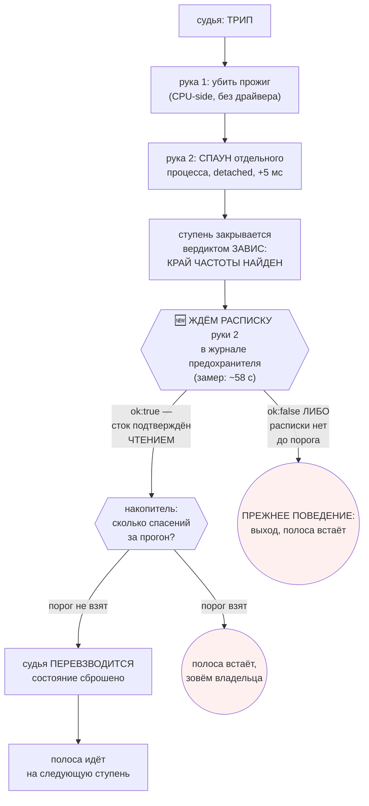

# План 81 — предохранитель переживает спасение, трип становится знанием, полоса идёт дальше

> **Создан:** 2026-08-31 (сессия 71) · **Родитель:** `ideas/17` — **ОДОБРЕНА ВЛАДЕЛЬЦЕМ 2026-08-31
> 10:40 через контур, `interviews/022` Q2 = A, полный механизм из трёх частей** ·
> `plans/55`/`plans/58` (эпик 51, предохранитель) · `bugs/86` (случай, который это породил)
> **Статус:** 🟡 **Ш1–Ш2 ИСПОЛНЕНЫ · Ш3–Ш4 ПРИОСТАНОВЛЕНЫ: ПОСЫЛКА ЧАСТИ 2 ОПРОВЕРГНУТА
> ХРОНОЛОГИЕЙ.** Разбор — `bugs/86` § «ХРОНОЛОГИЯ, СВЕДЁННАЯ ИЗ ТРЁХ ЖУРНАЛОВ».
> · **Карта:** не нужна до фазы приёмки · **Записей в GPU при разработке: 1** (замерная, §4)

> 🔴 **ЧТО ИМЕННО ОПРОВЕРГНУТО (2026-08-31 11:2x).** Часть 2 («трип закрывает СТУПЕНЬ вердиктом
> `ЗАВИС`») подразумевает трип ВО ВРЕМЯ прожига. Сверка трёх журналов по времени говорит другое:
> в единственном живом случае **трип был ДО прожига** (рука 1: «furnace.exe НЕ НАЙДЕН»), а прожиг
> пошёл через 3 секунды ПОСЛЕ того, как рука 2 ОБНУЛИЛА КРИВУЮ. Ступень не осталась без вердикта —
> **она ПРОДОЛЖИЛАСЬ на карте, которую спасение уже вернуло к стоку.**
>
> **Отсюда кандидат в настоящую причину, и он серьёзнее прежнего: спасение может испортить ту
> ступень, которую спасает.** Пока это не проверено на двойнике, строить части 1 и 2 значит
> строить на посылке, которую только что опровергли. Ш1 и Ш2 при этом остаются в силе целиком:
> замер стоимости руки и чтение расписки верны при любом объяснении.
>
> **Следующий шаг плана — не Ш3, а проверка гипотезы на ДВОЙНИКЕ, без карты:** подложить трип в
> момент записи кривой и посмотреть, дойдёт ли ступень до прожига после обнуления.

---

## 1. Вектор цели

**Боль, измеренная 2026-08-31:** предохранитель сработал впервые на живом пути, отработал безупречно
— и вечер кончился. `ОСТАНОВЛЕНО (fuse-rescue) · закрыто 0 из 20 (0 %) · 143,3 с`. Само событие
(«на 2145 МГц при 790 мВ машине стало плохо») и есть тот край, ради которого прогон существует, —
и оно не попало никуда, кроме журнала судьи.

**Куда хотим (Achieve):** спасение перестаёт быть концом вечера. Трип закрывает СТУПЕНЬ вердиктом
`ЗАВИС` (край частоты найден), судья перевзводится, а решение об остановке ПОЛОСЫ принимает
накопитель — механизм, который уже построен и работает.

**Чего план НЕ делает:** не смягчает предохранитель. Порог N не меняется, руки те же, порядок тот
же. Не отменяет правило «прогон без предохранителя запрещён» — наоборот, чинит его: сегодня после
трипа прогон остаётся БЕЗ судьи.

## 2. 🔴 ТРИ НАХОДКИ РАЗВЕДКИ, КОТОРЫХ ИДЕЯ НЕ ЗНАЛА

Идея писалась по замыслу; план пишется по коду. Три вещи изменились.

**Н1. Выход судьи — это одна строка, и она объясняет сама себя.**

```js
// fuse.mjs:682
resolve(); // one trip ends this judge: the step is over either way, a second trip would fire on a corpse
```

Часть 1 идеи целиком живёт здесь. Комментарий верен для случая «машина уже умирает» — и именно
поэтому перевзведение не может быть безусловным.

**Н2. Рука 2 — DETACHED, и судья её НЕ ЖДЁТ.** `makeStockHand` спаунит
`fuse-rescue-hand.mjs` отдельным процессом с `detached: true` и возвращается немедленно
(замерено на живом трипе: `hand: 2, action: "stock-voltage", ok: true, ms: 5.15` — это стоимость
СПАУНА, а не спасения). **Значит смягчение из идеи («перевзводиться только после того, как рука 2
подтвердила сток чтением») сегодня судье попросту НЕВИДИМО.**

**Канал, однако, уже существует, и изобретать нечего:** рука пишет в тот же журнал предохранителя
СВОЮ `fsync`-нутую строку с результатом ПЕРЕЧИТЫВАНИЯ:

```json
{"phase":"outcome","hand":2,"action":"stock-voltage-verified","ok":true,
 "ms":58444.85,"detail":"сток подтверждён чтением: остаточных смещений 0"}
```

**Н3. И вот цена смягчения, которую идея считала нулевой: расписка пришла через 58,4 СЕКУНДЫ.**

| событие живого трипа 31.08 | штамп | от трипа |
|---|---|---|
| намерение (`beat-silence`, тишина 500,61 мс) | 05:12:05.154 | 0 |
| рука 1 — прожиг убит | 05:12:05.664 | +0,5 с |
| рука 2 — процесс запущен | 05:12:05.671 | +0,5 с |
| **рука 2 — СТОК ПОДТВЕРЖДЁН ЧТЕНИЕМ** | **05:13:04.146** | **+58,4 с** |

При ступени в 15 секунд это **четырёхкратная пауза на каждое спасение**. Рука — один проход
(открыть NVAPI → обнулить 127 точек → перечитать), без цикла повторов, так что 58 с — стоимость
самого прохода на карте, которой только что было плохо. **Наблюдение ОДНО (n = 1)**, и на здоровой
карте число может быть другим; разложения 58 секунд по шагам у нас нет.

## 3. Механизм



**Три части, и третья — та, без которой первые две опасны:**

1. **Судья переживает спасение** — вместо `resolve()` сбрасывает своё состояние и продолжает такт.
   **Только по расписке `ok: true`**; иначе прежнее поведение.
2. **Трип едет в развёртку как ВЕРДИКТ СТУПЕНИ, а не как стоп полосы.** Вердикт `ЗАВИС` первого
   класса уже есть и уже закрывает частоту краем (R18) — новой сущности не заводим.
3. **Об остановке ПОЛОСЫ решает НАКОПИТЕЛЬ** (`bugs/80`, `bugs/84`): три предупреждения за прогон,
   два у самого стока. Уже построен, спасения кладутся в тот же счёт своим родом.

## 4. ✅ РАЗВИЛКА ЗАКРЫТА ЗАМЕРОМ 2026-08-31 11:0x — П1, И ВЫБИРАТЬ ОКАЗАЛОСЬ НЕ ИЗ ЧЕГО

**Владелец: «давай как ты считаешь».** Решил не выбирать, а мерить — 58 секунд были одним
наблюдением с карты, которой только что было плохо, и назначать по такому числу порог значило бы
завести в коде число из головы.

**Замер, самой малой обратимой формой.** Сперва путь руки БЕЗ ЕДИНОЙ ЗАПИСИ (вместо обнуления —
чтение), затем сама запись — `zeroCurve` в кривую, которая уже нулевая (проверено чтением
непосредственно перед: ненулевых 0). Эта операция И ЕСТЬ откат к стоку, состояние карты она не
меняет; после — два последовательных чтения, оба 0, сошлись.

| шаг пути руки 2 | здоровая карта |
|---|---|
| `import nvapi.mjs` (koffi + DLL) | 4,0 мс |
| `openNvapi()` | 11,8 мс |
| `NvAPI_Initialize` | 5,6 мс |
| `EnumPhysicalGPUs` | 0,2 мс |
| чтение кривой (127 точек) | 7,5 мс |
| чтение сдвигов | 0,7 мс |
| **`zeroCurve` — ЗАПИСЬ 127 нулей + перечитывание** | **1870,7 мс** |
| **ВСЯ РУКА** | **≈ 1,9 с** |

**Против 58,4 с живого трипа — разница в 31 раз.** Значит 58 секунд это НЕ свойство руки: мост,
инициализация и чтение стоят 30 мс вместе. Это свойство **карты, которой было плохо**.

**Отсюда выбор перестаёт быть выбором.** Ожидание расписки стоит **1,9 с** при ступени в 15 с —
величина, которой можно пренебречь. А 58 секунд случаются ровно тогда, когда карте плохо, то есть
**именно когда ждать и надо**. Это идеальная форма для защиты: дёшево на здоровой машине, медленно
там, где медленность и есть защита. **Порог (вариант П2) решал бы задачу, которой нет** — риск (г)
§7, теперь измеренный.

**ПРИНЯТО: П1 — ЖДАТЬ РАСПИСКУ.** Полоса не идёт дальше, пока сток не подтверждён ЧТЕНИЕМ.

> 🆕 **И побочная находка, которую стоит записать, но не строить сейчас:** само ВРЕМЯ расписки —
> сигнал. Подтверждение, пришедшее в 30 раз медленнее обычного, само по себе говорит, что карте
> было плохо. Это возможный вход оракула; в этот план не берётся — у величины одно наблюдение.

### (история) как стояла развилка

**Почему развилка:** касается предохранителя, то есть безопасности машины владельца, а цена ошибки
ненулевая. По границе, которую владелец утвердил сегодня (`interviews/022` Q3 = A), решение не моё.

- **П1 — ЖДАТЬ расписку, полоса стоит.** Просто и честно: следующая ступень не начнётся, пока сток
  не подтверждён ЧТЕНИЕМ. Платим ~58 с на каждое спасение (замер n = 1).
- **П2 — ждать с ПОРОГОМ.** Не пришла за N секунд — прежнее поведение (выход, полоса встаёт).
  Платим: N надо откуда-то взять, а у нас одно наблюдение; назначить его из головы — запрещено.
- **П3 — идти дальше СРАЗУ, расписку проверять задним числом.** Быстро и **опасно**: следующая
  ступень начнётся на карте, про которую мы ещё не знаем, вернулась ли она к стоку. Против прямого
  слова владельца о зависании как о нашем провале. **Агент против.**

**Рекомендация агента была П1**, и замер выше её подтвердил ровно тем доводом, которым она была
дана: «прежде чем усложнять порогом, надо ПОСМОТРЕТЬ, сколько рука занимает на здоровой карте».

## 5. Шаги

- [x] **Ш1. Замер стоимости руки 2** — ИСПОЛНЕН 2026-08-31 11:0x на живой карте в покое, §4.
      Рука ≈ 1,9 с на здоровой карте против 58,4 с на больной; развилка закрыта, взят П1.
- [x] **Ш2. Чтение расписки — ИСПОЛНЕН 2026-08-31 11:1x.** Две чистые функции в `fuse.mjs`:
      `stockReceipts(lines)` (расписки в порядке появления) и `rearmDecision(lines, seenBefore)`
      → `waiting` · `refused` · `confirmed`. **Расписки различаются СЧЁТОМ, а не временем** — штампы
      ставят разные процессы своими часами, и сравнение таких концов это ловушка [[EXP-0207]].
      9 блоков, из них один на фикстуре **из настоящего журнала трипа 31.08** (выдуманная проверяла
      бы мой разбор собственного формата, эта — разбор того, что рука пишет на самом деле).
      Мутации: **R1** спаун принят за подтверждение → 2 красных набора · **R2** отказ руки разрешает
      продолжать → красный · **R3** `seenBefore` не учитывается → красный.
- [ ] **Ш3. Перевзведение судьи** по решению владельца из §4: сброс состояния и продолжение такта.
- [ ] **Ш4. Трип → вердикт ступени.** Класс исхода `fuse-rescue` уже отличим полем (`bugs/67`);
      здесь он перестаёт быть стопом полосы и становится вердиктом `ЗАВИС` этой частоты.
- [ ] **Ш5. Спасение — в накопитель** своим родом, рядом с пульсом и голосом драйвера (`bugs/84`).
- [ ] **Ш6. Мутации**, каждая красит своё: (а) перевзводиться БЕЗ расписки; (б) перевзводиться при
      `ok: false`; (в) трип снова кончает полосу; (г) спасение не кладётся в накопитель.
- [ ] **Ш7. Репетиция на двойнике** — подложенный трип, полоса ПРОДОЛЖАЕТСЯ, ступень закрыта краем.
- [ ] **Ш8. Живая приёмка ПРИ ВЛАДЕЛЬЦЕ** (ворота 6a). До неё тега `DONE` нет.

## 6. Критерии приёмки

| # | критерий | Шкала · Прибор · Порог |
|---|---|---|
| **P81-AC1** | Спасение не кончает прогон | Шкала: частот, закрытых ПОСЛЕ первого спасения · Прибор: прогон с подложенным трипом на двойнике · **Порог: > 0. Сегодня — 0 из 20** |
| **P81-AC2** | Спасение становится ЗНАНИЕМ | Шкала: строк документа, закрытых краем по спасению · **Порог: 1 на каждое спасение. Сегодня — 0** |
| **P81-AC3** | 🔴 Неподтверждённый сток НЕ даёт продолжения | Шкала: продолжений полосы при `ok: false` или отсутствующей расписке · **Порог: 0**, и ОБЕ стороны доказать мутацией |
| **P81-AC4** | Судья взведён к следующей ступени | Шкала: ступеней после спасения, прошедших без взведённого судьи · **Порог: 0** |
| **P81-AC5** | Накопитель по-прежнему останавливает | Шкала: спасений подряд до остановки · **Порог: тот же, что у предупреждений — 3 за прогон, 2 у стока** |
| **P81-AC6** | Число спасений за вечер ВИДНО | Шкала: строк сводки прогона со счётом спасений · **Порог: 1** — владелец назвал зависание нашим провалом, и показатель обязан быть на виду |
| **P81-AC7** | Ноль записей в GPU при разработке | Прибор: `watchdog --status` до и после · **Порог: 0** |

## 7. Риски, названные вслух

- **(а) Судья, переживший трип, судит умирающую машину.** Ярус: ВЫСОКИЙ. Смягчение — §4 целиком:
  перевзведение только по расписке `ok: true`, то есть по ПЕРЕЧИТАННОМУ стоку.
- **(б) Череда спасений подряд = череда убитых прожигов.** Ярус: средний. Смягчение: накопитель
  (часть 3) плюс существующий тормоз «два зависания подряд на ОДНОЙ ступени».
- **(в) Спасение станет дешёвым, и появится соблазн ходить глубже.** Ярус: средний, и он про НАС,
  а не про код. Смягчение: AC6 — число спасений печатается отдельной строкой сводки.
- **(г) 58 секунд окажутся не свойством руки, а свойством больной карты** — тогда П2 решала бы
  задачу, которой нет. Смягчение: Ш1 ПЕРЕД выбором варианта.
- **(д) Судья, продолживший такт, унесёт с собой состояние прошлой ступени** (таймеры тишины,
  кольцо). Ярус: средний, класс известный — `bugs/19`. Смягчение: сброс — явный список полей, а
  не «продолжаем как было», и мутация (а) его стережёт.

## 8. Связи

`ideas/17` (одобрена, Q2 = A) · `interviews/022` · `bugs/86` (случай) · `bugs/67` (спасение —
происшествие, а не исход) · `bugs/23` + R18 (зависание закрывает частоту краем) · `bugs/80` и
`bugs/84` (накопитель) · `bugs/19` (сторож, переживший то, что стерёг) · `plans/80` (проверка
закрепления во время прожига — делает трипы ЧАЩЕ, поэтому идёт ПОСЛЕ этого плана) ·
`fuse.mjs:682` · `fuse-rescue-hand.mjs` · `runs/death-watch/2026-08-31T05-10-56-258Z-fuse.jsonl`
(источник всех четырёх штампов §2).
