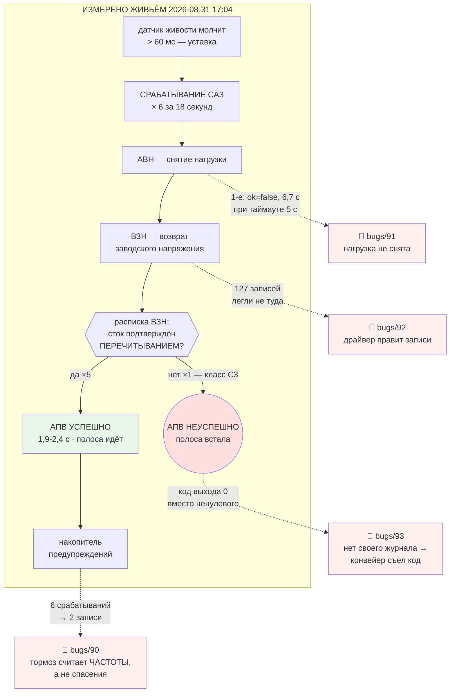

# План 82 — движок после ПЕРВОГО живого срабатывания защиты

> **Создан:** 2026-08-31 (сессия 73), вечером, сразу после двух живых прогонов ·
> **Заказ владельца, дословно:** *«сворачиваемся, чиним движок. сначала планы»*
> **Родитель:** `plans/81` (Ш5–Ш7 исполнены и подтверждены живой картой) ·
> **Входы:** `bugs/90` · `bugs/91` · `bugs/92` · `bugs/93` — все четыре заведены ЭТИМ вечером и
> все четыре найдены ЖИВЫМ ПРОГОНОМ, ни один — чтением кода
> **Карта:** не нужна до фазы 4 · **Записей в GPU: 0**

---

## 1. Вектор цели

**Тип: Achieve.** Довести машинерию до состояния, в котором **следующий живой вечер не тратится
на то, что уже измерено сегодня**: тормоз действительно тормозит, снятие нагрузки укладывается в
свой таймаут, отказ виден машине, а порча записей драйвером — понята, а не пересказана.

**Боль, измеренная 2026-08-31 (не оценённая — измеренная):**

| что | число |
|---|---|
| срабатываний защиты за 18 с | **6** |
| из них успешных возвратов на пост (АПВ) | **5** |
| записей накопителя, которые эти шесть породили | **2 при пороге 3** |
| времени, которое нагрузка прожила после решения спасать (1-е срабатывание) | **6,7 с** |
| код выхода прогона, остановленного спасением | **0** |
| строк, закрытых в документе за оба прогона | **3 из 29 частот** |

**Чего план НЕ делает:** не смягчает защиту, не трогает уставку 60 мс, не меняет решение владельца
о том, что спасение есть найденный край.

## 2. Механизм — что измерено и где сидит каждый дефект

**Что схема говорит помимо дефектов, и это важнее их:** зелёная ветка ОТРАБОТАЛА. Пять возвратов
на пост из шести, время возврата на живом кремнии **1,9–2,4 с** против предсказанных замером 1,9 с.
Отказ шестого — **правильное** поведение: подтвердить сток не удалось, значит продолжать нельзя.
**Чиним не механизм, а четыре его щели.**

## 3. Порядок работ — и он выведен, а не назначен

Порядок задан двумя правилами, а не удобством:

1. **Сперва то, что делает следующий вечер ЧИТАЕМЫМ** (`bugs/93`): пока отказ невидим машине,
   любой результат следующего прогона придётся проверять глазами, и автономный цикл соврёт.
2. **Потом то, что требует ВЛАДЕЛЬЦА** (`bugs/90`): его число нужно получить до кода, иначе
   код придётся переделывать под ответ.
3. **Разбор — до починки** (`bugs/91`, `bugs/92`): обе причины неизвестны, и чинить их вслепую
   запрещено правилом трёх попыток ещё до первой попытки.

## 4. Шаги

- [ ] **Ш1. `bugs/93` — свой журнал у прогона (`--log <файл>`).** Самый дешёвый и он же снимает
      слепоту машины. Мутация: остановка спасением при `--log` обязана дать НЕНУЛЕВОЙ код.
      Следом — рельс `GPU_TUNING_RAILS.md` §2 печатает команду БЕЗ `tee`.
- [x] **Ш2. `bugs/90` — развилка вынесена владельцу: `interviews/024`, ЖДЁТ ОТВЕТА.** Пять
      вариантов, и каждый описан тем, что увидит ОН, а не внутренними сущностями ([[EXP-0214]]).
      🔴 Код Ш3 не писать до ответа.
- [ ] **Ш3. `bugs/90` — починка по его числу.** Единица счёта — срабатывание, а не частота
      (это моя часть решения). Фикстура обязана МЕРЯТЬ раскладку срабатываний по частотам, а не
      задавать её сценарием: сегодняшний блок зеленел ровно потому, что я разложил 9 срабатываний
      по 3 на частоту своей рукой.
- [ ] **Ш4. `bugs/92` — РАЗБОР, не починка.** Опись класса C3 по всему архиву (`writeFailureClass`
      — поле есть, счётчика нет) · сверка окон обоих случаев с каналом драйвера · только потом
      гипотезы. Разведдок в `researches/`, если причина окажется внешней.
- [ ] **Ш5. `bugs/91` — разбор снятия нагрузки.** Почему 6693 мс при таймауте 5000 — разница
      1,7 с сама по себе улика. Репетиция на двойнике с зависшим на драйвере процессом.
- [ ] 🔴 **Ш5б. `bugs/94` — архив проб перестаёт затирать сам себя.** Заведён ПОСЛЕ остальных, и он
      срочнее их: сегодняшний прогон уничтожил сырые пробы `bugs/86` (превышение 690 МГц), потому
      что имя файла несёт частоту и подъём, но не прогон. Тот же класс, который `plans/27` §27.1
      закрыл для пульса и не перенёс на соседний архив ([[EXP-0212]]).
      **Улики вечера уже спасены копией** — `benches/fixtures/lock-slip-2026-08-31/`, и это
      ПЕРВАЯ парная фикстура `bugs/86`: подъём 555 → +420 МГц · 525 → +472 · 413 → −8 · 143 → −8.
      Контроль набора `hold` переезжает на неё (сегодня он читает живой архив и потому краснеет
      после каждого прогона — B94-AC2).
- [ ] 🔴 **Ш5в. `bugs/86` — разделяющая переменная НАЙДЕНА и ждёт проверки.** Сессия 71 опровергла
      «дело в размере подъёма» на подъёмах 847 и 922 — но то была ветка КРИВОЙ. На ветке
      ЗАКРЕПЛЕНИЯ сегодня граница чистая: 525 и 555 сорвались, 143 и 413 удержали, всё в одной
      полосе одного вечера. **Это не доказательство причины, а первое наблюдение с обеими
      сторонами** — и оно проверяемо фикстурой Ш5б без карты.
- [ ] **Ш6. Долг словаря — сторож `tools/glossary-guard.mjs` в ворота `npm run check`.**
      Перенесён сюда из эстафеты сессии 73: словарь заведён, удержание держится на аккуратности.
- [ ] **Ш7. Живая приёмка при владельце** — тот же вечерний прогон, ворота 6a. До неё `DONE` нет.

## 5. Критерии приёмки

| # | Критерий | Шкала · Прибор · Порог |
|---|---|---|
| **P82-AC1** | Прогон, остановленный спасением, виден машине | Шкала: код выхода · Прибор: двойник с подложенным срабатыванием, запуск БЕЗ конвейера · **Порог: ≠ 0. Сегодня 0** |
| **P82-AC2** | Всплеск спасений внутри одной частоты останавливает полосу | Шкала: срабатываний до остановки · Прибор: двойник, раскладка ИЗМЕРЕНА · **Порог: число владельца. Сегодня 6 и не остановило** |
| **P82-AC3** | Снятие нагрузки укладывается в свой таймаут | Шкала: мс от намерения до исхода · **Порог: ≤ 5000. Сегодня 6694** |
| **P82-AC4** | Частота класса C3 ИЗМЕРЕНА по архиву | **Порог: число с датами, а не «редкий»** |
| **P82-AC5** | Возврат к стоку не может доложить успех, не перечитав | **Порог: 0 таких путей** |
| **P82-AC6** | Мой жаргон краснит ворота сборки | Прибор: `npm run check` · **Порог: сторож есть и доказан красным** |
| **P82-AC7** | Ноль записей в GPU при разработке | Прибор: `watchdog --status` до и после · **Порог: 0** |

## 6. Риски

- **(а) Причина C3 окажется вне нашего кода** (драйвер, деградация карты). Ярус ВЫСОКИЙ.
  Смягчение: Ш4 — разбор, а не починка; вывод «это не мы» имеет право быть, но только с замером.
- **(б) Ответ владельца по числу спасений придёт не сразу** — Ш3 ждёт, Ш1/Ш4/Ш5 не ждут.
  Порядок шагов выбран так, чтобы ожидание не блокировало работу.
- **(в) Соблазн починить `bugs/91` вслепую** — причина «первый вызов дороже» правдоподобна и
  ничем не подтверждена. Смягчение: репетиция Ш5 обязана ВОСПРОИЗВЕСТИ 6,7 с, а не объяснить их.
- **(г) Починка тормоза сделает остановки частыми** и вечер будет вставать на здоровой карте.
  Смягчение: число даёт владелец (Ш2), а не я; и это ровно та граница, где его слово старше.

## 7. Связи

`plans/81` (Ш5–Ш7, подтверждены живой картой) · `bugs/90` · `bugs/91` · `bugs/92` · `bugs/93` ·
`bugs/67` (различитель, стёртый конвейером) · `bugs/50` (первый C3) · `bugs/80`/`bugs/84`
(накопитель) · `GLOSSARY.md` · `GPU_TUNING_RAILS.md` §2 · [[EXP-0216]] · [[EXP-0217]].
