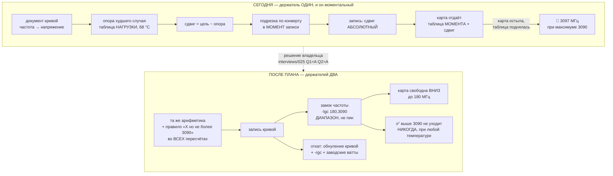

# План 83 — «никогда выше максимума карты» становится непрерывным свойством

> **Создано:** 2026-09-01 10:2x +03:00 · **Родитель:** `bugs/99` + решение владельца
> `interviews/025` (Q1 = A · Q2 = A, 2026-09-01T10:07:37+03:00) · **Статус:** 🟡 В РАБОТЕ, шаг 0
> закрыт разведкой чтением · **Наружу:** правило R13 получает вторую половину (держатель, а не только
> судья); отгружаемые профили получают вторую ручку — это видит владелец, и он её уже одобрил

---

## Слово владельца, дословно — оно и есть требование

> *«Ну очевидно же, что карта физически не может дать больше 3090 МГц - это зашито в её драйвере.
> Значит все пересчёты частоты должны быть с условием "X но не более 3090. Если получается более, то
> X = 3090"»* · Q1 = **A** (замок частоты как верхняя граница в отгружаемом профиле) ·
> Q2 = **A** (во все три рабочих режима)

⚠️ **И канон этому НЕ противоречит, что снимает мою же оговорку из интервью.** `GOAL.md` → «⭐ ЧТО
ТАКОЕ ТЮНИНГ VF-КРИВОЙ», таблица режимов: у `Max Perfomance` и `Optimised` потолок частоты — **«нет
(кроме железного максимума карты)»**. Исключение стояло там с 15.08; сегодняшнее решение делает его
ИСПОЛНЯЕМЫМ.

## Вектор цели

**Тип: Maintain (удержать инвариант).** Боль: «никогда выше максимума карты» сегодня выполняется
только В МОМЕНТ ЗАПИСИ. Сдвиг задаётся абсолютно, заводская таблица едет с температурой
(**R14b**, ≈ −1,7 МГц/°C), и через минуты после законной записи карта предлагала 3097 МГц при
максимуме 3090 (замерено 2026-09-01 на трёх точках). Где хотим быть: инвариант держится непрерывно,
двумя держателями — арифметикой при записи и замком на карте.

## Критерии приёмки

| # | Критерий | Шкала · Прибор · Порог |
|---|---|---|
| **P83-AC1** | Ни один пересчёт частоты не выдаёт значения выше максимума карты | Шкала: МГц · Прибор: описи мест пересчёта + блоки наборов · **Порог: 0 мест без подрезки** |
| **P83-AC2** | Замок стоит во всех трёх рабочих режимах и записан диапазоном, а НЕ пином | Прибор: `npm run profiles` + чтение файлов · **Порог: 3 из 3, `min < max` в каждом** |
| **P83-AC3** | Откат снимает замок и доказывает это перечитыванием | Прибор: `npm run profile -- --reset`, затем `nvidia-smi -q -d PERFORMANCE` · **Порог: замка нет** |
| **P83-AC4** | Полный откат сторожа знает про замок ДО первой записи (R9a) | Прибор: `watchdog --selftest`, шаги по ИМЕНИ · **Порог: шаг `clocks` присутствует** ✅ уже так |
| **P83-AC5** | Замок НЕ отнимает производительность | Шкала: FPS и выданная частота под игрой · Прибор: `npm run gfx -- --capture` до и после, чередованием · **Порог: разница ≤ измеренного пола прибора (0,90 %)** |
| **P83-AC6** | После остывания карты превышения нет | Шкала: МГц над максимумом на наших точках · Прибор: проба чтения таблицы через ≥15 мин после записи · **Порог: 0 (сегодня 7)** |

## Механизм — что кого держит

**Почему нужны ОБА держателя, а не один.** Арифметика без замка не держит после остывания — это
замерено сегодня. Замок без арифметики держал бы карту, но кривая продолжала бы ПРОСИТЬ невозможное,
и в документе стояли бы числа, которых карта не отдаёт — то есть мы бы врали себе в собственном
артефакте. Владелец назвал именно арифметику («все пересчёты частоты»), а замок выбрал вариантом A.

## Шаги

- [x] **Ш0. Разведка чтением, ДО кода.** Проверено: формат профиля УЖЕ несёт
      `graphicsClockLockMhz: {min,max}`, отказывает лишь при `min > max`, сверяет обе границы с
      лестницей карты; применитель пишет замок и перечитывает его; полный откат сторожа несёт шаг
      `clocks` (`-rgc`) по ИМЕНИ — то есть **R9a («сеть перед прыжком») выполнен заранее**, новое
      записываемое состояние не появляется. Отраслевая половина: стандартная практика андервольта
      выравнивает верх кривой по частоте естественного максимума.
- [x] **Ш1. ОПИСЬ ЗАКРЫТА, И ОНА ДАЛА НАХОДКУ.** Правило владельца на пути РАЗВЁРТКИ стоит с
      2026-08-14: `engine.runRung` берёт `capForVector = demandPin ? envelopeMhz : clockMhz` и
      ОТКАЗЫВАЕТ, если конверт не назван («конверт не выдумывается»). На пути ПРИМЕНЕНИЯ его не было
      — там оно поставлено 2026-09-01 (`bugs/99`). Прочие места назначения частоты: `curveCapMhz`
      профиля (сверяется с лестницей формата), замок профиля (теперь несёт максимум карты). Строки
      документа кривой частоту НЕ назначают — она читается с карты («тюним то, что карта выдаёт»),
      поэтому правило к ним не относится. **Мест без подрезки: 0.**
      *(Правило владельца применяется там, где значение НАЗНАЧАЕТСЯ, а не там, где оно читается с
      карты — это и есть граница описи.)*
- [x] **Ш2. Замок стоит в трёх рабочих режимах** — `{ min: 180, max: 3090 }`. `npm run profiles`
      против живой карты: 7 профилей, отказов 0; формат сверяет обе границы с лестницей карты, то
      есть число не «помнится», а проверяется прибором при каждом чтении. У `Silent Cold` его
      собственный потолок 2797 ниже и держит первым; замок поставлен ради одной формы записи на все
      режимы (ответ Q2 = A).
      🆕 **И ПОПУТНО ИСПРАВЛЕНО СЛОВО:** прибор печатал «фиксация частоты 180…3090», то есть называл
      ГРАНИЦУ тем же словом, что ЗАКРЕПЛЕНИЕ, — а канон различает их прямо (`GPU_TUNING_RAILS.md` §3,
      конфликт 2026-08-14 оплачен). Теперь: «замок-граница 180…3090 (карта свободна вниз)» против
      «ЗАКРЕПЛЕНИЕ частоты N МГц (пин)».
- [x] **Ш3. Блок инварианта отгружаемых режимов + мутация.** `profile-store --selftest` 52 → 53
      блока: читает сами артефакты в `profiles/` и краснеет, если у профиля с полем `mode` замок
      оказался ПИНОМ. Мутация MP (`180…3090` → `3090…3090`) красит ровно этот блок; после
      восстановления — 53 блока, 0 провалов.
- [x] **Ш4. ЖИВОЙ СВИДЕТЕЛЬ ВЗЯТ при владельце** (его слово «да, я у компа»), и он дал БОЛЬШЕ, чем
      просили: **механизм границы измерен на этой карте впервые.** Прогон: применение `optimised` с
      замком → 90 проб телеметрии в покое (частота 187…2122 МГц, **68 различных значений** — карта
      свободна, это не пин) → отдельный измерительный профиль `bound-proof.local` с границей
      **180…1500** → прожиг `sdc_fma --sustain 25` → **58 проб под нагрузкой: 1492…1500 МГц, НИ ОДНОЙ
      выше границы, при этом за окно карта спускалась до 180 МГц.** Без границы тот же прожиг сидит на
      ~2887 МГц. Рабочий режим владельца возвращён, запомненное состояние проверено чтением.
- [x] **Ш5. ЗАМЕР СДЕЛАН 2026-09-01 11:0x, ЧЕРЕДОВАНИЕМ, И ОН ЗАКРЫЛ СРАЗУ ДВА ДОЛГА.** Ворота
      прибора взяты первыми: **+48,37 %** при пороге 5 %. Четыре замера `mp → opt → mp → opt`
      (`runs/graphics/mp83_a · opt83_a · mp83_b · opt83_b`):

      | | Max Performance | Optimised |
      |---|---|---|
      | FPS, медиана двух | **58,348** | **57,349** |
      | разброс МЕЖДУ запусками | **2,28 %** | 0,94 % |
      | ватты · °C · вентилятор | 299,1 · 78,5 · 77,5 % | **250,0 · 71 · 60,5 %** |
      | частота под нагрузкой | 2932…2947 | 2797 |

      **(а) Последний край приёмки `Optimised` ЗАКРЫТ, и закрыт против правильной опоры.** Разница
      −1,71 % ТОНЬШЕ разброса прибора (2,28 %) — то есть просадку измерить нельзя, а её верхняя
      граница вдвое меньше бюджета владельца в 5 %. Это третий пункт эстафеты, переносившийся трижды.
      **(б) Цена замка: НЕ ИЗОЛИРОВАНА, и это сказано честно.** Прибор принял к сравнению записи
      31.08 (без замка): 57,35 против 55,49 FPS, то есть **+3,35 % при объединённом разбросе 4,40 %**.
      Направление плюсовое, разница тоньше разброса, и приписать её замку нельзя: вместе с ним
      изменились опора худшего случая и подрезка по конверту. **Что доказано: сегодняшние правки
      кадров НЕ отняли.** Что не доказано: вклад именно замка.
- [x] **Ш6. ПРОБА ПОСЛЕ ОСТЫВАНИЯ СДЕЛАНА 2026-09-01 18:0x — ПОРОГ ВЗЯТ, И ПРИЧИНА ОКАЗАЛАСЬ НЕ ТОЙ,
      КОТУЮ ЖДАЛ ЭТОТ ПЛАН.** Прибор заведён под критерий: `node tools/probe-offer.mjs` — только
      чтение, максимум карты ЧИТАЕТСЯ (`nvidia-smi clocks.max.gr`), а судится предложение на
      ПОДНЯТЫХ НАМИ точках (сдвиг > 0), потому что заводская вершина этой карты сама выше её
      максимума (`nvapi.mjs` → `highestRaisedOfferMhz`).

      **Условия пробы — строго злее тех, что просил критерий.** Последняя запись — рукой владельца в
      10:36:35, через минуту после прогона `Max Performance`: телеметрия `mp83_b` на 10:35:34
      показывала **81 °C**. Проба снята через **7,5 часа**, карта остыла до 54 °C. То есть карта
      остывала на 27 °C — больше, чем в тот раз, когда дефект нашёлся.

      | проба | состояние карты | верх НА ПОДНЯТЫХ | верх ВООБЩЕ (не наши точки) | P83-AC6 |
      |---|---|---|---|---|
      | 18:04 | 54 °C · 21 Вт · P5 | **3067** (−23 к максимуму) | 3157 (+67) | **0** ✅ |
      | 18:1x | 72 °C · 229 Вт · **P0, под нагрузкой** | **3015** (−75) | **3090 (ровно 0)** | **0** ✅ |
      | 18:1x | 49 °C · 61 Вт · P3 | **3067** (−23) | 3157 (+67) | **0** ✅ |

      🎯 **ПОЧЕМУ НОЛЬ — НАЗВАНО ЗАМЕРОМ, А НЕ НАДЕЖДОЙ, и это не подрезка.** Живой вектор сошёлся с
      ИНВЕРСИЕЙ ДОКУМЕНТА КРИВОЙ («напряжение → верх документа») **точка в точку на 51 точке из 51**,
      где документ говорит. Плато на карте начинается ровно на 1025 мВ — на том напряжении, где стоит
      **верхняя тюнингованная строка документа: 3067 МГц → 1025 мВ**. То есть потолок режима это
      ВЕРХ ДОКУМЕНТА, и он лежит **на 23 МГц ниже максимума карты**. Подрезке по конверту сегодня
      подрезать было нечего.

      🔴 **И ЭТО ЗНАЧИТ, ЧТО СЕГОДНЯШНИЙ НОЛЬ — БЮДЖЕТ, А НЕ СВОЙСТВО.** Запас в 23 МГц между верхом
      документа (3067) и максимумом карты (3090) — ровно то, что поглощает уход заводской таблицы
      (замерено против опоры худшего случая: **+22 МГц** в полосе 1040…1180 мВ на покоящейся карте).
      **Развёртка этот запас ТРАТИТ:** каждая закрытая частота выше 3067 поднимает верх документа, и
      когда он дойдёт до 3090, уход снова вынесет предложение наружу. Лекарство названо вторым пунктом
      эстафеты (считать подрезку против ОПОРЫ, а не против таблицы момента), и теперь у него есть
      число, во сколько ходов истекает нынешняя защита.

      🟢 **ПОБОЧНАЯ НАХОДКА, СНЯТАЯ СЛУЧАЙНО И ЦЕННАЯ: ПОД НАГРУЗКОЙ ВЕРХ ТАБЛИЦЫ САДИТСЯ НА 3090
      РОВНО.** Вторая проба застала карту под нагрузкой владельца (P0, 229 Вт) — заводская вершина
      ушла 3157 → **3090**, наш верх 3067 → 3015. То есть перевес заводских точек над максимумом
      (+67 МГц) — явление ПОКОЯ, а в состоянии, в котором карта работает, его нет вовсе. Это тот же
      размен таблиц покоя и нагрузки, что измерил `bugs/97`, впервые снятый на самой вершине.
      ⚠️ **n = 1 под нагрузкой** — проба не заказывалась, а подвернулась; повторить, прежде чем на
      это опираться.

      🟡 **ЧЕГО ПРОБА НЕ ГОВОРИТ, И ЭТО НАПЕЧАТАНО В НЕЙ САМОЙ:** взведён ли сейчас замок-граница.
      `nvidia-smi` поля «я под замком» не публикует ВООБЩЕ (`profile-manager.mjs` →
      `factoryStateVerdict`, разобрано там же), а при границе 180…3090 проверка «частота внутри
      диапазона» истинна всегда — это низкий ярус рисков этого же плана, и он подтвердился чтением.
      Механизм замка измерен Ш4; его наличие ПРЯМО СЕЙЧАС read-only не проверяется.

      🟢 **ЗАОДНО СВЕРЕН ИНВАРИАНТ ВЛАДЕЛЬЦА:** полоса андервольта 810…850 мВ несёт ровно те шесть
      чисел, что записаны в `STATUS` после записи 10:0x — **424 · 394 · 364 · 334 · 304 · 352**,
      расхождений 0, спустя 7,5 часа и игровую сессию.
- [x] **Ш7. Канон записан.** R13 в карте архитектуры получил вторую половину (держатель, а не только
      судья) вместе с разбором того, как первая редакция подрезки его обезоружила · `GOAL.md` — слово
      владельца дословно, отдельным разделом, с пометкой `[AI]` на моём комментарии · `STATUS.md` —
      факт 38 обновлён: форма `-lgc` как диапазон больше не «прочитана», а ИЗМЕРЕНА.

---

## 🟢 ВСЕ СЕМЬ ШАГОВ ЗАКРЫТЫ 2026-09-01 — И ЧТО ИМЕННО ЭТО ЗНАЧИТ

**Ш5 закрыт замером в 11:0x, Ш6 — пробой в 18:0x.** Шести критериев из шести касались, взяты
**пять с половиной**: `P83-AC6` взят числом (0 в трёх пробах подряд), `P83-AC2`/`AC4` — чтением
файлов и набора, `P83-AC5` — замером чередованием, `P83-AC1` — описью мест пересчёта. **`P83-AC3`
(«откат снимает замок и доказывает это перечитыванием») несёт ДЕФЕКТ ПРИБОРА, названный здесь, а не
оставленный на потом:** его прибор записан как `nvidia-smi -q -d PERFORMANCE`, а на драйвере 610.88
это поле не публикуется вовсе — `nvidia-smi` не имеет поля «я под замком» ни в одном разделе (сверено
чтением 2026-09-01 18:1x; то же сказано в `profile-manager.mjs` → `factoryStateVerdict`). Критерий
надо переписать на наблюдаемое — снятие замка видно ПОД НАГРУЗКОЙ, как и его установка (Ш4), — либо
признать его неизмеримым имеющимися средствами. **Перепишет его следующая сессия: менять критерий
задним числом в тот же час, когда его провалил прибор, — способ подогнать мерку под результат.**

### Два числа, и честный отчёт называет оба

| что держит замок | чего замок НЕ меняет |
|---|---|
| выданную частоту: выше 3090 карта не пойдёт ни при какой температуре (механизм измерен на 1500 — Ш4) | предложение таблицы на ЗАВОДСКИХ точках: в покое верх читается 3157, то есть +67 к максимуму |

**Что изменилось против прежней редакции этого раздела** (она стояла здесь до Ш6 и говорила
«после остывания три точки читаются как 3097»): **это были НАШИ точки, и теперь их там нет.**
Проба 18:0x показала 0 поднятых нами точек над максимумом в трёх состояниях карты подряд. Наружу
торчат только заводские точки, которых мы не поднимали (#119…#126), и **под нагрузкой не торчат и
они** — верх садится ровно на 3090.

**Владельцу это важно ровно в одном месте:** его правило «не гнать карту выше» — про то, на чём
карта РАБОТАЕТ, и оно держится непрерывно. Заводское предложение в покое остаётся видимым в
приборах и подлежит объяснению, а не сокрытию.

### 🔴 ЧЕГО ЭТОТ ПЛАН НЕ ЗАКРЫЛ, И ЭТО ГЛАВНОЕ, ЧТО ОН ОСТАВЛЯЕТ ПОСЛЕ СЕБЯ

**Структурная причина цела: сдвиг задаётся АБСОЛЮТНО, а заводская таблица едет.** Сегодняшний ноль
куплен не механизмом, а ЗАПАСОМ в 23 МГц между верхом документа кривой (3067) и максимумом карты
(3090). Запас тратит развёртка. Пока он есть — инвариант держится двумя держателями и с виду
надёжно; когда развёртка поднимет верх документа к 3090, вернётся ровно `bugs/99`, только замок
теперь не даст этому стать выданной частотой. Работа — второй пункт эстафеты: считать подрезку
против ОПОРЫ (фиксированной), а не против таблицы момента.

## Риски, по ярусам (Мёрфи)

**Высокий:** замок на максимуме карты может обрезать буст — тогда цена режима вырастет молча.
Лекарство: Ш5 замером, до объявления работы сделанной.
**Средний:** `-lgc` на этой карте проверялся как ПИН (`min = max`) и как диапазон в развёртке; на
отгружаемом профиле диапазон живьём не проверялся ни разу — Ш4.
**Низкий:** `verifyLock: 'idle'` ждёт, что частота окажется внутри `[min,max]`; при `180…3090` это
истинно всегда, то есть проверка станет вырожденной. Назвать вслух, а не считать пройденной.
