# План 84 — подрезка по конверту против ОПОРЫ: вектор воспроизводим, замок держит карту (репетиция на двойнике)

> **Создано:** 2026-09-04 (сессия 78) · **Родитель:** `plans/83` («чего план не закрыл»), `bugs/99`
> (остаток), `bugs/98` (B98-AC1), слово владельца 2026-09-04: *«репетиция подрезки против опоры на
> двойнике»* · **Статус:** 🟢 РЕПЕТИЦИЯ ЗАКРЫТА 2026-09-04 (Ш1–Ш6, флаг CLI); 🔲 живой шаг Ш7 — при владельце, по его решению ·
> **Наружу:** решение об отгрузке нового пути записи — владельцу, с числами репетиции в руках

---

## Вектор цели

**Тип: Achieve.** Боль: подрезка по конверту (`bugs/99`) считается против заводской таблицы МОМЕНТА
записи (`factoryBaseFrom(живая, сдвиги)`), а таблица едет с температурой (R14b) и режимом (`bugs/97`).
Поэтому одна и та же кнопка даёт РАЗНЫЙ вектор: 5 точек / −60 МГц, потом 4 / −53, потом 29 / −265
(сессия 76). `B98-AC1` («повторное применение даёт тот же вектор») на верхних точках не побайтово, а
нынешний ноль `P83-AC6` — бюджет в 23 МГц, который развёртка тратит (`plans/83` Ш6). Где хотим быть:
вектор считается и подрезается против ОДНОЙ ФИКСИРОВАННОЙ опоры (артефакта худшего случая) и потому
воспроизводим байт-в-байт, а «никогда выше максимума карты» держит НЕПРЕРЫВНЫЙ держатель — замок
`-lgc 180…3090`, поставленный ДО записи кривой.

## Критерии приёмки (репетиция на двойнике)

| # | Критерий | Шкала · Прибор · Порог |
|---|---|---|
| **P84-AC1** | Вектор ВОСПРОИЗВОДИМ при движении таблицы | Шкала: расхождение сдвигов, записанных на двойник с таблицей «нагрузка» и на двойник с таблицей «покой» (+22 МГц наверху) · Прибор: блок в `profile --selftest` · **Порог: 0 точек из 127** (контроль: прежний путь даёт ≠ 0) |
| **P84-AC2** | Намерение против опоры НЕ выше конверта — суд, а не подрезка | Шкала: `__intentTopMhz` · **Порог: ≤ 3090, вектор не тронут; намерение выше конверта → ОТКАЗ до записи (EXP-0225)** |
| **P84-AC3** | Бомба `bugs/11` по-прежнему ОТКАЗ | Прибор: тот же блок, вектор с намерением 3400 · **Порог: отказ R13-offer, запись 0** |
| **P84-AC4** | Без замка в профиле новый путь ОТКАЗЫВАЕТ до записи | **Порог: отказ, записей в кривую 0** |
| **P84-AC5** | Замок ставится ДО кривой | Прибор: журнал записей двойника · **Порог: `lgc` раньше первой записи кривой** |
| **P84-AC6** | Превышение момента НАЗВАНО числом в строке применения | **Порог: строка «предложение момента выше максимума на +N МГц — держит замок» есть, включая N = 0** |
| **P84-AC7** | Боевой путь без флага не изменился ни на байт | Прибор: батарея (`profile` · `nvapi` · `vgpu` · `twin`) · **Порог: те же блоки зелёные, число блоков растёт только на новые** |
| **P84-AC8** | Живая карта — ТОЛЬКО при владельце, вне этого плана | рельс S1; шаг названный, не начатый |

## Механизм — что меняется и что нет

```mermaid
flowchart TD
    subgraph OLD["СЕГОДНЯ — подрезка против таблицы МОМЕНТА"]
        A1["документ кривой"] --> A2["опора худшего случая<br/>(артефакт, нагрузка, 68 °C)"]
        A2 --> A3["вектор = цель − опора<br/>намерение ≤ 3090"]
        A3 --> A4["бэкенд: заводская таблица МОМЕНТА<br/>= живая − сдвиги"]
        A4 --> A5["подрезка: allowed = 3090 − момент_i"]
        A5 --> A6["R13 судит предложение МОМЕНТА"]
        A6 --> A7["запись кривой"] --> A8["замок 180…3090 ПОСЛЕ"]
        A5 -.->|"момент едет с T и режимом"| A9["🔴 вектор РАЗНЫЙ<br/>на каждом клике"]
    end

    subgraph NEW["РЕПЕТИЦИЯ — подрезка против ОПОРЫ, замок держит карту"]
        B1["документ кривой"] --> B2["опора худшего случая<br/>(ОБЯЗАТЕЛЬНА: без неё отказ)"]
        B2 --> B3["вектор = цель − опора<br/>подрезка: allowed = 3090 − опора_i"]
        B3 --> B4["✅ вектор ОДИН при любой T<br/>намерение ≤ 3090 по построению"]
        B4 --> B5["замок 180…3090 ставится ПЕРВЫМ<br/>без замка в профиле — ОТКАЗ"]
        B5 --> B6["бэкенд: подрезки момента НЕТ<br/>R13 судит НАМЕРЕНИЕ против опоры<br/>бомба bugs/11 (3400) — ОТКАЗ"]
        B6 --> B7["запись кривой"]
        B7 --> B8["строка: превышение момента +N МГц<br/>— держит замок 180…3090"]
    end
```

**Что НЕ меняется, названо, чтобы никто не «исправил» обратно:** опора худшего случая как база
вектора (`bugs/97`) · вычитание живого чтения на боевом пути без флага (`bugs/98`) · привратник
намерения (`bugs/99`: подрезка только при заявленном намерении внутри конверта) · четыре отказа
`curveWriteRefusal` для всех вызывающих без флага · паритет двойника и карты (одна функция отказов).

**Развилка, которую план НЕ решает:** отгружать ли новый путь. Репетиция даёт числа (P84-AC1…AC6),
решение — владельцу: новый путь допускает ПРЕДЛОЖЕНИЕ выше максимума на поднятых точках в покое
(до +22 МГц на 1040…1180 мВ), уповая на замок; прежний путь этого не допускает ценой невоспроизводимости.
Обе цены измерены; на живой карте ни одна не проверена. `@fork` — в `bugs/99`, поле DECIDED
дополняется после живого шага.

## Шаги

- [x] **Ш1. Разведка чтением** — механизм выше; места пересчёта: `resolveProfileCurve` (опора,
      намерение), `nvapiCurveBackend.writeRaiseAndCap` / двойник (таблица момента, конверт),
      `buildRaiseAndCapVector` (подрезка), `curveWriteRefusal` (R13-offer), `apply` (порядок шагов:
      сегодня кривая → ватты → замок).
- [x] **Ш2. Арифметика:** `resolveProfileCurve(profile, { clampAtBasis, envelopeMhz })` — при флаге
      СУДИТ намерение против ОПОРЫ и кладёт вердикт в `__basisJudge` (всегда, включая «резать нечего»);
      без опоры-артефакта — отказ по имени; `__boundHeldBy: 'lock'`.
      🔴 **НАХОДКА ШАГА, и она меняет название плана по существу: «подрезка против опоры» вырождается
      в СУД.** Первая редакция резала подъём до `конверт − опора_i`; блок P84-AC2 показал, что резать
      нечего: всё, что пришлось бы резать против опоры, — вектор, ЦЕЛИВШИЙСЯ выше максимума, а его
      R13 обязан ОТВЕРГАТЬ (EXP-0225 — не превращать отказ в тихое исправление; так первая подрезка
      момента пропустила бомбу `bugs/11`). Вектор, не целившийся выше, резать не за что. Что режим
      действительно покупает — отсутствие подрезки МОМЕНТА в бэкенде: вектор перестаёт зависеть от
      температуры клика, превышение момента (до +22 МГц) держит замок, поставленный первым.
- [x] **Ш3. Запись:** оба бэкенда принимают `boundHeldBy`; при `'lock'` конверт в
      `buildRaiseAndCapVector` не передаётся (подрезки момента нет), `curveWriteRefusal` судит
      `basisTopMhz` (намерение), а не предложение момента; заявка «держит замок» без намерения —
      отказ `R13-basis`; превышение момента возвращается числом (`momentOvershootMhz`).
- [x] **Ш4. Порядок:** при `__boundHeldBy === 'lock'` замок обязателен (граница, не пин; `max ≤ конверт`)
      и ставится ПЕРВЫМ; откат замка-границы — `-rgc` с честным `reported-only` (границу 180…3090 на
      простое не наблюдать — тот же вывод, что у `P83-AC3`).
- [x] **Ш5. Репетиция на двойнике** — `profile --selftest`, девять блоков `plans/84`: два двойника
      карты владельца (`benches/cards/rtx5070ti.json`) — таблица «нагрузка» (она же опора, внедрена
      по форме артефакта) и «покой» (+22 МГц от 1040 мВ, замер `plans/83` Ш6); один профиль с замком
      180…3090; читается то, что двойник ДЕРЖИТ, а не заявка.

      | критерий | результат |
      |---|---|
      | P84-AC1 | новый путь: **0 точек расхождения** из 128 между «нагрузкой» и «покоем»; **контроль** — прежний путь на тех же двойниках даёт расхождение > 0 |
      | P84-AC2 | намерение против опоры **3090** ≤ конверта, вектор не тронут (0 точек против прежнего пути); **AC2c** — намерение выше конверта → ОТКАЗ до записи с R13 |
      | P84-AC3 | бомба `bugs/11` (намерение 3400) под «держит замок» → `R13-offer`; без намерения → `R13-basis`; записей в кривую двойника 0 |
      | P84-AC4 | без замка в профиле → отказ до записи; `curveWrite 0`, `lockClocks 0` |
      | P84-AC5 | порядок записей двойника: новый путь `lgc → curve`, прежний `curve → lgc` |
      | P84-AC6 | строка применения: «выше максимума на **+0**» на нагрузке, «**+22** — держит замок 180…3090» на покое |
- [x] **Ш6. Мутации** (на копиях, откат байт-в-байт): M1 двойник режет МОМЕНТ и под замком → AC1+AC6 ·
      M2 двойник забывает намерение → AC1/AC3/AC5/AC6 · M3 замок не первым → **ровно AC5** · M4 отказ
      без замка снят → **ровно AC4** · M5 намерение выше конверта терпится → **ровно AC2c** · M6 отказ
      снова судит момент под замком → AC1/AC3/AC6. Ни одна не покрасила ни одного блока вне `plans/84`.
- [~] **Ш7. Флаг CLI `--clamp-at-basis`** у `profile --apply` — стоит, печатает предупреждение;
      батарея — `profile` 74 → 83; STATUS и `bugs/99` дополнены. **Живой шаг при владельце — НЕ сделан
      и не входит в репетицию:** это его решение с числами выше в руках.

## Риски, по ярусам (Мёрфи)

**Высокий:** карта в покое с ПРЕДЛОЖЕНИЕМ выше максимума на наших точках (до +22 МГц при том же
напряжении, что доказано под нагрузкой) — класс `bugs/11`, только на 22 МГц, а не на 90. Лекарство:
замок ставится ДО кривой, живой шаг только при владельце, и решение об отгрузке — его.
**Средний:** прежний путь остаётся по умолчанию; два пути записи — пара, которую надо стеречь.
Лекарство: один флаг, одна функция отказов, паритет двойника доказан блоком.
**Низкий:** `reported-only` у отката замка-границы — снятие замка на простое не наблюдаемо
(`P83-AC3`, тот же вывод); честная строка вместо ложного доказательства.
