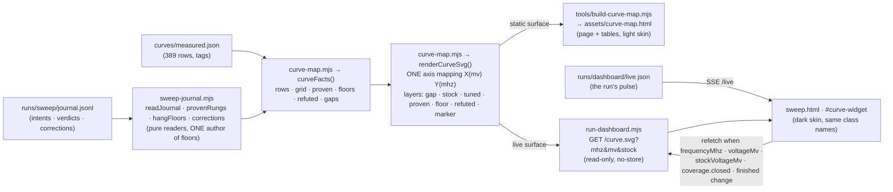
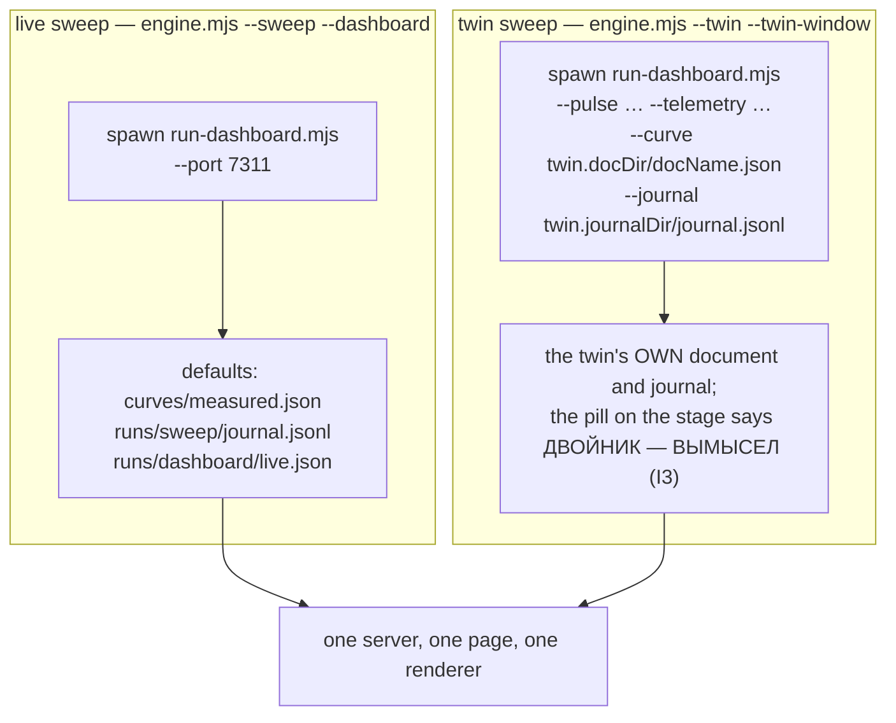
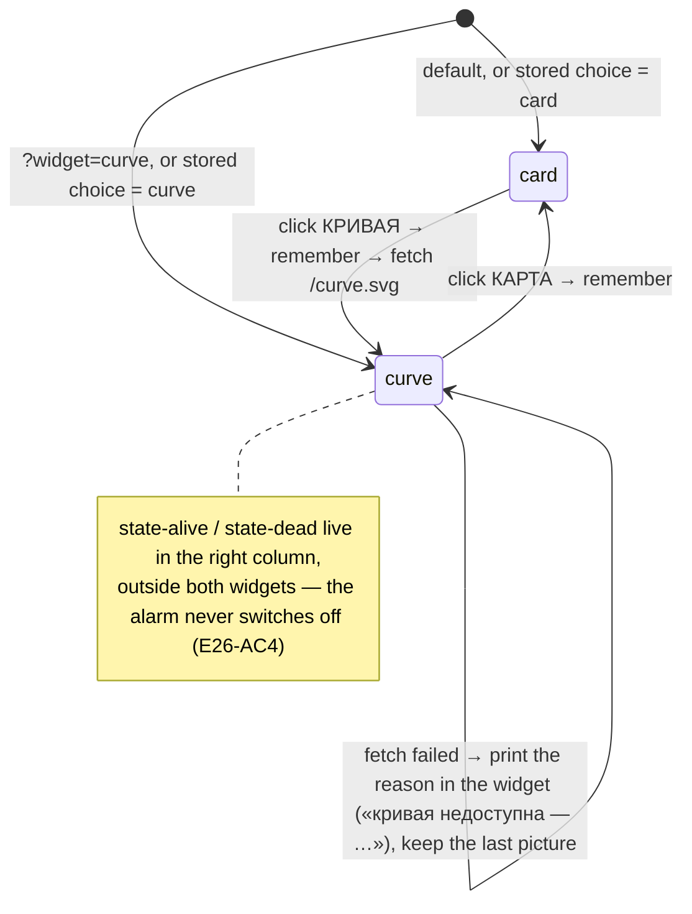

# Plan 85 — epic 26 phase 2: the V/F curve widget in the watch window (MVP)

> **Created:** 2026-09-04 (session 79; the owner's word in chat, verbatim: *«есть запрос на VF кривую
> в визуализаторе. Это тоже оффлайн. Сделаем MVP.»*)
> **Parent:** `plans/26_EPIC_curve_visualiser.md` — phase 2 «Виджет кривой в окне наблюдения
> (переключаемый)», gates `E26-AC1 · E26-AC2 · E26-AC4 · виден живой прогон` · `ideas/05` (the order)
> **Status:** 🟢 planned 2026-09-04 01:37 +03:00 · **MVP EXECUTED 2026-09-04 02:0x +03:00** — Ш1…Ш5 closed,
> Ш6 observation done (two renders looked at, live probe, hashes equal), papers at the session's
> closure · **waits for the OWNER'S EYE** (taste: letter size, the toggle's place, whether the curve
> should be the default view) — not DONE until he has looked
> **Outbound:** the owner's EYE on the built widget (taste class — the fonts of `E26-AC6`, the place
> of the toggle, whether the curve should be the default view) → chat, not an interview · phase 1 of
> the epic is recorded as CLOSED by the owner's verdicts of 2026-08-31 on the static map (see §1)

---

## 0. Goal vector and acceptance criteria

**Pain.** The owner watches a run through the watch window (`npm run dashboard`, «визуализатор») and
sees numbers; the curve itself — where stock is, what has been tuned, where the edges and the hang
floors stand, where the engine is descending RIGHT NOW — exists only as a separate static page
(`assets/curve-map.html`, rebuilt by hand). His words, 2026-08-31: *«у нас пока не хватает в
визуализаторе графика — поэтому мне нераглядно, что мы уже протюнили, где сток, где край. Я не могу
тебе подсказать, что тюнить»*.

**Where we go (Achieve).** In the watch window the card animation widget becomes SWITCHABLE with a
curve widget on the same spot (the owner's decision 2026-08-23, `plans/26`: *«переключать ВИДЖЕТ, а
не страницу: кривая встаёт на место анимации видеокарты — хорошо»*). The curve widget shows the same
five layers the static map already shows, plus the LIVE rung under test, drawn by ONE renderer that
both surfaces share. Offline work; zero GPU writes; the window stays a reader.

**Price line (интервью 017, rule 4):** ~1 session, offline, no owner at the machine needed; moves
nothing in the queue that needs him there (`Silent Cold` ceiling, `plans/84` Ш7, `P83-AC3` stay
first for the next live evening).

| # | Criterion | Scale · Meter · Target |
|---|---|---|
| P85-AC1 (= E26-AC1) | The page computes NOTHING about the curve — it is a reader of one SVG | Scale: arithmetic on curve/journal values inside `assets/dashboard/_wiring.js` · Meter: the widget receives a finished SVG from `/curve.svg`; the only numbers it forwards are three pulse fields passed through as query parameters verbatim · Target: 0 arithmetic, proved by a dashboard selftest block that greps the wiring for `voltageMv` arithmetic inside `wireCurveWidget` |
| P85-AC2 (= E26-AC2) | Emptiness is drawn as emptiness | Meter: `curve-map --selftest` on a synthetic document where every row is `stop:untouched` and the journal is empty · Target: the tuned polyline has 0 points, 0 proven dots, 0 floor dots; the stock line and the «не тронуто» band remain |
| P85-AC3 (= E26-AC4) | The alarm never leaves the screen in either widget state | Meter: dashboard selftest slices the built page · Target: `id="state-dead"` and `id="state-alive"` lie OUTSIDE `#curve-widget` and OUTSIDE `#card-widget`; mutation «move them inside» → red |
| P85-AC4 | The widget switches and the choice survives a reopen | Meter: built page carries the toggle (`#widget-card` / `#widget-curve`), the containers, `localStorage` key `kago.widget.v1`, and honours `?widget=curve`; observed by two headless renders of `--preview` (card state, curve state) looked at with eyes (EXP-0046) · Target: both renders show the intended widget; the taste verdict is the owner's |
| P85-AC5 | The live rung is on the picture | Meter: dashboard selftest issues a real HTTP request `/curve.svg?mhz=2842&mv=995&stock=1045` against sandbox fixtures · Target: the answer is `image/svg+xml`, carries `class="marker"` at that frequency and a trace from the stock voltage to the current one; the same route WITHOUT the query carries no marker |
| P85-AC6 | One renderer, two surfaces (DRY — the pair is REMOVED, not watched) | Meter: `grep -c "<polyline" tools/build-curve-map.mjs` and `grep -c "PAD.l + ((mv" -r automation-engine tools` · Target: 0 in the tool, exactly 1 definition of the axis mapping in the repository (`automation-engine/lib/curve-map.mjs`) |
| P85-AC7 | The static map tells the engine's truth about floors after `interviews/022` = B | Meter: the rebuilt `assets/curve-map.html` counts vs a direct probe of `hangFloors` / `provenRungs` / `corrections` on the production journal (taken 2026-09-04 before the rebuild, through the journal's own readers: floors **13**, proven **44**, `hung` verdicts 21 of which **6 carry a correction** — writer-crash or operator-stop, i.e. not card events — and of the 15 uncorrected the engine refutes **2** by rule B: 2872 @ 1035 and 2835 @ 1015). ✏️ The first draft of this row said «6 refuted»: that number came from a probe that ignored corrections — the very drift the old static map had (it drew corrected phantom hangs as walls) · Target: the page names 13 floors and 2 REFUTED hangs with the verb «снято движком», and no corrected hang appears at all |
| P85-AC8 | Read-only work | Meter: `sha256sum curves/measured.json runs/sweep/journal.jsonl` before and after the whole plan (I1 shape) · Target: both unchanged; `git status` shows no change to `curves/` |
| P85-AC9 | Data paths are seams, not constants (`bugs/65` shape) | Meter: dashboard selftest block — `raiseDashboard({curvePath, journalPath})` hands both to `startFn`; CLI accepts `--curve` / `--journal`; the twin branch of `engine.mjs` passes ITS sandbox document and journal · Target: the block is green and the engine source carries both flags on the twin spawn line |

Requirements sweep against the stop-word dictionary: «large fonts» is a taste criterion and is
deliberately NOT numeric here — it is `E26-AC6`, the owner's eye; every other line above has a
meter.

## 1. What is already decided — not re-litigated

1. **Voltage on X, frequency on Y** — the owner's order 2026-08-31 on the static map: *«перерисуй,
   напряжение по оси X»*; **the axis starts at 600 mV** — *«рисуй график начиная с 600 мВ»*; **our
   line is the EFFECTIVE curve** (highest frequency each voltage may serve), born from his defect
   report *«наша VF кривая ужасная, у неё не видно равномерности»* and *«не вижу нашего графика»*
   (commits `eff421b`, `40003cb`; the quotes live in the tool's own comments). This IS phase 1 of the
   epic — three corrections by the owner on real material — so phase 1's fork «which axis» is closed
   by his word and the meta-plan records it that way. What phase 1 did NOT deliver: three blind
   variants; that ceremony is dropped because the owner already judged the one composition he asked
   for.
2. **Widget, not page; no tabs** (2026-08-23, `plans/26`).
3. **The window is a reader** (`plans/20` AC6; `run-dashboard.mjs` header). The route added here
   READS two files; the journal is read only through the pure functions of `sweep-journal.mjs`
   (`readJournal` · `provenRungs` · `hangFloors` · `corrections`) — never `resumeState`, which writes
   (memory: *never-call-resumestate-during-a-live-sweep*).
4. **Occam stops at the owner's eye** (`PHILOSOPHY.md`): the widget's look is not economised —
   large axis labels, the page's own palette, a legend under the plot.

## 2. The contour, drawn once

Who feeds what on the two run paths (`bugs/65` — the window is impartial about its source):

The page, as a state machine (what the wiring does and nothing else):

## 3. Steps

Each step quotes the meta-plan line it executes: `plans/26` → «2 | Виджет кривой в окне наблюдения
(переключаемый) | E26-AC1 · E26-AC2 · E26-AC4 · виден живой прогон».

- [x] **Ш1 — the shared renderer.** ✅ 2026-09-04 (`curvemap` 25 blocks). New `automation-engine/lib/curve-map.mjs`: `curveFacts({doc,
      records})` (rows sorted, touched/untouched, gaps, `proven` = `provenRungs`, `floors` =
      `hangFloors`, `refuted` = highest raw hang per frequency not honoured as a floor and not
      corrected), `renderCurveSvg(facts, {size, marker, xCaption, summary})` — the ONE axis
      mapping; the effective («наша») line is the whole document once anything is measured and
      empty on an untouched document (E26-AC2); `--selftest` with the mutation addressees named before the run
      (empty document → no tuned points · order-independence of the effective line · refuted ≠ floor
      · marker on/off · floors come from `hangFloors`, not from a local re-implementation). Anchors
      E26-AC1, E26-AC2.
- [x] **Ш2 — the static map moves onto the renderer.** ✅ 2026-09-04 — stock and tuned polylines byte-identical to HEAD, grid identical; what changed: 13 floors from `hangFloors` (was 17 raw), 2 refuted rings (was 6 «contradictions», 4 of them corrected phantom hangs). `tools/build-curve-map.mjs` keeps its page,
      legend and tables and stops drawing; the «полы выше доказанного» table becomes «зависания,
      снятые движком» with the truthful verb (`interviews/022` = B, 2026-08-31). Rebuild
      `assets/curve-map.html`; the golden is a CONTROLLED diff explained by P85-AC7's numbers (13 ·
      6 · 44) and by the touched-only line — nothing else may change.
- [x] **Ш3 — the route and its seams.** ✅ 2026-09-04 — plus the bench path: `bench-run.mjs` now saves the rehearsal's document into `runs/bench/measured.json` and prints the window command with its paths (found while checking E26-AC3 on every path, not only the twin's). `run-dashboard.mjs`: `serve({curvePath, journalPath})` →
      `GET /curve.svg` (200 `image/svg+xml`, `no-store`; 404 with a Russian reason when the document
      is absent — honesty, not a stack trace); `raiseDashboard` plumbs both paths; CLI `--curve` /
      `--journal`; `engine.mjs` twin branch passes its sandbox document and journal. Anchors
      «виден живой прогон», P85-AC9.
- [x] **Ш4 — the page.** ✅ 2026-09-04 — and a defect of the PREVIEW found by the first render: since 2026-08-22 `--preview` injected the pulse into the sound engine's `disconnect();` (the first `connect();` substring in the page), so every preview since then showed «НЕТ СВЯЗИ» and empty tiles; the anchor is now the wiring's own tail. `tools/build-dashboard-page.mjs`: wrap the card SVG in `#card-widget`, add
      the toggle (top-left of the stage, mirror of the «ВИРТУАЛЬНАЯ» pill) and `#curve-widget`
      (SVG holder + legend + note), the dark skin for the renderer's class names using the page's
      own palette; `_wiring.js`: `wireCurveWidget()` — toggle, memory, `?widget=`, refetch rules,
      failure text. `--preview` additionally inlines a rendered SVG so a `file://` render shows the
      widget (`--preview --widget curve`). The accepted mockup `homeworks/03` is NOT edited (canon).
      Anchors E26-AC4.
- [x] **Ш5 — the checks land with the work.** ✅ 2026-09-04 — `curvemap` 25 · `dashboard` 76 → 87 · battery 48 suites, 0 red, 2478 blocks · `npm run check` green · **mutations executed at the judge pass (02:24), each reddening its named blocks and only them: M1b · M2 · M3 · M5 (curve map) · CH · CJ (window); the other named addressees (M4 · M6 · M7 · CA…CG · CI · CK) are named but NOT yet executed — a debt, not a claim.** New battery suite `curvemap` (`npm run curvemap --
      --selftest`), new blocks in `dashboard --selftest` (route with/without marker · 404 reason ·
      page structure · P85-AC3 · P85-AC1 grep · P85-AC9 plumbing); `npm run check` (freshness gate of
      the built page, entry guard); `npm run selftest:all`. Mutations: each new block names its
      addressee and is reddened once.
- [x] **Ш6 — verification by observation, then the papers.** ✅ observation 2026-09-04 02:0x: `runs/dashboard/preview-card.png` and `preview-curve.png` looked at (three defects found by eye and fixed: stub landed in the sound engine, marker label over the counts line, «МГц» over «3000», axis caption cut); live probe of `/curve.svg` from production files 61 ms / 16 KB with 44 · 13 · 2; hashes of the document and the journal equal before/after. Papers — at the session's soft closure. Two headless renders of the preview
      (card · curve) opened and LOOKED at; one live probe of `/curve.svg` served from the production
      files by a real server on an ephemeral port (read-only; counts of layers printed); sha check
      P85-AC8. Then: `plans/26` status (phase 1 closed by the owner's word, phase 2 MVP done and
      waiting for his eye), `ideas/05` status, `STATUS.md` (delivery line, session block, the table
      «Что работает на диске»), the two maps, `EXPERIENCE.md` if a lesson was paid for; commit.

## 4. Verification — by which artifacts, and where they live

| Claim | Artifact | Path |
|---|---|---|
| facts and geometry are right; emptiness is empty; floors are the engine's | `curve-map --selftest` (new suite `curvemap`) | `automation-engine/lib/curve-map.mjs` |
| the route serves the picture, the marker, and honest 404s; the page is structured as promised; the paths are plumbed | new blocks in `dashboard --selftest` | `automation-engine/lib/run-dashboard.mjs` |
| the built page is fresh and the tools carry their entry guards | `npm run check` | `tools/check.mjs` |
| the static map did not drift semantically | rebuilt page vs the numbers of P85-AC7 | `assets/curve-map.html` |
| it looks like a curve widget to a human | two headless renders looked at; then the owner's eye | `runs/dashboard/preview-card.png` · `runs/dashboard/preview-curve.png` (run artifacts, not history) |
| the REAL command path serves it, not only the library | ✅ 2026-09-04 02:14 — `npm run dashboard -- --no-window --port 7311` raised in the background; `/health` 200, `/` 206 KB with the widget markup, `/curve.svg` 200 · 18 KB · 39 ms, with the query: 1 marker · 1 trace · 2 refuted rings; closed by `--close` (pid named, port freed) | `automation-engine/lib/run-dashboard.mjs` (`main`) |

## 5. Risks, tiered (Murphy)

- **(a) The page's `svg{width:100%}` rule and the seven-segment font styling leak into the curve
  SVG** — the mockup styles `svg` and `.seg` globally. Reaction: the renderer emits only its own
  class names, and the widget's skin is scoped under `#curve-widget`; the render check (Ш6) is what
  catches a leak, not reading the CSS.
- **(a) Two surfaces, two skins, one renderer — the static page's look changes by accident.**
  Reaction: the static page's CSS is left as is; the renderer's default geometry reproduces the
  current picture; the diff of `assets/curve-map.html` is read line by line before commit (git
  hygiene rule).
- **(b) The journal is 580 KB and the route parses it on every request.** Reaction: the widget
  fetches only on the named pulse changes (about once per rung, ~15 s) and on show; measured cost
  printed by the live probe in Ш6; if it ever matters, cache by mtime — not now (Occam).
- **(b) On the twin path the document file may not exist yet when the window opens.** Reaction:
  the route answers 404 with the reason; the widget prints it and retries on the next pulse change
  — the twin's first `closed` event rewrites the document and the picture appears.
- **(c) The owner wants the curve as the DEFAULT view.** Cheap to reverse: one constant in the
  wiring; asked in the report, not decided here.

## 6. Decisions made without the owner (to be settled at closure)

- default view stays the accepted card animation; the curve is one click away and remembered;
- the toggle sits top-left ON the stage (the pill's mirror), not inside the МЕНЮ dropdown — the
  widget switch is a thing you do while glancing at the picture, the menu is for settings;
- the effective line is the WHOLE document once anything is measured (what lands on the card: our
  measurement where it beats stock, stock elsewhere — never to the right of the stock line), and no
  line at all on a document nobody touched. ✏️ The first edition took touched rows only, reading
  E26-AC2 literally; the rebuilt static page showed the defect — the green line ran right of the grey
  wherever a factory row outranks the measured ones — and the rule was corrected the same hour;
- a hang the engine no longer honours is drawn as a HOLLOW red ring and named «снято движком» — the
  fact stays visible, the verb is truthful;
- the live marker is a ring at (voltage, frequency) with a horizontal trace back to the frequency's
  stock voltage — the descent, seen.
