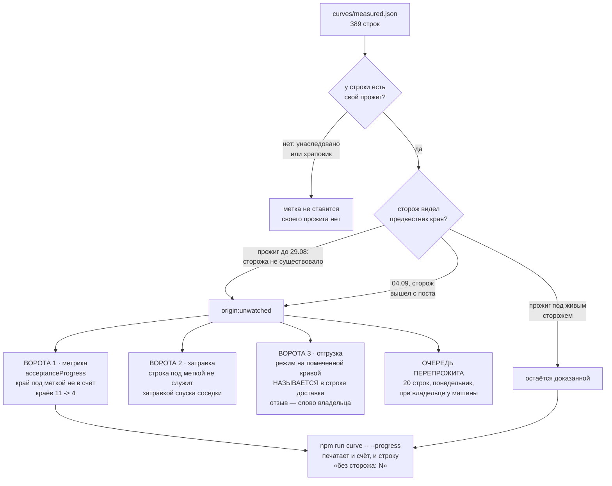

# План 87 — строки, прожжённые без сторожа на посту, получают метку и перестают быть доказанными

> **Родитель:** `interviews/026` Q1 = B и Q4 = A (владелец, 2026-09-04 19:37 и 19:54) ·
> `GOAL.md` → «🛑 ЛАГ ТЕЛЕМЕТРИИ — ЭТО ОТКАЗ, А НЕ PASS» (слово владельца 2026-08-26) ·
> `curves/measured.json` · `bugs/101` (пять ступеней без защиты 04.09)
> **Слово владельца дословно:** Q1 — *«оракул, который корректность расчетов смотрел — не видел
> предсказание края. Сейчас он стал лучше, когда он смотрит на лаги телеметрии. Перемерить то, что
> было намерено по старому оракулу»*; Q4 — *«все перемерить. Но в понедельник. не сегодня»*.
> **Тяжесть:** обычная задача, один операционный план (`/plan-task`); эпика не открывает.

---

## 1. Вектор цели

Документ кривой перестаёт называть доказанным то, что снято прибором, который не видел предвестника
края. Метка ставится СЕГОДНЯ (офлайн, карты не касается), перепрожиг — **в понедельник**, при
владельце у машины, по его прямому слову «не сегодня».

**Граница разделения — проверяемая дата, а не мнение:** прибор научился видеть лаг телеметрии
**2026-08-29**, коммит `8409546` («пульс сэмплера доехал до вердикта ступени — ступор системы =
ЗАВИС, край записывается», `bugs/61` DONE).

## 2. Что именно метится — замер, а не оценка

| группа | сколько | почему под меткой |
|---|---|---|
| строки со своим прожигом до 29.08 | **18 частот** | сторожа, видящего предвестник, тогда не существовало |
| 2692 и 2685 МГц (04.09) | **2 строки** | сторож существовал, но **вышел с поста** (код 2) — Q1 |
| **всего под меткой** | **20 строк** | из них краёв 7, не-краёв 13 |

**Последствие для метрики приёмки: краёв 11 → 4 из 389.** Под меткой оказываются 2835, 2820, 2812,
2805, 2797, 2790 и 2692 МГц; остаются доказанными **2887, 2880, 2842, 2827 МГц** — все сняты 04.09
новым прибором при живом стороже.

⚠️ **В `interviews/026` Q4 таблица обещала «11 → 5». Это была моя ошибка счёта:** она учитывала
шесть краёв старого прибора и не учитывала, что 2692 МГц — тоже край и попадает под ответ на Q1.
Верное число — **4**, и оно вычислено скриптом, а не в уме.

## 3. Почему НОВАЯ метка, а не существующий слой «перемерить»

В проекте уже есть слой `remeasure` (`curve-map.mjs`, `plans/86`), и он означает **другой факт**:
записи противоречат друг другу — зафиксировано зависание, которое движок не признаёт полом. Он
ВЫЧИСЛЯЕТСЯ на лету из журнала, в документе не хранится и к возрасту прибора отношения не имеет.

Слить их одним словом — завести ровно ту пару «две правды под одним именем», за которую проект уже
платил (`bugs/40`, `interviews/008`, `interviews/013`). Поэтому: новый тег
**`origin:unwatched`** — «напряжение прожжено, когда сторож, видящий предвестник края, не был на
посту». Одна метка покрывает оба маршрута (сторожа не существовало · сторож вышел), потому что для
владельца это ОДИН факт: числу верить нельзя, пока его не перемерят под защитой.

Имя тега — внутренний идентификатор, его выбирает агент (`AGENT_GUIDE.md` → THE NAMING RULE); на
экране владельца он читается словами **«снято без сторожа на посту»**.

## 4. Механизм

**Три ворот, а не одни.** Метка, которая только красит документ, — украшение: завтра её строка станет
затравкой соседнего спуска, и непроверенное число расползётся. Поэтому метка ОТКЛЮЧАЕТ строку от
трёх мест сразу, и каждое отключение проверяется отдельно.

## 5. Критерии приёмки

| № | критерий | проверка (наблюдением) |
|---|---|---|
| P87-AC1 | Тег `origin:unwatched` есть в словаре и перечислим; словарь по-прежнему закрыт | `curve-store.mjs --selftest`: неизвестный тег отвергается, новый принимается |
| P87-AC2 | Ровно 20 строк несут метку: 18 со своим прожигом до 29.08 плюс 2692 и 2685 | скрипт печатает 20 и поимённо; `git diff` документа показывает ровно 20 изменённых строк |
| P87-AC3 | Метрика приёмки печатает **краёв 4/389** и отдельной строкой «без сторожа: 7» | `npm run curve -- --progress` |
| P87-AC4 | Строка под меткой НЕ служит затравкой спуска соседки | selftest движка: `seedFor` на частоте, соседка которой под меткой, возвращает сток, а не её напряжение |
| P87-AC5 | ✏️ **ПЕРЕПИСАН ДО КОДА, см. §9.** Отгруженный режим, опирающийся на помеченную кривую, **НАЗЫВАЕТСЯ** строкой доставки; счёт отгрузки не трогается, применение не ломается | selftest: `restingOnUnwatched` содержит режим, `modes.shipped` не изменился, строка «опираются на помеченную кривую: optimised» напечатана |
| P87-AC6 | Очередь перепрожига печатается одной командой и содержит 20 частот | `npm run curve -- --unwatched` |
| P87-AC7 | Метка СНИМАЕТСЯ перепрожигом под живым сторожем, а не руками | selftest: закрытие частоты при живом стороже убирает тег; при вышедшем — оставляет |

## 6. Шаги

- [x] **Ш1.** Тег `origin:unwatched` в `CURVE_TAGS` + разбор в комментарии (оба маршрута, дата 29.08,
      коммит `8409546`). Словарь остаётся закрытым и перечислимым.
- [x] **Ш2.** `acceptanceProgress`: край под меткой выходит из `edges.total` в отдельный счёт
      `edges.unwatched`; `renderDeliveryLine` печатает его строкой. **Сначала сторож на числе 4,
      потом код** — иначе «11 → 4» проверить будет нечем.
- [x] **Ш3.** Ворота затравки (`engine.seedFor`) — строка под меткой не затравка.
- [x] **Ш4.** Ворота отгрузки (квалификация профиля) — вектор на метке не проходит.
- [x] **Ш5.** Простановка метки: скрипт со сторожем границ (не руками, EXP-0019 — числа из головы),
      `git diff` проверяется ДО коммита.
- [x] **Ш6.** `npm run curve -- --unwatched` — очередь перепрожига для понедельника.
- [x] **Ш7.** Снятие метки перепрожигом (AC7) + самопроверки всех ворот.

## 7. Риски, названы вслух (Мёрфи)

1. **Метка расползётся на унаследованные строки.** Соседки, взявшие напряжение от помеченной, своего
   прожига не имеют и метку НЕ получают — но их число происходит от помеченного. **Названо и НЕ
   лечится в этом плане:** сначала перепрожиг 20 строк, потом видно, сдвинулись ли соседки.
2. **Число 4 обидное, и его захочется «не ронять».** Ровно этого владелец и потребовал; счёт,
   который врёт вверх, — тот самый класс, за который он назвал документ «ложью и пиздежом»
   (`bugs/62`). Падение метрики — исполнение приказа, а не регресс.
3. **Ш5 может задеть лишние строки.** Лечится тем же способом, что и стрижки STATUS: скрипт печатает
   поимённый список ДО записи, `git diff` сверяется по числу 20.
4. **Объём приказа.** Владелец выбрал вариант «перемерить все» и сказал «все перемерить». Вариант A
   в таблице называл шесть краёв; метку получают 20 строк, потому что его ПРАВИЛО («что намерено
   старым оракулом») шире его же примера. **Расширение названо здесь явно** и отменяется одной
   строкой в чат.

## 8. Чего этот план НЕ делает

- **Не жжёт ничего.** Карты не касается вовсе; перепрожиг — понедельник, при владельце, его словом.
- Не трогает слой `remeasure` карты кривой (`plans/86`) — это другой факт, см. §3.
- Не решает, что делать с соседками помеченных строк (риск 1).
- Не переносит требование владельца из Q3 («автоматически различать реальное зависание от медленного
  запуска, возможно перемерять точку несколько раз на разных напряжениях») — это ОТДЕЛЬНАЯ работа,
  заводится своим документом.

## 9. ИСПОЛНЕНО 2026-09-04 20:2x — И ОДИН ШАГ ИСПОЛНЕН НЕ ТАК, КАК БЫЛ НАПИСАН

`FORK:` варианты — (A) ворота на пути ПРИМЕНЕНИЯ профиля, как требовал план · (B) метрика НАЗЫВАЕТ зависимость, применение не трогается · (C) ничего не делать · **цена ошибки:** A ломает рабочий ярлык владельца на его столе (`optimised` несёт `qualified: true` и ссылается на размечаемую кривую), C оставляет отгруженным режим на непроверенных числах · **на кого сослались:** `bugs/72` + [[EXP-0193]] (оплаченный этим проектом класс «сторож, ставший стеной»), не собственное рассуждение. Взят B.

**Ш4 переписан ДО кода, а не после.** План говорил «вектор на метке не проходит» — то есть ворота
на пути ПРИМЕНЕНИЯ профиля. Проверка перед реализацией показала цену: `optimised` несёт
`qualified: true` и ссылается ровно на размечаемую кривую, значит ворота отказали бы **рабочему
ярлыку владельца на его столе.** Это в точности класс `bugs/72` · [[EXP-0193]] — сторож,
превратившийся в стену, которая останавливает работу, ради защиты которой он поставлен.

Сделана честная половина: метрика **НАЗЫВАЕТ** зависимость (`отгружённые режимы опираются на
помеченную кривую: optimised`), счёт отгрузки не трогает, применение не ломает. **Отзыв принятого
режима — слово владельца, а не решение счётчика**, и потому вынесен ему, а не сделан молча.

**Что получилось на выходе:**

| | было | стало |
|---|---|---|
| краёв в приёмке | 11/389 | **4/389** (2887 · 2880 · 2842 · 2827 МГц) |
| под меткой | — | **20 строк**, из них 7 краёв |
| зелёных блоков батареи | 2501 | **2514**, красных 0 |
| наборов | 48 | 48 |

Диф документа проверен ДО коммита: **ровно 20 строк** получили тег, и **ни одно число не
изменилось** — ни `voltageMv`, ни `mhz`, ни `provenBy`, ни `stockVoltageMv` (сверено грепом по
дифу: совпадений ноль). Копия до правки — `runs/measured.before-unwatched-marking.json`.

**Ш7 сделан осторожнее, чем требовал критерий.** Метку снимает только явное
`watchOnPost: true`; `false` её ставит; **`null` — «никто не сказал» — переносит как есть.** Так
вышло потому, что состояния «сторож на посту» в движке ещё НЕТ: оно родится вместе с полуоткрытым
окном (ОТДЕЛЬНЫЙ ПЛАН полуоткрытого окна (ещё не написан; `plans/81` Ш7 ЗАКРЫТ 31.08 — ссылка на него была ошибкой), решение Q2 этой же сессии). Умолчание `true` оставило бы дыру — любой
перепрожиг молча стирал бы метку, включая сделанный без защиты.

🔴 **НАЗВАННЫЙ ДОЛГ, ЕДИНСТВЕННЫЙ:** движок пока НЕ передаёт `watchOnPost` в `closePoint`, то есть
работает на осторожном умолчании. Проводка делается вместе с полуоткрытым окном в ОТДЕЛЬНЫЙ ПЛАН полуоткрытого окна (ещё не написан; `plans/81` Ш7 ЗАКРЫТ 31.08 — ссылка на него была ошибкой) —
раньше нечего передавать. До неё перепрожиг метку не снимет сам, и это безопасная сторона.

**Статус:** ✅ исполнен 2026-09-04 20:2x, кроме названного долга проводки. Карта не тронута,
записей в GPU ноль. Перепрожиг — понедельник, при владельце у машины.
