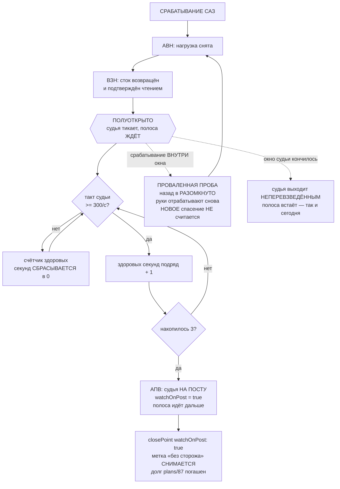

# План 88 — судья возвращается на пост через ПОЛУОТКРЫТОЕ окно, а не по одной расписке

> **Родитель:** `interviews/026` Q2 — **вопрос СНЯТ с владельца и решён агентом** по его же признаку
> (варианты A и B для него неотличимы, EXP-0214); политику он дал дважды — 30.08 («зависание — наш
> провал») и 04.09 Q1 («перемерить то, что намерено без сторожа») · `researches/33` §4b (замер) ·
> `bugs/101` (шторм 04.09: шесть срабатываний за 21 с, пять ступеней сожжено без защиты) ·
> `plans/87` (метка «без сторожа», её единственный долг гасится здесь)
> **Тяжесть:** обычная задача, один операционный план. Карта НЕ НУЖНА — всё на двойнике.
> **Записей в GPU: НОЛЬ.** Приёмка живьём — при владельце, не раньше 08.09.

---

## 1. Вектор цели

После спасения судья возвращается на пост **не по одной расписке, а доказав, что машина здорова**.
Полоса, которой разрешено идти дальше, идёт дальше по здоровой машине — а не по той, что заикается.

**Что это покупает на числах 04.09:** прогон возобновился бы на 3 с позже вместо того, чтобы сжечь
**пять ступеней вслепую** и подарить документу две строки, которые сегодня пришлось пометить.

## 2. Что сегодня и почему это не работает

Сегодня условие возврата одно — **«сток подтверждён чтением»** (`fuse.mjs` → `awaitRearm` → `poll`,
`rearmDecision` вернула `confirmed`). Замер по всем протоколам предохранителя на диске:

| перевзведение | сколько | что было дальше |
|---|---|---|
| в БОЛЬНУЮ машину | **10 из 10** | следующее срабатывание через **0,06 с** — ровно один период сторожа |
| в ЗДОРОВУЮ машину | 1 | пост держался **319 с** |

**Сегодняшний критерий не отличил больную машину от здоровой ни разу из одиннадцати.**

## 3. 🔴 ПРОБА, КОТОРУЮ ЕДВА НЕ ВЗЯЛИ, И ПОЧЕМУ ОНА БЫ ПОВЕСИЛА ПРОГОН

Разведка `researches/33` §4a выбрала пробой **тишину ударов живости** и измерила её. Затем был
прочитан код — и оказалось, что **этой пробы в охраняемом состоянии не существует**:

```js
// fuse.mjs:825
if (buf[0] === 0x01) { lastBeatMs = now; beats += 1; }   // удар шлёт ВСАДНИК ПРОЖИГА
```

Полуоткрытое состояние наступает ПОСЛЕ того, как рука 1 убила прожиг: нагрузки нет → ударов нет →
проба не проходит НИКОГДА. Окно, ждущее здоровых ударов при снятой нагрузке, **не вернуло бы судью
на пост вовсе**, и полоса встала бы навсегда на первом же спасении. Это стена, а не сторож — класс
`bugs/72` · EXP-0193, за который проект уже платил.

**Поймано чтением кода ДО написания плана.** Замер был сделан первым, код прочитан вторым — порядок
неверный, и урок из этого дороже самого числа.

## 4. Проба, которая переживает снятие нагрузки, — СОБСТВЕННЫЙ ТАКТ СУДЬИ

Цикл судьи тикает и без прожига. Перемерено по тем же 716 секундам (`researches/33` §4b):

| | здоровая машина | больная |
|---|---|---|
| такт судьи, тактов/с | **356 … 442** (676 секунд) | 4 … **261** (40 секунд) |
| разрыв между классами | \-- | **95 тактов/с, и в нём нет ни одной точки из 716** |

**Уставка 300 тактов/с** стоит внутри пустого разрыва. Это не «выбранное число» в смысле `bugs/73`:
**любое значение от 262 до 355 даёт то же самое разбиение измеренных данных**. Уставка 100 была
опробована первой и **отвергнута замером** — она оставляла три «здоровые» секунды (100, 102, 107)
внутри больного эпизода, то есть резала распределение, а не разрыв.

**Длина окна — 3 здоровые секунды подряд.** Основание: шесть непрерывных больных эпизодов
(0,0 с · 11,3 · 24,0 · 0,0 · 0,0 · 14,8), и **ни в одном нет ни одной здоровой секунды**. Значит окну
достаточно быть больше нуля; **запас от 1 до 3 секунд — МОЙ выбор, и он назван моим**, а не
измеренным: он стоит прогону 3 секунды на спасение против пяти ступеней, сожжённых вслепую.


## 4a. 🔴 ВТОРАЯ НАХОДКА ТОГО ЖЕ КЛАССА, И ОНА МЕНЯЕТ Ш3

Проба выбрана верно — такт судьи переживает снятие нагрузки. Но чтение `runJudge` перед проводкой
показало вторую половину той же ошибки: **во время ожидания перевзведения такт судьи ОСТАНОВЛЕН.**

```js
// fuse.mjs — finish(true) внутри awaitRearm:
if (ok) { rearmsDone += 1; resetForRearm(now); ...; setTimeout(tick, JUDGE_TICK_MS); }
```

Цикл такта возобновляется ТОЛЬКО на успешном перевзведении. Между срабатыванием и возвратом на пост
`tick` не запланирован вовсе, значит `aliveTicks` не растёт и мерить нечего. Полуоткрытое окно,
написанное поверх этой посылки, ждало бы такта, которого никто не производит, — и это ровно та же
стена, что и в §3, только этажом ниже.

**Лечение — и оно уже существует в модуле, изобретать нечего.** Судья умеет жить НЕВЗВЕДЁННЫМ:
`judgeLiveness` с `armNMs: null` наблюдает и записывает, но не срабатывает (доказано блоком
самопроверки «невзведённый не трипает»). Полуоткрытое состояние — это буквально оно: **такт идёт,
строка жизни пишется, срабатывание невозможно.** Что и означает «half-open» в отрасли: контур
наблюдает пробу, не пропуская нагрузку.

**Ш3 переписан:** ожидание перевзведения не останавливает такт, а переводит судью в НАБЛЮДЕНИЕ
(`armNMs = null`); после подтверждения стока начинается счёт здоровых окон; по накоплении окна
судья ВЗВОДИТСЯ обратно и полоса идёт дальше. Это правка ядра цикла самого ответственного модуля
проекта, поэтому она делается отдельным шагом с репетицией смерти в приёмке (AC7), а не дописывается
в конце длинной сессии.

⚠️ **ОБЩЕЕ У ОБЕИХ НАХОДОК, И ЭТО ДОРОЖЕ ОБЕИХ:** дважды за один день замер сигнала был сделан
РАНЬШЕ, чем проверено, что сигнал вообще существует в том состоянии, ради которого меришь. Оба раза
ловило чтение кода перед написанием плана, ни разу — сам замер. Урок вынесен в `EXPERIENCE.md`.


## 4b. ЧЕТЫРЕ ОГРАНИЧЕНИЯ ПРОВОДКИ, СНЯТЫЕ ЧТЕНИЕМ 2026-09-04 22:2x

Ш3 не начат намеренно, но его конструкция ВЫВЕДЕНА и записана здесь, чтобы следующий заход не
выводил её заново. Каждое ограничение найдено чтением `runJudge`, и каждое сломало бы проводку,
написанную «в лоб».

**(1) Такт обязан идти ВЕСЬ рескью, а не только после расписки.** Сегодня у места ожидания стоит
прямой комментарий: *«дальше судья намеренно не тикает, и дыру во времени объясняет ПАРА строк
`intent` → `rearm`»*. Это решение отменяется — но оно ОСОЗНАННОЕ, и комментарий надо переписать, а
не молча обойти. Взамен получаем лучшую улику: строка жизни покрывает и само спасение, а пара
`intent` → `rearm` никуда не девается.

**(2) `resetForRearm` зовётся при ВЗВЕДЕНИИ, а не при входе в полуоткрытое.** Он ставит
`lastBeatMs = now`. Позови его на входе — и к моменту взведения он будет протухшим на всю длину
окна: первый же взведённый такт увидит тишину в 3 секунды и сработает мгновенно. Спасение,
порождающее спасение, — тот самый шторм 04.09, только сделанный своими руками.

**(3) `finish(true)` НЕ должен перепланировать такт, если цикл уже идёт.** Сегодня он делает
`setTimeout(tick, JUDGE_TICK_MS)`. При живом цикле это заводит ВТОРОЙ цикл такта в том же процессе —
два судьи на одном журнале, удвоенный `aliveTicks` и удвоенные шансы срабатывания. Дефект, который
выглядел бы как «машина стала здоровее» (такт вырос вдвое) — то есть врал бы в безопасную сторону.

**(4) Длина окна ОБЯЗАНА быть параметром `runJudge`, а не только константой модуля.** Фикстура
`fuse.mjs:1665` («две тишины, а не одна») гоняет судью с `seconds: 2`, а окно строки жизни — 1000 мс.
С окном в 3 здоровые секунды этот прогон не успел бы перевзвестись НИКОГДА, и зелёный блок,
доказывающий повторное срабатывание, стал бы красным не потому, что механизм плох. Значит:
`healthySeconds` приходит параметром с умолчанием `REARM_HEALTHY_SECONDS`, фикстуры передают 1.

⚠️ **И это, а не длина текста, причина не писать Ш3 в конце длинной сессии:** четыре ограничения в
одном цикле, и три из четырёх врут в сторону «выглядит рабочим». Проводка делается со свежей
головой и заканчивается репетицией смерти на трёх профилях (AC7).
## 5. Механизм



**«Проваленная проба не считается новым спасением»** — прямо из разведки отрасли (Polly: провалённая
проба возвращает контур в «разомкнуто» немедленно). Иначе шторм из шести срабатываний за 21 с
израсходовал бы лимит спасений, которого владелец и так не захотел (`interviews/024` = E).

## 6. Критерии приёмки

| № | критерий | проверка (наблюдением) |
|---|---|---|
| P88-AC1 | Судья не встаёт на пост, пока такт не был здоров окно подряд | selftest `fuse`: подставной ряд тактов `[400, 100, 400, 400, 400]` → пост занят только на 5-м; `[400,400,400]` → на 3-м |
| P88-AC2 | Одна больная секунда СБРАСЫВАЕТ накопление, а не уменьшает | ряд `[400,400,100,400,400]` → пост НЕ занят (после сброса накоплено только 2) |
| P88-AC3 | Срабатывание внутри окна = проваленная проба: руки отрабатывают, счёт спасений НЕ растёт | selftest: `tripsFired` до и после равны; в журнале строка `rearm-refused` с причиной «проба провалена» |
| P88-AC4 | Машина, не выздоровевшая до конца окна судьи, оставляет его НЕПЕРЕВЗВЕДЁННЫМ | поведение сегодняшнего дедлайна не тронуто; блок краснеет, если полоса пошла дальше |
| P88-AC5 | Уставка и длина окна названы ОДНИМ местом и печатаются в журнал | `fuse.jsonl` строка `rearm` несёт `ticksPerSec` и `healthySeconds` |
| P88-AC6 | Движок передаёт `watchOnPost` в `closePoint` — **долг `plans/87` погашен** | selftest движка: закрытие после спасения без окна метку СТАВИТ, после полного окна — СНИМАЕТ |
| P88-AC7 | Репетиция смерти зелёная на всех трёх профилях ПОСЛЕ правки | `--rehearse-death <три профиля>`: код 0, красных 0 (реестр пар, `bugs/104`) |
| P88-AC8 | МУТАЦИЯ: снять требование окна → P88-AC1 краснеет | мутация в selftest |

## 7. Шаги

- [x] **Ш1.** ✅ ИСПОЛНЕН 2026-09-04 22:1x — Чистая функция `halfOpenGate({ ticksPerSec, healthyNeeded, state })` — накопитель здоровых
      секунд со сбросом. Сторожа AC1/AC2 пишутся ДО неё и обязаны покраснеть.
- [x] **Ш2.** ✅ ИСПОЛНЕН 2026-09-04 22:1x — Уставки `JUDGE_HEALTHY_TICKS_PER_SEC = 300` и `REARM_HEALTHY_SECONDS = 3` — одним местом,
      с разбором в комментарии (пустой разрыв 261→356, шесть эпизодов без здоровых секунд).
- [ ] **Ш3.** ✏️ ПЕРЕПИСАН, см. §4a. Ожидание перевзведения НЕ останавливает такт, а переводит судью в
      наблюдение (`armNMs = null`); `confirmed` больше не завершает ожидание — открывает полуоткрытое
      состояние. `finish(true)` зовётся только по накоплению окна.
- [ ] **Ш4.** Проваленная проба (AC3): срабатывание внутри окна возвращает в «разомкнуто», счёт спасений
      не растёт.
- [ ] **Ш5.** `watchOnPost` наружу: судья публикует состояние, движок передаёт его в `closePoint` (AC6).
- [ ] **Ш6.** Репетиция смерти на всех трёх профилях (AC7) + мутация AC8.

## 8. Риски, названы вслух

1. **Окно превратится в стену на медленной машине.** Дедлайн окна судьи старше окна здоровья и уже
   работает — машина, не выздоровевшая, оставляет судью неперевзведённым, и полоса встаёт. Это
   сегодняшнее поведение, оно НЕ трогается (AC4).
2. **Такт судьи зависит от нагрузки на CPU, а не только от здоровья машины.** Замер снят на прогонах,
   где прожиг ГРУЗИЛ машину, и здоровый такт всё равно держался 356…442. Но полуоткрытое состояние
   наступает при СНЯТОЙ нагрузке — там такт может быть только выше. Осторожная сторона.
3. **Уставка 300 снята на шести эпизодах, а не на шестидесяти.** Названо: это малая выборка. Лечение —
   не угадывать шире, а печатать `ticksPerSec` в журнал каждого перевзведения (AC5), чтобы выборка
   росла сама.

## 9. Чего этот план НЕ делает

- Не трогает вход 1 (тишина ударов прожига): там нагрузка ЖИВА и проба существует.
- Не меняет решение владельца «сколько угодно спасений» — окно задерживает возврат, а не запрещает его.
- Не переносит требование Q3 (различать зависание от медленного запуска) — отдельная работа.

**Статус:** 🟡 Ш1 и Ш2 исполнены 2026-09-04 22:1x (набор `fuse` 82 → 91 блок, 0 красных); Ш3 переписан
по находке §4a и НЕ начат — это правка ядра цикла судьи, ей нужна своя сессия и репетиция смерти.
Карта не нужна ни на одном шаге.
