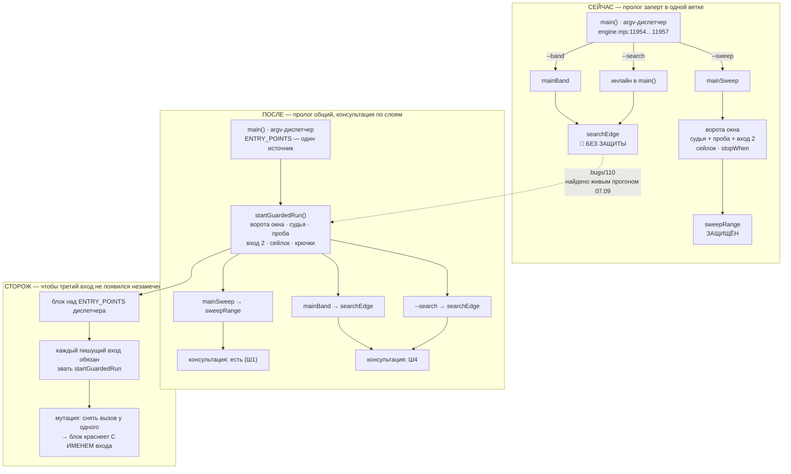

# План 89 — ОДИН пролог защиты на все точки входа, пишущие в карту

> **Создан:** 2026-09-07 (сессия 86, дневной цикл) · **Родитель:** `bugs/110` ·
> **Опора:** `EXPERIENCE.md:1899` (общая форма класса) · `EXPERIENCE.md:1489` (именованный список
> точек входа уже существует — `tools/tidy.mjs` → `MARKERS`) · `plans/52` risk (d) ·
> `interviews/017` Q1 = A (исключение «блокер ближайшего живого прогона» выполнено буквально)
> **Тест тяжести:** признак один из пяти (≥3 подсистемы). Задача ОБЫЧНАЯ — один операционный план,
> без лестницы эпика.

## Что установлено чтением ДО плана, а не предположено

| точка входа | пишет в карту | судья + проба | ворота окна | консультируется с судьёй |
|---|---|---|---|---|
| `--sweep` → `mainSweep` (`engine.mjs:10803`) | да | **есть** | **есть** | **да** — `stopWhen`, `fuseTripsFn`, `watchOnPostFn` в `sweepRange` |
| `--band` → `mainBand` (`engine.mjs:10589…10802`) | да (`searchEdge` + `vf.runStep`) | **НЕТ** | **НЕТ** | нет — у `searchEdge` крючков нет вовсе |
| `--search` → инлайн в `main()` (`engine.mjs:11957…12106`) | да (`searchEdge` + `vf.runStep`) | **НЕТ** | **НЕТ** | нет — то же |

Список входов взят НЕ из головы: `tools/tidy.mjs:115` уже держит его положительным и полным
(`MARKERS`: `--sweep`, `--band`, `--search`, плюс приборы вне движка) — с комментарием, который
здесь читается как приговор: *«забытая здесь команда — это команда, которую уборка однажды убьёт
посреди записи в GPU»*. Уборка список знала. Защита — нет.

**Связность защиты с телом развёртки: 15 обращений, все в трёх колбэках** — шов, а не сплетение.
Значит пролог выносится, а не переписывается.

**Факт, определяющий нарезку:** руки судьи (снятие нагрузки, возврат стока) спасают машину
НЕЗАВИСИМО от того, консультируется ли с ним вызывающий. Поэтому один только пролог уже закрывает
опасность S1, а консультация — отдельный слой, который можно взять позже и не в спешке.

## Механизм и фазы



**Порядок фаз выведен, а не назначен:** Ш1 не меняет поведения вовсе (это проверяемо дословно),
Ш2 закрывает опасность, Ш3 запирает класс, Ш4 доводит до полноты. Если день кончится после Ш2 —
опасность уже снята, а не наполовину.

## Goal vector

- **ИЗБЕЖАТЬ** (главное): записи в живую карту из точки входа, у которой не поднята аварийная
  защита и не проверено окно наблюдения. Сегодня таких точек две из трёх, и одна из них была
  запущена на живой карте владельца.
- **ДОСТИЧЬ:** взведение защиты и ворота окна живут в ОДНОМ месте, которое зовут все пишущие входы.
- **УДЕРЖАТЬ:** живой путь `--sweep`, проверенный на железе 2026-09-07 (шесть спасений, машина
  выжила все шесть), не меняет поведения ни на байт.

## Критерии приёмки (сделано, когда)

### P89-AC1 — пролог вынесен, а поведение `--sweep` не изменилось ни на байт

> 🔴 **ЭТОТ КРИТЕРИЙ В НАПИСАННОМ ВИДЕ НЕИСПОЛНИМ, и это найдено 2026-09-07 при Ш0 — `bugs/112`.**
> Сухой прогон печатает ВЫВЕДЕННУЮ ИЗ ПОЛИТИКИ величину и ЖИВОЕ ЧТЕНИЕ карты одной строкой
> («утечка потолка 5 МГц, пол железа 2172 МГц»), а живое чтение едет с текущей частотой карты: два
> прогона ПОДРЯД на одном коде расходятся на этих двух строках. «Совпадает дословно» на `--band` не
> будет выполнено НИКОГДА.
> ✅ **РАЗБЛОКИРОВАНО В ТОТ ЖЕ ДЕНЬ: заведён флаг `--stable`** (`bugs/112`, половина починки). Он
> опускает живые чтения карты, и два прогона подряд с ним дают **0 строк расхождения** — то есть
> эталон снова годен. Вывод по умолчанию НЕ ТРОНУТ ни на байт: его читает глаз владельца.
>
> **AC1 читать так:** «вывод `--sweep --dry-run --stable` до и после правки совпадает ДОСЛОВНО».
> Снимать эталоны этим флагом; без него критерий невыполним на `--band` в принципе.

- **Ситуация.** `startGuardedRun()` извлечён из `mainSweep`; `mainSweep` зовёт его вместо
  собственного кода. Дерево собрано, ворота зелёные.
- **Действие.** Прогнать `node automation-engine/engine.mjs --sweep --from 2700 --to 2677 --dry-run`
  до правки и после, сохранив оба вывода.
- **Результат.** Выводы совпадают ДОСЛОВНО, включая порядок строк.
- **Проверка.** `diff` двух сохранённых выводов. · Scale: строк расхождения · Meter: `diff -u | wc -l`
  · Target: **0**.

### P89-AC2 — все ТРИ пишущих входа поднимают защиту и требуют окна

- **Ситуация.** `mainBand` и ветка `--search` зовут `startGuardedRun()`. Окно не поднято.
- **Действие.** Запустить каждый из трёх входов БЕЗ `--dry-run` при закрытом окне наблюдения.
- **Результат.** Каждый печатает `ОТКАЗ: ОКНО НАБЛЮДЕНИЯ НЕ ОТКРЫТО, а развёртка пишет в карту` и
  выходит НЕНУЛЕВЫМ кодом, не сделав ни одной записи.
- **Проверка.** Три запуска подряд; после каждого `node automation-engine/lib/nvml.mjs` печатает
  `НИ ОДНОЙ ЗАПИСИ В КАРТУ ЭТОТ ПРОГОН НЕ СДЕЛАЛ` и сдвиг `0 МГц`. · Scale: входов, прошедших без
  отказа · Meter: счёт нулевых кодов возврата · Target: **0 из 3**.

### P89-AC3 — сторож краснеет ИМЕНЕМ входа, у которого сняли пролог

- **Ситуация.** Блок читает список пишущих входов ИЗ argv-диспетчера (`engine.mjs:11954…11957`),
  а не из литерала в самом блоке.
- **Действие.** Снять вызов `startGuardedRun()` у одного входа и прогнать набор `engine`.
- **Результат.** Блок краснеет и **называет этот вход по имени** в строке провала.
- **Проверка.** Мутация на каждом из трёх входов по очереди; вывод содержит `--band` / `--search` /
  `--sweep` соответственно. · Scale: мутаций, покрасивших свой блок с именем · Meter: счёт ·
  Target: **3 из 3**.

### P89-AC4 — `--band` и `--search` СЛУШАЮТ судью, а не только поднимают его

- **Ситуация.** `searchEdge` принимает `stopWhen`, `fuseTripsFn`, `watchOnPostFn` — те же крючки,
  что `sweepRange`.
- **Действие.** На двойнике отыграть смерть под `--band`.
- **Результат.** Ступень после срабатывания НЕ начинается, пока защита не вернулась на пост; в
  протоколе видна пара `intent` → `rearm`, как у `--sweep`.
- **Проверка.** Блок сквозного прогона в наборе `engine` + мутация «снять `stopWhen` у band».
  · Scale: ступеней, начатых при сработавшей защите · Meter: разбор протокола · Target: **0**.

⚠️ **Живой свидетель AC2 и AC4 — прогон при владельце у машины.** До него строки несут
`[NOT-TESTED: живой путь]` по канону проекта: доказанная форма аргументов ≠ доказанная проводка
(`EXP-0193`).

## ✏️ ПОПРАВКА К ПЛАНУ 2026-09-07, ВНЕСЁННАЯ ЗАМЕРОМ, А НЕ ЗАМЫСЛОМ

**1. Добавлен Ш0, которого в первой редакции не было.** Прочитав пролог целиком, я увидел, что он
сплетён с ветками двойника и извлечение — часы аккуратной хирургии. Оставлять дыру открытой на это
время незачем: безопасное состояние достижимо за минуты. Ш0 — **временная заглушка**: два
незащищённых входа ОТКАЗЫВАЮТ на живом пути, называя причину и уводя на `--sweep`. Это не починка,
и так и названо в коде; починка остаётся Ш1–Ш4.

**2. AC1 пришлось уточнить: сухой план `--band` НЕВОСПРОИЗВОДИМ между прогонами.** Первый же
эталонный диф дал 2 строки расхождения, и я едва не записал их себе. Проверка показала обратное:
**два прогона подряд на ОДНОМ И ТОМ ЖЕ коде дают ровно те же две строки.**

```
=>  ФОРМА: … утечка потолка  5 МГц, пол железа 2172 МГц
<=  ФОРМА: … утечка потолка 20 МГц, пол железа 2187 МГц
```

«Утечка потолка» читается с ЖИВОЙ карты и едет с её текущей частотой (в момент замера 2557 МГц).
Значит эталонный диф обязан это поле исключать, иначе AC1 краснеет от температуры, а не от правки.
🟡 **Побочная находка, годная в тикет:** сухой прогон обещает описывать тот прогон, который
исполнится (`bugs/09`), а по этому полю он не описывает даже сам себя дважды подряд.

### ✅ Ш0 ИСПОЛНЕН 2026-09-07 — наблюдением, а не заявлением

| что проверено | как | результат |
|---|---|---|
| AC1 на всех трёх входах | диф эталонов до/после | `--sweep` **0** · `--search` **0** · `--band` 2 строки, и они доказаны НЕ моими |
| живой `--band` отказывает | запуск без `--dry-run` | `ОТКАЗ: РЕЖИМ --band ПИШЕТ В КАРТУ…`, **код 2** |
| живой `--search` отказывает | то же | тот же отказ, **код 2** |
| карта не тронута | `nvml` после обоих | `НИ ОДНОЙ ЗАПИСИ В КАРТУ ЭТОТ ПРОГОН НЕ СДЕЛАЛ`, сдвиги 0/0 |
| список входов — не литерал в блоке | `automation-engine/lib/entry-points.mjs` | один источник на двух читателей: уборку и сторож движка |
| сторож краснеет | 4 мутации | каждая красит СВОЙ блок с именем виновника (`--descend` · `--band` · текст отказа · рабочий путь) |
| путь `--sweep` цел | смоук двойника сквозняком | `код 0`, I1 держится: документ, журнал и папка всадников не тронуты |

Батарея: **49 наборов, 0 красных, 2573 зелёных** (было 2569); `engine` 484 → **488**.

**Что Ш0 НЕ закрывает и не притворяется, что закрывает:** `--band` и `--search` теперь безопасны
ценой недоступности. Владелец получает работу обратно на Ш2, а не сегодня.

## ⏸ ПОЧЕМУ Ш1 НЕ ВЗЯТ 2026-09-07, ХОТЯ ВРЕМЯ БЫЛО — РЕШЕНИЕ, А НЕ НЕХВАТКА

К 15:30 дневного цикла оставалось около двух часов до возвращения владельца к живому прогону.
Времени на Ш1 хватало. Он не взят СОЗНАТЕЛЬНО, и довод стоит записать, чтобы следующая сессия не
прочла это как забывчивость:

- **Единственная польза Ш1 сегодня — вернуть `--band` и `--search`**, а владельцу вечером нужен
  `--sweep`: все три полосы эстафеты идут через него. Опасность S1 уже закрыта Ш0.
- **Риск №1 этого плана — сломать `--sweep`**, проверенный на железе в тот же день шестью
  спасениями. Платить этим риском за функцию, которая сегодня не нужна, — плохая сделка.
- **Правка идёт в самое безопасно-критичное место проекта**, а за день до неё случились два
  промаха того же рода (мёртвое правило `interviews/027`, два блока чужим диалектом). Оба поймали
  сторожа — но оба показывают, чего стоит спешка именно здесь.

**Когда брать:** после вечернего живого прогона владельца, со свежей головой, и первым шагом —
эталон дифа сухих прогонов (AC1), а не правка.

🔗 **И ОДНА СВЯЗЬ, НАЙДЕННАЯ ПРИ ЭТОМ РАЗБОРЕ:** «режим перепрожига на записанном напряжении»
(нужен, чтобы разблокировать 6 недостижимых строк очереди) — это НОВАЯ точка входа, пишущая в
карту. Значит она ЗАВИСИТ от Ш1: без общего пролога она родилась бы с той же дырой, что `--band`,
и её пришлось бы либо чинить сразу, либо заводить с заглушкой. Порядок работ: Ш1 → Ш2 → режим
перепрожига. Раньше эта зависимость нигде не была названа.

## Шаги

- [x] **Ш0.** Заглушка: два незащищённых входа отказывают на живом пути; список входов — общий
      модуль; блок покрытия + четыре мутации. **Опасность S1 снята.** (2026-09-07)
- [ ] **Ш1.** Снять эталон: вывод `--sweep --dry-run` в файл ДО правки. Извлечь `startGuardedRun()`
      из `mainSweep` (ворота окна · судья · проба · файл сердцебиения входа 2 · сейлок руки 2 ·
      возврат `{ stopWhen, fuseTripsFn, watchOnPostFn, fuseJournalPath, progressFile }`). `mainSweep`
      зовёт его. **AC1: `diff` эталонов = 0 строк.**
- [ ] **Ш2.** `mainBand` и ветка `--search` зовут `startGuardedRun()` СРАЗУ ПОСЛЕ возврата по
      `--dry-run` и до первой записи. **AC2.** Опасность S1 снята здесь, даже без Ш4.
- [ ] **Ш3.** Список пишущих входов — ОДИН, экспортируемый из диспетчера; `tools/tidy.mjs` →
      `MARKERS` перевести на него же (иначе будет пара «правда ↔ зеркало» — уборка и защита
      разойдутся в третий раз). Блок + три мутации. **AC3.**
- [ ] **Ш4.** Крючки в `searchEdge`; `--band` и `--search` консультируются. Блок сквозного прогона
      на двойнике + мутация. **AC4.**
- [ ] **Ш5.** `bugs/110` → раздел исполнения; `STATUS.md` — числа батареи и строка о закрытии;
      `EXPERIENCE.md` — урок класса.

## Verification — чем именно наблюдается каждое заявление и где оно лежит

| заявление | артефакт | путь |
|---|---|---|
| AC1 «поведение не изменилось» | два сохранённых вывода + `diff` | `runs/plan89/sweep-dryrun-{before,after}.txt` |
| AC2 «вход отказывает без окна» | три запуска + чтение `nvml` после каждого | журнал шага в `plans/89` |
| AC3 «сторож называет вход» | блок набора `engine` + три мутации | `automation-engine/engine.mjs` → `selfTest()` |
| AC4 «ступень не идёт при сработавшей защите» | блок сквозного прогона на двойнике | там же |

Артефакты производятся ЭТИМ ЖЕ планом, в тех же шагах — не «потом».

## Риски по Мёрфи, каждый с реакцией

1. 🔴 **Извлечение сломает живой путь `--sweep`, проверенный на железе сегодня.** Это худшее, что
   может дать этот план: он затевался ради безопасности и мог бы её отнять.
   **Реакция:** AC1 — дословное совпадение вывода сухого прогона — стоит ПЕРВЫМ шагом и является
   воротами ко всем остальным. Плюс полная батарея после Ш1. Не совпало — откат одного файла по
   истории, а не разбор.
2. 🟡 **Пролог, вызванный из `mainBand` не в том месте, поднимет судью на сухом прогоне.**
   Тогда `--dry-run` начнёт плодить процессы и писать протоколы — тихая порча улик.
   **Реакция:** в Ш2 вызов ставится ПОСЛЕ возврата по `--dry-run` явно; блок «сухой прогон не
   поднимает ни одного процесса» — часть Ш3, а не пожелание.
3. 🟡 **Ш4 добавит крючки в `searchEdge`, которым пользуется и `sweepRange`** — можно случайно
   удвоить консультацию и получить двух судей на одном журнале.
   **Реакция:** Ш4 берётся ПОСЛЕДНИМ и только после зелёного Ш3; блок AC4 считает срабатывания и
   краснеет на удвоении.

## Что в этот план НЕ входит (названо, чтобы не расползлось)

- Правило шести попыток `interviews/027` Q1 = D — отдельная работа, стоит после `bugs/111`.
- Режим перепрожига на записанном напряжении — отдельный предмет (очередь встала на 15 строках).
- Любая запись в живую карту: владелец у машины, до ~17:30 живых прогонов нет.
