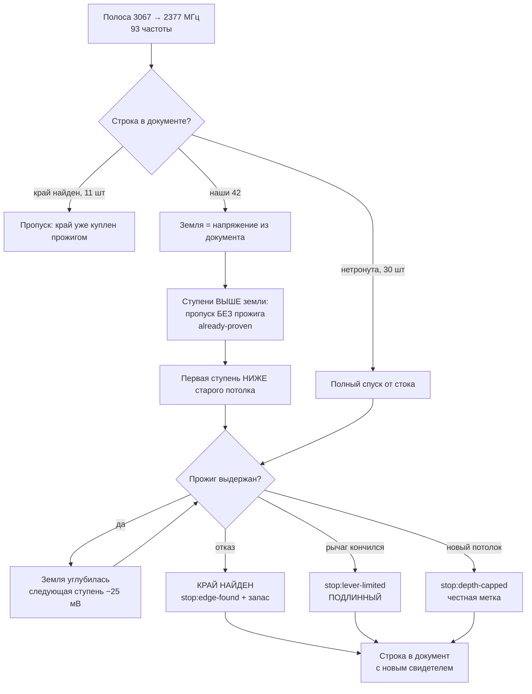

# План 90 — перепрожечь 42 частоты, которые закрыл НАШ потолок глубины, а не рычаг

**Источник:** решение владельца 2026-09-08 утром по развилке `bugs/115` AC4 — **вариант Б целиком**,
дословный выбор: *«Только Б — перепрожечь все 42»*, плюс слово в чате: *«я у машины, давай
перетюнивать по-честному»*. Агент предлагал Б только для верхушки и А для остальных; **владелец
поднял планку, и это его право.** Записано так, чтобы позже никто не спутал предложение агента с
решением владельца.

**Тикет:** `bugs/115` (AC4, и через него AC1/AC5) · **Тяжесть исходного дефекта:** S2

---

## Вектор цели

**Тип: Achieve.** Каждая из 42 строк, закрытых НАШИМ условием прогона, получает **настоящий замер** —
спуск идёт до того места, где его останавливает кремний или рычаг, а не наша уставка. Хотим: в
документе кривой ни одна строка не выдаёт наше решение за предел железа, и каждая новая метка стоит
на прожиге, а не на переклейке.

**Чего этот план НЕ делает:** не трогает 12 подлинных `lever-limited` (их свидетель говорит «глубже
рычаг не достаёт», и `bugs/115` признаёт их подлинными) и не переклеивает ни одной метки без замера —
вариант А владельцем отвергнут.

---

## Что измерено ДО работы (наблюдение, не оценка)

| величина | число | чем снято |
|---|---|---|
| строк со `stop:lever-limited` | **56** | чтение `curves/measured.json` |
| из них свидетель говорит «НАШ потолок глубины» | **42** | сверка статуса с `provenBy` |
| из них свидетель говорит «глубже рычаг не достаёт» | **12** | там же — **не трогаем** |
| иное | 2 | там же |
| непросмотренный ход суммарно | **3030 мВ** | разность «рычаг достаёт» − «потолок был», из свидетеля |
| в среднем на частоту | **72,1 мВ** | то же |
| **новых ступеней по 25 мВ** | **105** | то же |
| диапазон, в котором лежат все 42 | **2377…3067 МГц** | min/max |
| частот в этом диапазоне ВСЕГО | **93** | 42 наши · 30 нетронутых · 11 край найден · 5 без метки · 2 не отдана · 3 обрезана |
| темп прожига, замерен живьём | **27,5 с на ступень** | `runs/logs/band-2370-2235/2026-09-08T00-17-35+03-00.log`: 164,7 с на 6 ступеней |

> ⚠️ **3030 мВ — это НЕПРОСМОТРЕННОЕ, а не выигрыш.** Прожиг может отказать на первой же ступени
> ниже. План покупает знание, а не глубину.

---

## Механизм — почему широкая полоса не тратит минуты карты зря

Ключ, из-за которого «перепрожечь 42» не означает «прожечь всё заново»: спуск садится на
**доказанную землю** — на напряжение, которое уже стоит в документе, — и ступени НЕ ГЛУБЖЕ земли
проходит **без единого прожига** (`engine.mjs:2819`, ветка `already-proven`). Значит полоса
3067→2377 пройдёт верх каждой из 42 строк даром и начнёт жечь с первой ступени ниже старого потолка.



**Три исхода на выходе, и все три честны:** край найден прожигом · рычаг действительно кончился ·
уперлись в НОВЫЙ потолок — и последний теперь ляжет меткой `stop:depth-capped`, а не
`stop:lever-limited`. Это подтверждено прогоном, а не чтением кода — см. AC2 ниже.

---

## Критерии приёмки

- **AC1. Живой путь пишет `depth-capped` там, где спуск остановила наша уставка.**
  ✅ **ВЗЯТ 2026-09-08 09:21, прогоном на двойнике, карта не тронута.**
  - Ситуация. Двойник, документ `benches/runs/virtual-rtx5070ti.json`, 388 строк `untouched`.
  - Действие. `node automation-engine/engine.mjs --sweep --from 2872 --to 2850 --card virtual --max-depth 30`
  - Результат. 4 строки закрылись `stop:depth-capped`; свидетель каждой: «остановлено НАШИМ потолком
    глубины 30 мВ (рычаг достаёт до −260 мВ)». `stop:lever-limited` — ноль.
  - Проверка. Счёт меток ДО `{untouched:388, depth-capped:1}` → ПОСЛЕ `{untouched:384, depth-capped:5}`.
    Код возврата 0.

- **AC2. Полоса пройдена на живой карте с поднятым потолком глубины, и ни одна из 42 строк не
  закрыта старой уставкой.**
  *Проверка:* после прогона ноль строк, чей свидетель говорит «остановлено НАШИМ потолком глубины
  <старое число>»; у каждой из 42 в `provenBy` стоит штамп сегодняшнего прогона.

- **AC3. Каждая новая метка стоит на прожиге.**
  *Проверка:* у всех 42 строк `origin:measured` или `origin:inherited` от измеренной соседки; ни одной
  правки метки без замера (вариант А не применён нигде).

- **AC4. Сводка проекта пересчитана с документа, а не с памяти.**
  *Проверка:* `npm run curve -- --progress` печатает новое `краёв X/389`; строка доставки в `STATUS.md`
  переписана этим числом.

- **AC5. Сторож расхождения «метка против свидетеля» стоит в `npm run check`** (`bugs/115` AC3).
  *Проверка:* сторож доказан красным на строке с подменённой меткой.

---

## 🔴 НАХОДКА, СДЕЛАННАЯ ПРОГОНОМ AC1 — тот же дефект в СВОДКЕ

Тот же прогон, что закрыл AC1, напечатал в итоге:

```
ВЕРДИКТЫ: край найден 0 · остановлено НАШИМ потолком глубины 0 · упёрлось в предел сдвига ±1000 МГц 2
```

**Документ той же секунды говорит `depth-capped` на всех четырёх строках, а итоговая строка считает
две ступени как предел рычага.** Это `bugs/115` ещё раз — в счётчике вердиктов, а не в документе.

⚠️ **Следствие для этого плана, названное заранее:** после живой полосы отчёт владельцу снимается
**с документа кривой**, а не с этой строки. Иначе повторится ровно ошибка сессии 89 — агент
пересказал владельцу неверное число из сводки.

Заводится отдельным тикетом.

---

## Шаги

- [ ] **Ш0. Предполётный лист.** `npm run check` зелёный · Broadcast и Parsec погашены ·
      `npm run dashboard` поднят, порт 7311, окно открыто · карта в заводском состоянии.
- [ ] **Ш1. Полоса.** `--sweep --from 3067 --to 2377 --dashboard --log reburn-42`
      🔴 **БЕЗ `--max-depth` — решение владельца 2026-09-08 утром, дословно: «Без потолка — до самого
      рычага».** Спуск останавливает только кремний или конец рычага. Следствие, названное заранее:
      **на выходе не должно остаться НИ ОДНОЙ строки со `stop:depth-capped`** — если такая появится,
      это дефект, а не результат.
- [ ] **Ш2. Разбор с документом в руке** (не со строкой ВЕРДИКТОВ — см. находку выше).
- [ ] **Ш3. Восстановить фон:** `runs/restore-card-background.ps1`.
- [ ] **Ш4. AC4 и AC5:** пересчитать сводку, поставить сторож расхождения.
- [ ] **Ш5. Закрыть `bugs/115`** и дописать урок в `EXPERIENCE.md`.

---

## Риски, по ярусам (Мёрфи)

- **(a) Зависание машины.** Спуск идёт в непросмотренную глубину — это ровно то место, где карта
  отказывает. `GOAL.md`: зависание — осознанный риск владельца. Аварийная защита взводится полосой,
  окно наблюдения обязано быть открыто. **Владелец у машины весь прогон** — условие, а не пожелание.
- **(b) Длительность.** 105 новых ступеней у наших 42 плюс полные спуски у 30 нетронутых.
  При замеренных 27,5 с на ступень это **порядка 2,5–3 часов карты**, а не час.
- **(c) Класс отказа записи C3** (`bugs/92`, драйвер правит запись) — всплывал 31.08 и 04.09.
  Не чинится этим планом; при появлении фиксируется, полоса продолжается.
- **(c) Строка ВЕРДИКТОВ соврёт** — уже названо выше, обойдено чтением документа.

---

## Решения, принятые без владельца

- **Одна широкая полоса вместо 42 точечных заходов.** `--band` на живом пути ОТКАЗЫВАЕТ
  (`bugs/110`: пишет в карту без аварийной защиты и без ворот окна), а механизм `already-proven`
  делает широкую полосу дешёвой: верх каждой строки проходится без прожига.
- **12 подлинных `lever-limited` не трогаем** — их свидетель называет другую причину, и `bugs/115`
  признаёт их подлинными.
- **Отчёт снимается с документа, а не со сводки** — из-за находки выше.
