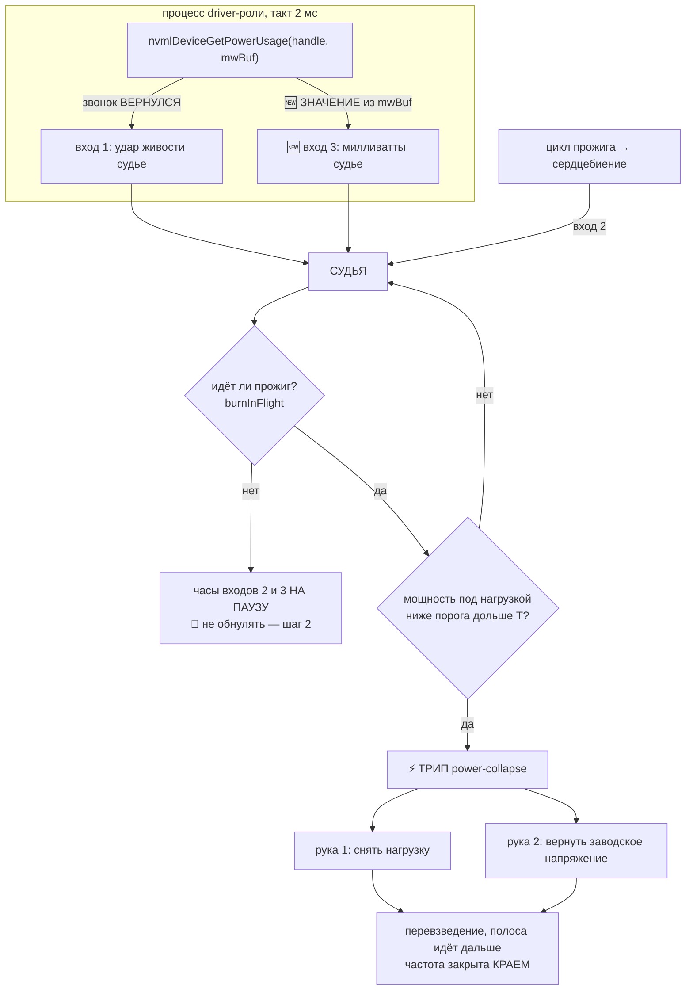

# План 91 — фаза 6 эпика 51: ТРЕТИЙ ВХОД. Предохранитель наконец смотрит на КАРТУ

> **Родитель:** `plans/51` (эпик «предсказание приближения к краю»), фаза 6 «предсказатель-порог» ·
> **Повод:** `bugs/117` — синий экран 2026-09-08 09:50 на 3067 МГц / 925 мВ ·
> **Требование владельца, дословно (08.09):** *«У НАС ЕСТЬ ПРЕДОХРАНИТЕЛЬ, И ОН ОБЯЗАН СПАСТИ МАШИНУ
> НА КРАЕ»* · **Статус:** 🟢 РАСПЛАНИРОВАН 2026-09-08, ни строки кода ·
> **Карта:** шаги 1–6 офлайн, карта НЕ нужна. Шаг 7 — живой, при владельце.

---

## 0. Одна страница для владельца

**Что случилось.** Полоса дошла до 3067 МГц / 925 мВ. Карта тихо перестала считать: заявляла 100 %
загрузки, потребляла 60 Вт вместо 280, температура падала. Так было **две с половиной секунды, пять
замеров подряд**. Предохранитель не сработал. Потом — синий экран.

**Почему не сработал — не «не успел», а нечем.** Оба его входа мерят НАС, а не карту:

| вход | что мерит | в окне смерти |
|---|---|---|
| 1 — тишина пульса | жива ли наша проба | 4,86 мс при пороге 60 — **здоров** |
| 2 — тишина прогресса | тикает ли наш цикл прожига | 1177 мс при пороге 1177 — **как всегда** |

Карта, переставшая считать, позволяет нашему циклу тикать нормально. **Предохранитель сторожил нас,
а не её.**

**Что строим — и почему это дёшево.** Проба предохранителя УЖЕ вызывает `nvmlDeviceGetPowerUsage`
каждые 2 мс и кладёт милливатты в буфер. И выбрасывает их — в коде так и написано:
`// read-only; the VALUE is irrelevant, the RETURN is the datum` (`death-watch.mjs:176`).
**Число, которое поймало бы этот отказ, лежит у предохранителя в руке пятьсот раз в секунду.**
Третий вход — прочитать буфер, а не завести прибор.

---

## Вектор цели

**Тип: Achieve.** У предохранителя появляется вход, мерящий РАБОТУ КАРТЫ, а не жизнь наших
процессов. Хотим: тихий отказ недовольтажа — карта заявляет загрузку и не потребляет — виден
предохранителю и останавливается им, а не синим экраном.

**Чего этот план НЕ делает:** не трогает входы 1 и 2 по существу (кроме дефекта обнуления часов,
шаг 2) · не обещает поймать МГНОВЕННУЮ смерть без предвестника — если контраста нет, спасать нечем,
и это будет сказано вслух · не заменяет пол зависания (память о прошлых смертях остаётся).

---

## Замеры, на которых стоит план (свои, а не рассуждение)

Из архива инцидента `bugs/evidence/117-bsod-2026-09-08/` и `runs/vmin/cap-3067-*.jsonl`:

| | здоровая ступень 935 мВ | смертельная 925 мВ |
|---|---|---|
| мощность под нагрузкой | **248–290 Вт** | **60,8 · 60,4 · 60,1 · 84,3 · 84,3 · 84,3 Вт** |
| `utilization.gpu` | 100 % | **100 %** |
| температура | 62 → 71 °C, растёт | **62 → 52 → 50 °C, падает** |
| длительность окна | — | **2,5 с, 5 замеров сэмплера** |

**Контраст 4,5×.** Для сравнения — контраст двух существующих входов в том же окне: **нулевой**.

---

## Механизм

**Почему вход 3 не дублирует вход 2, а закрывает именно его дыру:** вход 2 спрашивает «тикает ли
НАШ цикл», вход 3 — «делает ли КАРТА работу». Сегодня первое было «да», второе «нет», и разошлись
они на 4,5 раза.

---

## Критерии приёмки

- **AC1. Значение мощности доходит до судьи.**
  - Ситуация. Проба driver-роли работает на такте 2 мс, буфер `mwBuf` заполняется.
  - Действие. Оператор запускает судью с поднятым входом 3.
  - Результат. В строке жизни кольца появляется поле мощности рядом с `worstBeatSilenceMs`.
  - Проверка. `node automation-engine/lib/fuse.mjs --judge --seconds 5 --out F` — в каждой строке
    `F` присутствует непустое поле мощности.

- **AC2. Порог входа 3 ВЫВЕДЕН ИЗ АРХИВА, а не назначен.**
  - Ситуация. На диске лежат 22 замера здоровой ступени и 8 замеров смертельной.
  - Действие. Прибор вывода порога читает архив живых прогонов.
  - Результат. Порог напечатан числом вместе с тем, сколько ложных срабатываний он дал бы на
    ВСЕХ здоровых прогонах архива.
  - Проверка. Прибор печатает `ложных на архиве: 0`; при пороге, поднятом на 10 %, печатает > 0 —
    то есть прибор способен показать ложные, а не всегда рапортует ноль.
  - ⚠️ **Если контраста на архиве не окажется — записать это и остановиться**, а не подгонять
    число (`PHILOSOPHY.md` → три двери: выдуманный порог в предохранителе запрещён).

- **AC3. Вход 3 трипает на ИЗМЕРЕННОЙ смерти, проигранной на двойнике.**
  - Ситуация. Двойник играет запись 08.09: 100 % загрузки при 60 Вт в течение 2,5 с.
  - Действие. Оператор запускает репетицию.
  - Результат. Трип `power-collapse`, обе руки отработали, машина цела.
  - Проверка. `--twin-death power-collapse` даёт трип; тот же прогон без входа 3 трипа не даёт.

- **AC4. Здоровый прогон не даёт НИ ОДНОГО ложного трипа.**
  *Проверка:* полигон (30 семян) с поднятым входом 3 — ложных 0; кольцо всех 30 прогонов
  проверено на пересечения порога.

- **AC5. 🔴 Дефект обнуления часов входа 2 исправлен (`bugs/117`, дыра 2).**
  Ворота `fuse.mjs:1296` при отказе пишут `lastProgressMs = now` и тем ОБРЕЗАЮТ измеряемую тишину
  своим же порогом: за 232 секунды максимум 1179,58 мс при уставке 1177, 78 пересечений.
  *Проверка:* после правки на записи 08.09 тишина прогресса в окне смерти РАСТЁТ выше 1177 —
  пауза между ступенями и мёртвый прожиг перестают выглядеть одинаково.

- **AC6. Объявление ворот 5 стоит рядом с входом 3 и его `ON-REAL-PATH` честен.**
  *Проверка:* `npm run check` → «СТОРОЖ УГРОЗ» видит блок `@guard fuse-power-collapse` с полями
  `THREAT` · `PROVED-AGAINST` · `GAP` · `ON-REAL-PATH`; до живого прогона последнее поле —
  `NOT YET`, и это законно.

- **AC7. 🔴 Сторож не даёт объявить вход «ВЗВЕДЁН», пока он не доказал трип.**
  Сегодня движок напечатал «ВТОРОЙ ВХОД ВЗВЕДЁН», и это было правдой по аргументам — но ни разу
  не проверено делом. *Проверка:* мутация «объявить взведённым вход, который не трипает на своей
  репетиции» → ворота красные.

---

## Шаги

- [ ] **Ш1. Вход 3 в пробу и судью** — читать `mwBuf`, слать значение датаграммой (протокол уже
      однобайтный: `0x01` пульс, `0x02` прогресс → `0x03` мощность + значение). Поле в кольцо. AC1.
- [ ] **Ш2. 🔴 Починить обнуление часов входа 2** (`fuse.mjs:1296`): ворота обязаны СТАВИТЬ НА
      ПАУЗУ, а не обнулять — иначе величина навсегда обрезана порогом. AC5. **Делать первым: это
      дефект существующего входа, и он дешевле нового.**
- [ ] **Ш3. Прибор вывода порога из архива** — читает `runs/vmin/*.jsonl` и кольца, печатает порог
      и число ложных на архиве. AC2.
- [ ] **Ш4. Репетиция `power-collapse` на двойнике** по записи 08.09. AC3.
- [ ] **Ш5. Полигон 30 семян с поднятым входом 3.** AC4.
- [ ] **Ш6. Объявление ворот 5 + сторож «взведён ≠ доказан».** AC6, AC7.
- [ ] **Ш7. ЖИВОЙ прогон при владельце на ДОКАЗАННО безопасной ступени, БЕЗ поиска края** —
      канон фазы 3 эпика 51 соблюдается: сперва дежурство, потом край. `ON-REAL-PATH` получает дату.

---

## Риски, по ярусам (Мёрфи)

- **(a) Контраста на архиве может не хватить.** Один инцидент — одна точка. Смягчение: архив
  здоровых прогонов большой, и порог выводится по расстоянию от ЗДОРОВЬЯ, а не от одной смерти.
  Если не хватит — сказать вслух (AC2), а не подогнать.
- **(a) Ложный трип дороже пропуска для ВЛАДЕЛЬЦА:** он убивает вечер работы. Отсюда AC4 с
  полигоном на 30 семян до всякой живой карты.
- **(b) Мгновенная смерть без предвестника.** Сегодня предвестник был 2,5 секунды. Другой отказ
  может не дать и такого — вход 3 не всемогущ, и это записано в `GAP`.
- **(b) Мощность падает законно** между ступенями и на лёгких формах — отсюда ворота
  `burnInFlight` и порог, привязанный к идущему прожигу.
- **(c) NVML вернёт мусор** при умирающей карте — значение проверяется на диапазон до сравнения.

---

## Решения, принятые без владельца

- **Ш2 раньше Ш1.** Дефект существующего входа дешевле нового входа и лечит уже построенное.
- **Вход 3 в СУДЬЕ, а не отдельным прибором.** Проба уже читает мощность; отдельный наблюдатель
  был бы второй сущностью и вторым источником расхождения (`PHILOSOPHY.md` → Оккам).
- **Порог выводится прибором, а не назначается в этом документе.** Число в предохранителе без
  замера — ровно то, что запрещают три двери.
