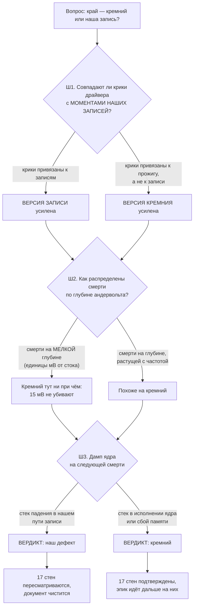

# План 92 — подлинность краёв: свойство кремния или след нашей записи (эпик 51, подфаза 6а)

**Источник:** подозрение владельца 2026-09-08, дословно: *«1135 мв - зависание - я ПОЧТИ УВЕРЕН,
что ты неправ и это фрод»*, *«что-то ты неверно намерил, как обычно, и интерпретиловал неверно, как
край»*. И его же заказ этого дня: *«СДЕЛАТЬ ЭПИК plans/51, полно»* → *«разведка, нарезка планов»*.

**Родитель:** `plans/51` подфаза 6а · **Разведка:** `researches/35` §1.4, §4 · **Тяжесть:** S1 —
загрязнённые метки делают невозможным ВЕСЬ остаток эпика.

---

## Вектор цели

**Тип: Decide.** Ответить уликой на один вопрос: **записанные «края» — это поведение кремния или
след нашей собственной записи в карту?**

**Почему это первая подфаза, а не любая другая.** Предсказатель учится на метках «смерть/жизнь». Если
часть смертей вызвана нашим путём записи, а не напряжением, то число близости, выведенное из таких
меток, будет предсказывать НАШ дефект. Это не осторожность, это порядок работ: сначала метки, потом
модель.

**Чего план НЕ делает:** не чинит найденное, не переписывает документ кривой, не трогает живую карту.
Он выносит ВЕРДИКТ и передаёт его дальше.

---

## Что уже измерено ДО работы (наблюдение, не оценка)

| величина | число | чем снято |
|---|---|---|
| код остановки последней смерти | **`DRIVER_IRQL_NOT_LESS_OR_EQUAL (0xD1)`**, виновник `nvlddmkm.sys` | фотография экрана владельца 08.09 |
| подпись, ожидаемая от нестабильного андервольта | `VIDEO_TDR_FAILURE 0x116` / `0x117`, сброс дисплея | отраслевая, `researches/35` §1.4 |
| криков драйвера перед первой смертью дня | **39 событий 153 за 86 с** (13:00:25 → 13:01:51) | журнал Windows, источник `nvlddmkm` |
| смертей за день | **3** (09:47 · 10:02 · 13:26), плюс ещё одна перезагрузка в 13:02 | журнал системы, 6008 |
| записанных полов зависания в документе | **17** | `curves/measured.json` |
| аварийных дампов на диске | **0**, и записаны быть не могли | `CrashDumpEnabled = 0` до 08.09 |
| расхождение приборов о мощности в момент смерти | **62,62 Вт** (сэмплер) против **227,6 Вт** (судья) | `researches/35` §1.3 |

---

## Механизм — как улика отделит одно от другого

**Почему трёх шагов, а не одного.** Дамп (Ш3) — самая прямая улика, но он требует СЛЕДУЮЩЕЙ смерти,
то есть железа владельца. Ш1 и Ш2 делаются по уже собранным журналам сегодня и могут вынести
вердикт раньше — или, самое ценное, **сузить вопрос до того, что дамп обязан подтвердить.**

---

## Критерии приёмки

- **AC1. Крики драйвера сопоставлены с нашими действиями по времени.**
  *Ситуация:* 39 событий `nvlddmkm` 153 за 86 секунд 08.09 и журналы полосы за тот же интервал.
  *Действие:* совместить метки времени событий с метками записей в карту и с границами прожигов.
  *Результат:* сказано числом, к чему привязаны крики — к записям, к прожигам или ни к чему.
  *Проверка:* доля событий, попавших в окно ±1 с от записи, против доли, ожидаемой при случайном
  распределении по тому же интервалу. Совпадение «на глаз» не принимается.

- **AC2. Смерти разложены по ГЛУБИНЕ андервольта от стока.**
  *Ситуация:* 17 записанных полов зависания и стоковые напряжения тех же частот.
  *Действие:* для каждой стены посчитать глубину от стока в милливольтах и в ступенях сетки.
  *Результат:* таблица «частота · сток · стена · глубина», отсортированная по глубине.
  *Проверка:* стены глубиной менее двух ступеней сетки от стока помечены как **подозрительные** —
  на такой глубине отказ кремния неправдоподобен, и подозрение владельца про 1135 мВ проверяется
  ровно здесь.

- **AC3. Расхождение приборов о мощности объяснено механизмом, а не версией.**
  *Ситуация:* 62,62 Вт у сэмплера против 227,6 Вт у судьи в ту же секунду.
  *Действие:* прочитать путь мощности от вызова до удара и найти, где значение может застыть.
  *Результат:* названо место и условие, при котором судья держит устаревшее число.
  *Проверка:* воспроизведено блоком на фикстуре — испорченный статус вызова оставляет судью со
  старым значением, и блок краснеет, если это починить.

- **AC4. Следующая смерть оставляет дамп ядра.**
  *Ситуация:* запись дампов включена 08.09, но требует перезагрузки.
  *Действие:* после перезагрузки — проверить готовность (`CrashDumpEnabled = 2`, выделенный файл на
  месте, свободного места хватает).
  *Проверка:* готовность подтверждена ЧТЕНИЕМ до прогона, а не надеждой после.

- **AC5. Вердикт вынесен и записан там, где его прочтёт следующая сессия.**
  *Проверка:* раздел в `STATUS.md` и пометка в `curves/measured.json` у каждой подозрительной стены;
  ни одна стена не переклеена без улики.

---

## Шаги

- [ ] **Ш1. Сопоставление криков драйвера с записями** (AC1). Журналы: `runs/logs/reburn-42/*`,
      события Windows `nvlddmkm`. Прибор — отдельный, с самопроверкой.
- [ ] **Ш2. Таблица глубин 17 стен** (AC2). Источник — `curves/measured.json`; глубина считается от
      стока той же частоты, а не от соседки.
- [ ] **Ш3. Разбор пути мощности** (AC3), с блоком на фикстуре.
- [ ] **Ш4. Готовность дампа** (AC4) — после перезагрузки владельца.
- [ ] **Ш5. Вердикт** (AC5) — в `STATUS.md`, и владельцу одной строкой: подтвердилось его подозрение
      или нет.

---

## Риски, по ярусам (Мёрфи)

- **(а) Вердикт окажется «и то, и другое».** Часть стен подлинные, часть — след записи. Это НЕ
  провал плана: он и должен разделить их поимённо, а не вынести один приговор на семнадцать.
- **(б) Дамп не дождётся своей смерти.** Ш1–Ш3 обязаны вынести предварительный вердикт БЕЗ него,
  иначе план встанет в ожидание зависания — а ждать зависания как события работы недопустимо.
- **(в) Соблазн переклеить документ.** Прямо запрещено: владелец 08.09 уже отверг вариант «А»
  (переклейка меток без замера) в родственной развилке `bugs/115`. Метка меняется прожигом.
- **(г) Ш1 даст корреляцию, которой нет.** 39 событий на 86 секундах — плотность высокая, и
  случайное попадание в окно ±1 с вероятно. Поэтому AC1 требует сравнения с ожидаемой при случайном
  распределении, а не просто числа совпадений.

---

## Решения, принятые агентом — **[ИИ]**

- **Порядок 6а → 6б → 6в.** Метки чистятся до модели. Владелец порядка не называл.
- **Порог «подозрительной» стены — менее двух ступеней сетки от стока.** Число выбрано агентом как
  граница правдоподобия и подлежит пересмотру, когда Ш2 покажет распределение.
- **План не ждёт дампа.** Ш1–Ш3 идут по уже собранным уликам сегодня.
