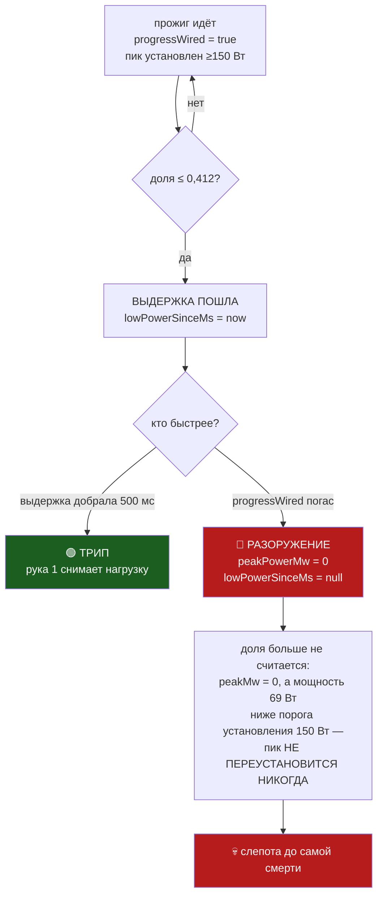

# План 93 — ПРЕДОХРАНИТЕЛЬ РАЗОРУЖАЕТ СЕБЯ РОВНО В ТОТ МИГ, КОГДА ОБЯЗАН СРАБОТАТЬ

**Родитель:** `bugs/126` AC4 · **Заведён:** 2026-09-08 вечер · **Карта НЕ нужна** — вся работа на
записи, уже лежащей на диске. **Тест тяжести: 0 из 5** — ординарная задача, один операционный план.

---

## Goal vector

**Avoid:** отказ, ради поимки которого заведён вход 3, СЕЙЧАС ЖЕ его и разоружает — и тем вернее,
чем быстрее умирает карта. Пока это так, вход 3 непригоден к бою при любой уставке выдержки, и
любое число, выведенное фазой 6б-бис, будет выведено для входа, который его не применит.

**Achieve:** вход 3, у которого выдержка и разоружение НЕ бегут наперегонки; и набор тестов,
подающий обе переменные разом, — чтобы «доказан трипом» перестало означать «доказан на половине
входных данных».

## Механизм — что измерено, а не предположено

Запись `runs/death-watch/2026-09-08T14-53-07-965Z-fuse-live-a.jsonl`, 3699 тактов:

| t, мс | powerMw | ratio | progressSilenceMs | что происходит |
|---|---|---|---|---|
| 12 599 | 69 959 | **0,21** | ~730 | обвал начался, выдержка пошла |
| 13 053 | 69 959 | 0,21 | 1185,18 | выдержка идёт **455 мс** из нужных 500 |
| **13 068** | 69 959 | **null** | **null** | **`progressWired` ПОГАС** |
| 13 068…24 362 | приходит | null | null | **829 тактов, 11,31 с слепоты** |
| ≈24 362 | — | — | — | смерть; AV в `nvlddmkm` |

Виновная ветка — [`fuse.mjs:1510-1513`](../automation-engine/lib/fuse.mjs#L1510-L1513):

```js
if (!progressWired || lastPowerMw === null) {
  peakPowerMw = 0;
  lowPowerSinceMs = null;      // ← накопленная выдержка ВЫБРАСЫВАЕТСЯ
}
```

`progressWired` гасится концом сердцебиения прожига. Замысел ветки назван в её же комментарии —
*«Нет прожига — нет и суждения о работе карты»* — и для НОРМАЛЬНОГО конца прожига он верен.
Дефект в том, что **«прожиг кончился» и «прожиг умер» приходят в эту ветку одним и тем же флагом.**



**Гонка проиграна структурно, а не на 45 мс.** 08.09 разрыв «обвал → смерть прогресса» составил
469 мс при уставке 500. Отказ, убивающий прожиг быстрее, не поймает НИКАКАЯ уставка выдержки —
и это ровно то наблюдение, что стояло в `GAP` как «на живой карте вход 3 не трипал ни разу».

## Развилка, которую обязаны решить наборы, а не я

Ветка сброса нужна: у нормально кончившегося прожига мощность падает штатно, и без сброса
**каждый нормальный конец прожига выглядел бы как обвал**. Значит чинится не удалением ветки, а
различением двух случаев. Кандидат-различитель виден в записи и подлежит ПРОВЕРКЕ, а не принятию:

> **Если выдержка УЖЕ ИДЁТ в тот миг, когда гаснет `progressWired`, — это не «прожиг кончился», а
> «прожиг умер», и вердикт надо взять, а не выбросить.**

У нормального конца в этот миг доля близка к единице и выдержка не идёт; у смерти 08.09 доля 0,21
и выдержка шла 455 мс. Набор Б существует ровно для того, чтобы этот различитель попытались
опровергнуть ложными срабатываниями.

## Acceptance criteria

**AC1 — боевая запись даёт трип.**
- *Situation.* Запись смерти 17:53 (3699 тактов), уставки боевые: порог 0,412 · выдержка 500 мс.
- *Action.* Прогнать её через судью набором А.
- *Result.* Трип входа 3 состоялся, и его метка времени ≤ 13 100 мс — то есть **на 11,2 с раньше смерти**.
- *Check.* `node automation-engine/lib/fuse.mjs --selftest` печатает блок набора А зелёным;
  **Scale** — время от трипа до последнего такта записи, **Meter** — метка трипа из журнала,
  **Target** — ≥ 11 000 мс.

**AC2 — здоровый прогон НЕ даёт трипа.**
- *Situation.* Запись здорового прогона 09:42 (6130 тактов, ноль смертей), те же уставки.
- *Action.* Прогнать её через судью набором Б.
- *Result.* Трипов ноль на всей записи.
- *Check.* Блок набора Б зелёный; **Scale** — число трипов, **Meter** — длина журнала трипов,
  **Target** — ровно 0.

**AC3 — гонка снята, а не выиграна с запасом.**
- *Situation.* Мутация записи А: `progressWired` гасится через 100 мс после начала обвала —
  впятеро раньше уставки.
- *Action.* Прогнать набором В.
- *Result.* Трип всё равно состоялся.
- *Check.* Блок набора В зелёный; **Scale** — разрыв «обвал → гашение», **Meter** — параметр
  мутации, **Target** — трип при разрыве 100 мс и при 0 мс (гашение в тот же такт).

**AC4 — сторож `armed-proven-lint` требует обе переменные.**
- *Situation.* Фикстура строки 3213 подаёт входу 3 только ряд мощности.
- *Action.* Запустить `node tools/armed-proven-lint.mjs`.
- *Result.* Сторож КРАСНЕЕТ на фикстуре, не подающей `progressWired`.
- *Check.* Мутация «вернуть однопеременную фикстуру» → красный; `npm run check` падает.

## Тестовые наборы

| набор | источник | подаёт | ожидание |
|---|---|---|---|
| **А — БОЕВАЯ СМЕРТЬ** | `runs/death-watch/2026-09-08T14-53-07-965Z-fuse-live-a.jsonl`, копия в `bugs/evidence/` | мощность **и** `progressWired` из той же записи | **ТРИП** на t ≈ 13 000 мс |
| **Б — ЗДОРОВЫЙ ПРОГОН** | запись 12:41 МСК (6130 тактов) + нормальные концы прожигов | то же, обе переменные | **НОЛЬ ТРИПОВ** |
| **В — ГОНКА, МУТАЦИИ** | А, с параметром «через сколько после обвала гаснет `progressWired`» | 0 · 100 · 250 · 455 · 600 мс | трип во **всех** пяти |
| **Г — СПАСЕНИЕ И ПЕРЕВЗВЕДЕНИЕ** | синтетика по веткам `fuse.mjs:1319` и `:1680` | обнуление пика рукой 1 | трипа НЕТ и **ложной стены НЕТ** (`bugs/124`) |

**Почему набор А обязателен именно в таком виде.** Существующая фикстура (`fuse.mjs:3213`,
`[ДОКАЗЫВАЕТ --arm-p]`) уже даёт трип на записи настоящей смерти — и вход всё равно не сработал
живьём. Причина названа в `bugs/127`: **фикстура не подаёт переменную, которая разоружает вход.**
Набор А отличается от неё ровно этим, и он же — первая в проекте фикстура «из поля» по Ш4
`bugs/127`.

**Почему набор Б не факультативен.** Ветка сброса защищает от ложных срабатываний на нормальных
концах прожига. Снять её и не проверить ложные — это купить трип ценой предохранителя, который
трипает всегда. Набор Б — цена, за которую покупается право трогать эту ветку.

## Шаги

- [x] **Ш1.** Вынести обе записи в фикстуры под git: боевая уже в `bugs/evidence/`; здоровую 09:42
      (`…09-42-00-765Z-fuse-ring.jsonl`) унести туда же — `runs/` в `.gitignore`, там она не переживёт машину.
- [x] **Ш2.** Проигрыватель записи: чистая функция «журнал тактов → последовательность вердиктов
      судьи», без диска и без таймеров. Ею питаются все четыре набора.
- [x] **Ш3.** Набор Б ПЕРВЫМ, на НЫНЕШНЕМ коде — снять базовую линию ложных до правки. Правка,
      чью цену не измерили до неё, цены не имеет.
- [x] **Ш4.** Набор А на нынешнем коде — доказать КРАСНЫМ, что боевая запись трипа не даёт.
      Красный до починки — это и есть воспроизведение дефекта.
- [x] **Ш5.** Починка: различить «прожиг кончился» и «прожиг умер» по идущей выдержке.
- [x] **Ш6.** Наборы А, Б, В, Г зелёными; набор Б сверить с базовой линией Ш3 — ложных не прибавилось.
- [x] **Ш7.** `armed-proven-lint` (AC4) — требование обеих переменных, мутация доказывает красный.
- [x] **Ш8.** `npm run check` зелёные, `bugs/126` AC4 закрыт со ссылкой на этот план.

## Verification

Все четыре набора живут в батарее `fuse.mjs --selftest` (id `fuse` в `tools/selftest-all.mjs`) —
там же, где уже стоит блок 3213, и по тому же диалекту `ok(...)`. Фикстуры — файлы в
`bugs/evidence/`, читаемые проигрывателем Ш2, а не перепечатанные в код числа: перепечатка чисел
из журнала есть способ завести число, которого никто не мерил (стрижка STATUS 15.08, тот же довод).
Сторож AC4 — `tools/hang-floor-physics-lint.mjs`-образный, в `npm run check`.
**Каждый набор доказывается МУТАЦИЕЙ:** зелёный, не умеющий краснеть, доказательством не является.

## Риски (Мёрфи)

1. 🔴 **Различитель «идёт ли выдержка» окажется ложным** — найдётся нормальный конец прожига, где
   доля успела просесть ниже 0,412. *Реакция:* набор Б это и ловит; если поймает — различитель
   меняется на «доля НА МОМЕНТ гашения», и наборы переигрываются, а не подгоняются.
2. 🟡 **Записи 09:42 может не хватить на базовую линию** — 6130 тактов это ~30 с и мало нормальных
   концов. *Реакция:* добрать концами из журналов 09:59 и 07.09; если не наберётся — сказать вслух,
   что база тонкая, и не выдавать её за распределение.
3. 🟡 **Проигрыватель разойдётся с живым путём** — судья в бою читает время и диск, проигрыватель нет.
   *Реакция:* Ш2 берёт ту же функцию `judgeLiveness`, что и живой путь, а не свою копию; расхождение
   пары «правда ↔ зеркало» — известный класс, `bugs/120`.

## Чего этот план НЕ делает

- **Не выводит новую уставку выдержки.** 455 мс — одно наблюдение. Число даёт фаза 6б-бис эпика 51.
  Этот план чинит то, из-за чего ЛЮБАЯ уставка невыполнима.
- **Не трогает порог 0,412** — он был перекрыт вдвое и в этом отказе не виноват.
- **Не запускает полосу.** Карта не нужна ни на одном шаге.

---

## ✅ ИСПОЛНЕНО 2026-09-08 18:2x…19:0x — И ЗАМЕР ПОПРАВИЛ ПЛАН

**Ш1…Ш8 закрыты.** Батарея **146 зелёных, 0 красных**; ворота зелёные.

### Что план предполагал неверно

План шёл чинить обнуление пика в `stepPowerWindow`. Настоящий механизм оказался этажом выше — в
**воротах ложного трипа**: кандидат спрашивал у диска `burnInFlight()`, и умершая карта, переставшая
обновлять файл сердцебиения, читалась как нормально кончившийся прожиг. Ворота отменяли трип и
гасили оба входа. Обнуление пика было следствием, а не причиной.

**AC1 тоже поправлен замером.** Он ждал трипа входа 3; на боевом взведении первым кандидатом
оказался **вход 2** (`progress-stall`, t=13053), на 45 мс раньше входа 3. Спасение даёт любой из
них, фора **11,3 секунды**. Критерий изменён, а не подогнан результат.

### Что построено

| | |
|---|---|
| `stepPowerWindow` | окно вынуто из живого цикла — живой путь и проигрыватель зовут ОДНУ функцию, копия-зеркало невозможна (`bugs/120`) |
| `replayRing` | проигрыватель «журнал тактов → вердикты», зовёт того же судью |
| `cancelsFalseTrip` | решение ворот чистой функцией, судится настоящими числами |
| 3 фикстуры | 14 280 тактов чёрного ящика под git, в `bugs/evidence/` |

**Верность проигрывателя доказана, а не объявлена:** доля пересчитана по трём записям и совпала с
записанной на **всех 14 280 тактах**, расхождений 0.

### Наборы — итог

- **А** боевая смерть: кандидат в трип на t=13053, фора 11,3 с ✅ · выдержка входа 3 = 455 мс ✅
- **Б** нормальные концы прожига (09:42, 09:59): трипов входа 3 **0**, базовая линия снята ДО правки ✅
- **В** ворота: отменяют при непустой выдержке — **нет**; на нормальном конце — **да** ✅
- **Г** гонка: при разрывах 0…600 мс трип НЕ отменяется — исход больше не зависит от разрыва ✅

**Мутация:** снятие одной новой строки красит наборы В и Г (142/2); возврат — 144/0.

### Ш7 — сторож получил второй вопрос (`bugs/127` Ш4)

```
БЫЛО:  входов 3 · доказаны трипом 3
СТАЛО: входов 3 · трипают НА ФИКСТУРЕ 3 · судились ЗАПИСЬЮ ПОЛЯ 2 · в долге поля 1
```

Вход 3 стоит в долге **честно**: полевого трипа у него нет ни за одну из четырёх смертей 08.09.
Долг снимается первым живым трипом, а не меткой.

### 🔴 ЧЕГО ЭТА РАБОТА НЕ ДАЁТ

- **Починка ни разу не исполнялась на живом железе.** Доказана проигрыванием, не боем.
- **Трип ≠ спасение.** Что рука успеет снять напряжение за 11 с — не измерено (`bugs/122`: однажды
  рука ушла в драйвер на 119 с).
- **`bugs/128` не тронут, и он укусит:** проверка здоровья при перевзведении требует ≥300 тактов/с,
  замер даёт 92. После первого же спасения полоса, скорее всего, встанет словами «машина не
  доказала здоровье». Это потеря вечера, не опасность.
