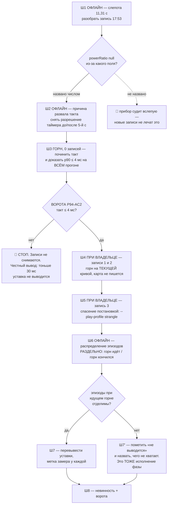
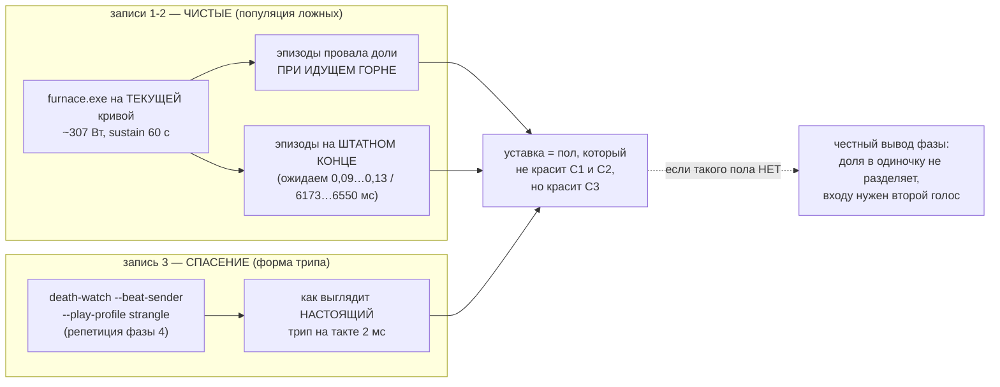

# План 94 — эпик 51 фаза 6б-бис: три записи высокого разрешения, без поиска края

> **Создан:** 2026-09-09 01:2x +03:00 · **Родитель:** `plans/51` → строка «**[ИИ] Следствие для
> порядка фаз:** между 6б и 6в встаёт **6б-бис** — снять три записи высокого разрешения (две чистые
> и хотя бы одну со спасением) новым прибором, и только потом выводить число»
> **Предыдущая фаза:** 6б ✅ ИСПОЛНЕНА (`tools/channel-archive.mjs`, 23 прогона) · **следующая:** 6в
> 🔴 ЗАБЛОКИРОВАНА ДАННЫМИ — её разблокирует эта фаза или честно объявит неразблокируемой
> **Статус:** 🔵 СОЗДАН, шаги 1–3 офлайн начаты не были
> **Вовне:** распределение эпизодов провала доли на МГНОВЕННОЙ мощности → уставки предохранителя
> (`POWER_COLLAPSE_RATIO` · `POWER_LOW_HOLD_MS` · `CARD_TELEMETRY_FROZEN_MS`) → снятие запрета на полосу
> **Слово владельца 2026-09-09:** *«за 6б-бис»* — фаза разрешена. Запрет на ПОЛОСУ действует.

---

## Вектор цели фазы

**Боль, названная числом.** Три уставки предохранителя стоят на замере, который отменён `bugs/125`:
их вывели из УСРЕДНЁННОЙ за секунду мощности, а вход 3 судит МГНОВЕННУЮ. Допущение «окно смерти
2500 мс» промахнулось в 5,5 раза (замер `bugs/126`: окно 455 мс), и весь запас выдержки был съеден.
Пока это так, полосу запускать нельзя — это записано в эстафете 92 как запрет.

**Вторая боль, вскрытая разведкой этого плана.** Посылка фазы — «записи ВЫСОКОГО разрешения» — на
сегодня НЕПРАВДА: `bugs/128` замерил, что такт чёрного ящика разваливается 2,24 → 13,99 мс около
5-й секунды прожига и дальше не восстанавливается. Снимать три записи прибором, который грубеет
ровно в интересном месте, — значит заплатить живым прогоном за материал, из которого число опять
не выведется. **Разрешение чинится ПЕРВЫМ.**

**Куда хотим.** Три записи сняты прибором с доказанным тактом; распределение эпизодов провала доли
измерено на мгновенной мощности отдельно для «горн идёт» и «горн кончился»; каждая из трёх уставок
либо перевыведена формулой из этого распределения, либо помечена «не выводится, причина такая-то».
Ни одна не остаётся молча стоять на отменённом замере.

**Тип цели:** Achieve (распределение и вывод из замера) + Avoid (уставка из головы; запись прибором,
чьё разрешение не доказано) + Maintain (карта не пишется, доставка не двигается).

## Критерии приёмки фазы

- **P94-AC1 — слепота прибора названа наблюдением** *(долг эстафеты 92, `bugs/126` AC4)*.
  Шкала: причина обнуления `powerRatio` · Мера: разбор существующей записи смерти 17:53
  (`runs/death-watch/2026-09-08T14-53-07-965Z-fuse-live-a.jsonl`, 3699 тактов) · Цель: **названо,
  какое именно из трёх полей (`power.mw` · `power.peakMw` · `power.establishedMw`) обнулилось и на
  каком такте**, напечатан счёт тактов с `powerRatio === null` и длительность серии.
  Гипотеза «мощность приходила исправно» либо подтверждена, либо опровергнута — числом.
- **P94-AC2 — разрешение доказано, а не объявлено** *(`bugs/128` AC1–AC2)*.
  Шкала: такт чёрного ящика · Мера: `p90(gapMs)` за ВЕСЬ прогон под горном ≥ 60 с, не за первые
  секунды · Цель: **≤ 4 мс**. 🔴 **Это ворота фазы: красный здесь — шаги 4–5 не запускаются.**
- **P94-AC3 — три записи, и каждая доказана проигрывателем**.
  Шкала: записей · Мера: файлы в `runs/death-watch/` · Цель: **3** — две чистые (горн ≥ 60 с) и одна
  со спасением; **каждая проходит сверку `replayRing` до значения** («пересчитанная доля ==
  записанная доля на каждом такте»), расхождений 0.
- **P94-AC4 — распределение приложено, и оно разделено по состоянию горна**.
  Шкала: эпизоды провала доли ниже `POWER_COLLAPSE_RATIO` · Мера: скрипт разбора по трём записям ·
  Цель: **число эпизодов · медиана · p99 · max длительности · глубина**, напечатанные ОТДЕЛЬНО для
  «горн идёт» и «горн кончился». Разделение обязательно: `bugs/130` доказал, что на штатном конце
  прожига доля падает ГЛУБЖЕ и ДОЛЬШЕ, чем при смерти (0,09…0,13 при 6173…6550 мс), и смешанное
  распределение снова выдаст ложную уставку.
- **P94-AC5 — ни одна уставка не остаётся на отменённом замере**.
  Шкала: три уставки · Мера: строка в `automation-engine/lib/fuse.mjs` + метка замера · Цель: у
  КАЖДОЙ из `POWER_COLLAPSE_RATIO` · `POWER_LOW_HOLD_MS` · `CARD_TELEMETRY_FROZEN_MS` стоит либо
  **новая формула со ссылкой на AC4**, либо **явная пометка «из этих данных не выводится, причина»**.
  Молчаливое сохранение старого числа = красный критерий.
- **P94-AC6 — невинность фазы доказана двумя свидетелями**.
  Шкала: записей в карту · Мера: `npm run curve -- --progress` до/после **И** журнал `write-watch` ·
  Цель: **0 и 0**. Строка доставки (`краёв 5/389 · режимов 1/4`) не двигается.
- **P94-AC7 — батарея**. Шкала: ворота · Мера: `npm run selftest:all` и `npm run check` ·
  Цель: **0 красных, новых нарушений 0**.

### Границы фазы — что она НЕ доказывает (написано заранее, чтобы не приписали потом)

1. **Смерти в этих записях не будет** — фаза не ищет край. Значит уставка получает **пол ложных
   срабатываний**, а не порог обнаружения смерти. Сторону смерти по-прежнему держат архив 6б и
   единственная запись 17:53.
2. **`write-watch` живого выхода здесь НЕ получает** — фаза пишет в карту ноль раз. Его первый
   боевой выход остаётся за следующим прогоном с записью. Не заявлять его проверенным.
3. **Механизм смерти «в паузе, на записи» фаза не проверяет** и не может: проверка требует записи.

## Блок-схема: почему порядок шагов именно такой

## Блок-схема: что меряет каждая из трёх записей

## Шаги

- [x] **1. ОФЛАЙН. Слепота 11,31 с — разобрать существующую запись** *(якорь: эстафета 92, долг
      «`bugs/126` AC4 не разобран: почему доля перестала считаться на 11,31 с»)*. ✅ **ИСПОЛНЕН
      2026-09-09 01:4x, P94-AC1 закрыт — см. `bugs/126` AC4-бис.** Замер: переключений за 3699
      тактов **ровно два, оба — один и тот же такт для обоих каналов**; `powerMw` не был `null` ни
      разу за 832 такта слепоты и не дрогнул на границе (69 959 обе стороны). **Обнулилось не поле
      мощности, а ДЕЛИТЕЛЬ** — веткой `stepPowerWindow` по погасшему `progressWired`.
      🔴 **Побочная находка, которая стоит дороже самого AC1** (`workloads/furnace.cu:381`):
      `if (progress_file) remove(progress_file);` — **штатный конец прожига СТИРАЕТ файл
      сердцебиения тем же движением, что и умершая карта.** Это корень неразличимости, на которой
      построены и AC4, и ошибка `bugs/130`. Различитель обязан браться НЕ из этого файла.
- [x] **2. ОФЛАЙН. Причина развала такта** *(якорь: `bugs/128` AC1)*. ✅ **ИСПОЛНЕН 2026-09-09
      01:5x — причина найдена, воспроизведена БЕЗ КАРТЫ и вылечена.** Заголовок тикета врал словом
      «под нагрузкой»: тот же цикл, запущенный **скрытым отсоединённым процессом**, разваливается
      на 3-й секунде с 2,18 на 15,40 мс при нулевой нагрузке на GPU. Механизм — EcoQoS Windows 11:
      фоновому процессу `timeBeginPeriod(1)` **принимается и молча игнорируется**.
      Лекарство — `refuseTimerThrottling()` перед подъёмом; проверено тем же скрытым запуском:
      2,02 мс все 20 секунд. ⚠️ **Три отвергнутых кандидата, каждый снят замером, а не мнением:**
      «процесс теряет разрешение со временем» (в консоли развала нет вовсе за 15 с) · «сборщик
      мусора выгружает `winmm.dll`» (после явного `global.gc()` такт 2,19) · «судья не поднимает
      разрешение» (поднимает с 28.08, `git log` строки 3878).
      🔴 **И главный урок:** `NtQueryTimerResolution` печатал **0,5 мс на каждой секунде развала** —
      он читает разрешение СИСТЕМЫ, а гасят его ПРОЦЕССУ. Проверка «спроси у ядра» дала бы зелёный
      свет во всех трёх опытах, включая сломанный. Свидетелем назначен наблюдённый ЗАЗОР.
      Пара `loadWinmm` (две копии, семь мест вызова) схлопнута в `lib/timer-resolution.mjs`.
- [~] **3. ГОРН, 0 ЗАПИСЕЙ. Починить такт и доказать его на всём прогоне** *(якорь: `bugs/128`
      AC2–AC3)*. **ПОЛОВИНА ИСПОЛНЕНА ОФЛАЙН:** починка стоит, и настоящий прибор
      (`fuse --jitter-floor --seconds 20`), пущенный **скрытым отсоединённым** — то есть ровно как
      судья в ночь смерти, — держит **медиану 2,02 мс · p99 3,76 · max 7,28 · доставка 99,55 %**
      все 20 секунд. «До» брать неоткуда лучше, чем из самой записи смерти: тот же судья, так же
      запущенный, держал 15,3 мс с 5-й секунды и до конца.
      ✅ **ВТОРАЯ ПОЛОВИНА ИСПОЛНЕНА 2026-09-09 22:40 ЖИВЫМ ПРОГОНОМ ПРИ ВЛАДЕЛЬЦЕ. `P94-AC2`
      ЗАКРЫТ.** Стенд + горн 60 с: **p90 = 2,68 мс** при цели ≤ 4 (было 15,67), медиана 2,03,
      41 259 тактов, держится посекундно все 90 секунд включая окно нагрузки. DPC-задержка от
      занятого драйвера оказалась несущественной — вклад измерен и он в пределах запаса.
      В карту не записано ничего, машина жива. Улика-картинка:
      `bugs/evidence/128_tick_gate_2026-09-09.html`.
      🔴 **ОСТАЁТСЯ ДОЛГ ШАГА:** сторож `bugs/128` AC3 в батарею — краснеть на записи, где p90
      такта хуже объявленного вдвое. Без него починка не защищена от регресса.
- [x] **4. ПРИ ВЛАДЕЛЬЦЕ. Записи 1 и 2 — чистые** ✅ **ВЗЯТЫ 2026-09-09 11:24 и 11:26 по слову
      владельца «сначала три записи».** Стенд одним действием: окно поднялось само, горн 60 с
      запустился и кончился сам, судья невзведён. Запись 1 — 40 822 такта, **33 605 строк с
      посчитанной долей**, такт p90 2,71 мс. Запись 2 — 41 359 тактов, **34 142 строки с долей**,
      p90 2,67 мс. Обе засчитаны воротами стенда, машина жива, в карту не записано ничего.
      Уложены под git: `bugs/evidence/p94_record1_clean_2026-09-09.jsonl` и `..._record2_...`.
      ⚠️ Окно во время этих записей ВРАЛО счётчиком (стоял на нуле) — дефект в окне, не в приборе;
      починен после, `cba2f72`. Записи в силе.
- [ ] **4-ИСХОДНЫЙ. ПРИ ВЛАДЕЛЬЦЕ. Записи 1 и 2 — чистые** *(якорь: 6б-бис «две чистые»; форма взята у
      `plans/56` шага 3–4, где она отработала дважды)*. Предполётный лист; `furnace.exe 2400 8192
      256 64 --sustain 60` НАПРЯМУЮ на текущей кривой; судья `fuse --judge` unarmed, кольцо пишется.
      Карта не пишется — контрольная строка доставки до и после.
      🔴 **УСЛОВИЕ, НАЙДЕННОЕ ШАГОМ 1, БЕЗ КОТОРОГО ПРОГОН ДАЁТ НОЛЬ МАТЕРИАЛА.** Горн обязан
      идти С `--progress-file`, а судья — с тем же файлом. Доказано записью 17:53: при погашенном
      проводе `stepPowerWindow` держит `peakMw = 0`, и **доля не считается вовсе** — в той записи
      так прошли 2387 тактов из 3699. Прогон без провода запишет 60 секунд `powerRatio: null` и
      не даст ни одного эпизода в распределение AC4. Проверяется ДО пуска: первые 5 секунд записи
      обязаны нести `progressSilenceMs !== null`, иначе прогон останавливается и не считается за
      одну из трёх записей.
- [ ] **5. ПРИ ВЛАДЕЛЬЦЕ. Запись 3 — со спасением.** 🔴 **ПРОТОКОЛ ПЕРЕПИСАН 2026-09-09 ПОСЛЕ
      ШАГА 6: ПРЕЖНИЙ НЕ ДАЛ БЫ ИСКОМОГО ЧИСЛА, И ЭТО ИЗМЕРЕНО, А НЕ ПРЕДПОЛОЖЕНО.**

      **Почему прежний протокол отменён.** Он звучал: «удушение ПОСТАНОВОЧНОЕ —
      `death-watch --beat-sender --play-profile strangle`», и подразумевал, что такая запись даст
      уставку. Не даст: проигрыватель подделывает **УДАРЫ** (вход 1), а не мощность карты. Карта
      под ним считает как ни в чём не бывало, значит ни доля, ни площадка замершей мощности в такой
      записи не отличаются от чистой. Шаг 6 показал вдобавок, что и НАСТОЯЩАЯ смерть в этих двух
      величинах от спасения не отличается (0,21/266 мс против 0,21-0,24/230-364 мс · 2060 мс
      против 1971 мс у выжившей). **Уставка из постановки не выводится в принципе.**

      **Чем запись 3 становится.** РЕПЕТИЦИЕЙ ПОЛНОГО ПУТИ СПАСЕНИЯ НА ПОЧИНЕННОМ ПРИБОРЕ —
      единственное, чего у проекта нет: как выглядит трип, обе руки и перевзведение при такте
      2 мс, а не 15,6. Что она обязана дать:
      · срабатывание входа 1 по постановочному удушению · рука 1 находит и снимает НАСТОЯЩИЙ горн
      · рука 2 возвращает заводское напряжение · перевзведение проходит · машина жива
      · кольцо непрерывно на всём протяжении, такт p90 ≤ 5,36 мс (сторож `bugs/128` AC3).

      **Чего она НЕ докажет, и это пишется здесь, а не выясняется потом:** ни одной уставки. Она не
      несёт смерти, а различителя смерти в потоке судьи сегодня нет ни одного.

      Требования к стенду (шаг 5-бис ниже): судья ВЗВЕДЁН по входу 1 · вместо живой пробы —
      проигрыватель профиля · горн настоящий, чтобы руке 1 было что убивать.
      ⚠️ Рука 2 ПИШЕТ в карту заводское напряжение — это первая запись фазы, и она объявляется
      владельцу до пуска. Края не касаемся, напряжение не двигаем.

- [ ] **5-бис. ОФЛАЙН. ДВЕ ДВЕРИ СТЕНДА** *(без них шаг 5 нечем провести)*. Стенд
      `--loaded-floor` поднимает судью ТОЛЬКО невзведённым и ТОЛЬКО с живой пробой. Нужны:
      `--arm-n <мс>` (взвести вход 1) и `--play strangle` (проигрыватель вместо пробы).

- [ ] **5-терц. 🔴 РАЗВИЛКА, КОТОРУЮ ЗАКРЫВАЕТ ВЛАДЕЛЕЦ, А НЕ АГЕНТ: ВХОД 3 НА ПОЛОСЕ.**
      Шаг 6 измерил, что вход 3 **не различает смерть и здоровье** — его срабатывание не несёт
      информации о смерти, а ложные он давать может. Взведённым он остаётся защитой, которая
      способна оборвать работу владельца, ничего при этом не обнаруживая. Варианты: (а) оставить
      взведённым как есть · (б) погасить вход 3 на полосе, оставив входы 1 и 2 с измеренной
      родословной · (в) оставить взведённым, но поднять порог так, чтобы ложных не было по замеру.
      **Решение владельца — это вопрос о том, чем он рискует, а не о машинерии.**
- [~] **6. ОФЛАЙН. Распределение** — **ПОЛОВИНА ИСПОЛНЕНА 2026-09-09 по двум чистым записям.**
      Прибор `npm run ratiofloor` (`tools/ratio-floor-from-rings.mjs`), 5 своих блоков, в батарее.
      Под горном (55 000 тактов): медиана доли **0,91-0,92** · p01 0,78-0,79 · самая глубокая
      просадка **0,21** · самая долгая ниже 0,412 — **364 мс**. При выдержке 500 мс ложных **НОЛЬ**.
      🔴 Прибор первым делом поймал СВОЮ ошибку: `progressWired` не гаснет после горна, и хвост
      записи (ровно 15 с) читался как провал 0,12-0,14 длиной 15 с. Свидетель заменён на свежесть
      прогресса. **Вторая половина ждёт записи 3** — порог обнаружения по чистым не выводится.
- [ ] **6-ИСХОДНЫЙ. ОФЛАЙН. Распределение** *(якорь: 6б-бис «и только потом выводить число»)*. Скрипт по трём
      записям: эпизоды ниже порога, их длительность и глубина, **раздельно по состоянию горна**.
      **P94-AC3, P94-AC4.**
- [ ] **7. ОФЛАЙН. Уставки** *(якорь: эстафета 92 «НЕ выводить новую уставку из этой одной смерти»)*.
      Каждой из трёх — формула из AC4 либо пометка «не выводится, причина». Метка замера рядом с
      числом — минимальный реестр под `bugs/127` Ш1. **P94-AC5.**
- [ ] **8. Невинность и ворота.** Строка доставки до/после, журнал `write-watch` пуст,
      `npm run selftest:all` + `npm run check`. **P94-AC6, P94-AC7.**

## Проверка — какими артефактами и где они лежат

| что доказываем | артефакт | путь |
|---|---|---|
| разбор слепоты воспроизводим | блок в батарее судьи на записи с `powerRatio: null` | `automation-engine/lib/fuse.mjs` → `--selftest` |
| такт держится | сторож p90 такта, краснеет на грубой записи | `automation-engine/lib/death-watch.mjs` → `--selftest` (`bugs/128` AC3) |
| записи не подделаны | сверка `replayRing`: пересчитанная доля == записанная, на каждом такте | уже стоит блоком, `fuse.mjs:3463` |
| распределение считается верно | блоки анализатора на фикстурной пиле + на настоящей записи | батарея анализатора |
| карта не тронута | строка доставки до/после + пустой журнал `write-watch` | `npm run curve -- --progress` · `runs/write-watch/` |
| регресс `bugs/130` не вернулся | сторож «нормальный конец прожига ≠ подпись смерти» | `fuse --selftest`, стоит с 08.09 |

Артефакты рождаются ШАГАМИ ЭТОГО ПЛАНА, не «потом»: сторож такта — шагом 3, анализатор — шагом 6.

## Риски по Мёрфи, с реакцией

- **(а) Такт не чинится офлайн — держатель разрешения оказался чужим процессом.** Реакция:
  **фаза не идёт дальше ворот P94-AC2**; честный вывод — «уставка тоньше ~30 мс из этого прибора
  не выводится», он уходит в `plans/51` и блокирует 6в дальше. Это исполнение фазы, а не провал:
  запрещено выдумывать число, а не запрещено его не иметь.
- **(б) Горн на текущей кривой всё-таки убивает машину.** Вероятность низкая (эта же нагрузка
  отработала дважды в `plans/56`, карта заводская, записей 0), но механизм смерти НЕ назван, и
  выдавать «смерть приходит после записи» за «пишет — значит убивает» запрещено эстафетой.
  Реакция: запись переживёт смерть (в этом весь чёрный ящик), и такая смерть — **самое ценное
  наблюдение фазы**: смерть без единой записи в карту опровергает главную гипотезу дня.
- **(в) Соблазн вывести уставку из двух чистых записей без смерти.** Это ровно та ошибка, которой
  оплачен `bugs/130`. Реакция: **P94-AC5 принимает пометку «не выводится» как валидный исход**, а
  границы фазы записаны выше ДО начала работы, а не после.
- **(г) Названный риск снова не покраснит ворота** (`bugs/127`, урок сессии 92). Реакция: шаги 4–5
  не начинаются без явного слова владельца в чате в тот же час; ворота P94-AC2 — машинные, не
  словесные.

## Согласия, которые уже есть

- Фаза разрешена владельцем 2026-09-09: *«за 6б-бис»*.
- Пуск шагов 4–5 — отдельное слово, в тот час, у машины (`bugs/127`).
- ⚠️ Broadcast и Parsec погашены предполётным листом 08.09 и НЕ восстановлены. Поднимаются
  `runs/restore-card-background.ps1`. Для шага 2 это ещё и улика: они — известные держатели
  высокого разрешения таймера.
