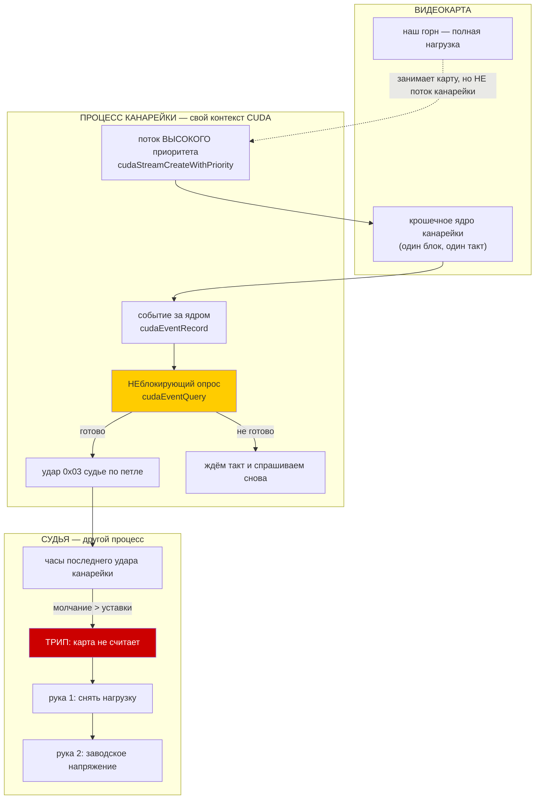

# Эпик 95 — КАНАРЕЙКА: обнаружение вставшей карты за МИЛЛИСЕКУНДЫ, а не за секунды

> **Создан:** 2026-09-09, сразу после зависания 14:44 на 3090 МГц / 900 мВ ·
> **Родитель:** эпик 51 (предохранитель) · **Вход:** `bugs/132` AC4 ·
> **Карта:** нужна с фазы 2 · **Записей в GPU в фазе 1: 0**

---

## 0. Слово владельца — это заказ на порядок величины, а не на улучшение

**2026-09-09, после того как предохранитель не спас машину:**

> *«177 секунд комп уже висел, я просто не перезагружал его в надежде, что КАГО спасёт. Не спас»*
> *«Не рассчитывай на секунды, рассчитывай на миллисекунды на спасение»*

И раньше в тот же день, о причине:

> *«ты не охватываешь всевозможные сценарии, очень тупо и слабо его делаешь, не тестируешь нихуя —
> вот комп и зависает постоянно, от твоей лени»*

**Это заказ на СМЕНУ ПОРЯДКА ВЕЛИЧИНЫ.** Сегодняшний лучший вход обнаруживает вставшую карту за
~1,5 с и упирается в физику источника: NVML отдаёт число дважды в секунду, быстрее спросить не у
кого. Миллисекунды требуют ДРУГОГО источника — сигнала, идущего с самой карты и чаще.

## 1. Что именно не сработало 09.09 — четыре слепоты, и все ПО ПОСТРОЕНИЮ

| вход | что видел в момент смерти | почему был слеп |
|---|---|---|
| 1 — тишина канала | идеальные удары, зазор 0,01…2,4 мс | драйвер ОТВЕЧАЛ на опрос: канал был жив, встала карта |
| 2 — остановка прожига | `progressSilenceMs: null` все 20 546 тактов | прожига не было вовсе — смерть случилась МЕЖДУ ступенями |
| 3 — обвал мощности | доля не считалась | разоружён (`bugs/131`): у порога нет родословной |
| 4 — телеметрия замерла | 46 981 мВт × 44 726 мс | заведён СЕГОДНЯ, ловит за ~1,5 с — это секунды, а не миллисекунды |

**Общий корень всех четырёх: ни один не спрашивает САМУ КАРТУ, считает ли она.** Три спрашивают
наши процессы, четвёртый — драйвер о его показаниях. Никто не даёт карте ЗАДАЧУ и не ждёт ответа.

## 2. Вектор цели

**Тип: Achieve.** Дать предохранителю вход, который спрашивает карту НАПРЯМУЮ — крошечным ядром,
отправляемым каждые несколько миллисекунд, — и обнаруживает её остановку за время, измеряемое
десятками миллисекунд, независимо от того, идёт ли прожиг.

**Мерка эпика:** миллисекунды от фактической остановки карты до срабатывания руки, **измеренные**,
а не выведенные из документации.

### Критерии приёмки эпика

- **E95-AC1.** Канарейка живёт ОТДЕЛЬНЫМ процессом со своим контекстом и стучит судье чаще, чем
  раз в 10 мс, при неработающей карте — доказано записью её ударов.
- **E95-AC2.** **ПОЛ КАНАРЕЙКИ ПОД ПОЛНОЙ НАГРУЗКОЙ ИЗМЕРЕН**: распределение задержек её ядра,
  пока карта занята нашим же горном. Уставка выводится ИЗ ЭТОГО ПОЛА, как все уставки проекта.
- **E95-AC3.** Поведение канарейки на РЕАЛЬНО вставшей карте наблюдено, а не предположено:
  различено «доложила о неготовности» и «замерла в драйвере». От этого зависит время обнаружения,
  и оно не берётся из документации.
- **E95-AC4.** Вход 5 в судье трипает по канарейке; матрица отказов (`lib/fuse-scenarios.mjs`)
  получает сценарий, где ловит ТОЛЬКО он, и краснеет на его снятии.
- **E95-AC5.** Ложных срабатываний ноль на записи полного прогона полосы — проверено ПРОИГРЫВАНИЕМ
  записи, а не «вроде не видели».
- **E95-AC6.** Канарейка не крадёт у прожига столько, чтобы менять его вердикт: доля времени карты
  измерена, влияние на контрольную сумму и на ватты названо числом.

## 3. Механизм — как это устроено и почему именно так

### Три решения, без которых это не работает

1. **ОТДЕЛЬНЫЙ ПРОЦЕСС, А НЕ ПОТОК В ПРОЖИГЕ.** Зависшая карта утаскивает контекст; канарейка
   внутри прожига умрёт вместе с ним и не успеет сказать ни слова. Тот же довод, по которому судья
   не живёт внутри развёртки (`bugs/27`).
2. **ПОТОК ВЫСОКОГО ПРИОРИТЕТА.** Иначе ядро канарейки встанет в очередь за нашим же горном, и мы
   будем мерить длину очереди, а не здоровье карты. Это ровно класс `bugs/124` — прибор измеряет не
   то, что называет.
3. **СУДЬЯ СМОТРИТ ТОЛЬКО НА ОТМЕТКУ ВРЕМЕНИ.** Если канарейка заблокировалась в драйвере — это и
   есть сигнал. Наблюдатель обязан жить в другом процессе, иначе зависнет вместе с ней.

### Чего мы НЕ знаем и обязаны измерить (это и есть содержание фаз 2-3)

**Как ведёт себя опрос готовности на РЕАЛЬНО вставшей карте.** По документации `cudaEventQuery` не
блокируется и возвращает «не готово». Но зависание бывает такой природы, что блокируется любой
вызов в драйвер. Для нас сигнал есть в обоих случаях (удары прекратились), но **разница между
«доложила» и «замерла» определяет время обнаружения**, и её нельзя брать из документации.

### Об «индустриальном стандарте» — честно, чтобы не выдавать приём за спецификацию

Рядом стоит **TDR** (Timeout Detection and Recovery, Windows): драйвер сам сбрасывает карту, если
ядро не завершилось за отведённое время — по умолчанию около двух секунд. Это отраслевой механизм
обнаружения зависшего GPU, но он **в драйвере, медленнее заказа владельца и лечит драйвер, а не
спасает нашу ступень**. У NVML отдельного API «зависла ли карта» нет вовсе.

Канарейка прикладного уровня — **известный инженерный приём** (сторожа в вычислительных кластерах,
нагрузочные стенды), но не спецификация с гарантиями. Называть её стандартом было бы преувеличением,
и эпик этого не делает.

## 4. Фазы и ворота

| фаза | что делает | ворота (закрывается, когда) |
|---|---|---|
| **1. Канарейка родилась** | `workloads/canary.cu`: ядро, поток приоритета, событие, удары `0x03` по петле; сборка в конвейере `workloads:build`; блоки | канарейка стучит на ХОЛОСТОЙ карте чаще 10 мс, ударов не теряет; записей в GPU ноль |
| **2. Пол под нагрузкой** | замер: канарейка + настоящий горн 60 с; распределение задержек ядра | **E95-AC2**: пол измерен, уставка ВЫВЕДЕНА из него; влияние на прожиг названо числом (**E95-AC6**) |
| **3. Поведение на вставшей карте** | наблюдение на двойнике и, если получится, на настоящем зависании | **E95-AC3**: различено «доложила» и «замерла», время обнаружения названо |
| **4. Вход 5 в судье** | трип по канарейке, сценарий в матрице, проигрывание записи полосы | **E95-AC4**, **E95-AC5** |
| **5. Живой прогон** | полоса под канарейкой при владельце | мерка сдвинулась, ложных ноль |

**Правило лестницы:** операционный план пишется на ФАЗУ N+1, когда закрыта фаза N. Сейчас написан
`plans/96` — фаза 1.

## 5. Риски по Мёрфи

| риск | ярус | реакция |
|---|---|---|
| Канарейка сама роняет карту (лишний контекст, память) | средний | ядро в один блок, память — единственное слово; фаза 1 идёт на холостой карте |
| Ядро канарейки опаздывает под нагрузкой и даёт ложные | **высокий** | вся фаза 2 — про это; уставка только из измеренного пола |
| Опрос блокируется на зависшей карте, и мы теряем миллисекунды | **высокий** | фаза 3 меряет; если блокируется — судья считает молчание, и это всё равно быстрее NVML |
| Канарейка крадёт время у прожига и меняет вердикт | средний | **E95-AC6** — доля времени карты измеряется, а не предполагается |
| Приоритет потока не соблюдается драйвером | средний | проверяется замером фазы 2: если приоритет не работает, пол это покажет |

## 6. Связи

`bugs/132` (зависание 09.09, вход 4 и его граница) · `bugs/131` (вход 3 разоружён) ·
эпик 51 (предохранитель) · `lib/fuse-scenarios.mjs` (матрица отказов) ·
`plans/66` (вход 2 — та же архитектура удара по петле).
