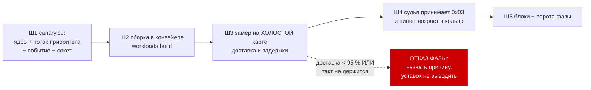

# План 96 — эпик 95, фаза 1: КАНАРЕЙКА РОДИЛАСЬ И СТУЧИТ

> **Родитель:** `plans/95` (эпик 95) · **Ворота фазы:** канарейка стучит на холостой карте чаще
> 10 мс и не теряет ударов · **Записей в GPU: 0** · **Присутствие владельца: не нужно**

---

## Вектор цели фазы

**Тип: Achieve.** Получить работающий источник сигнала «карта считает», идущий с САМОЙ карты и на
два порядка чаще, чем NVML, — и доказать его замером на холостой карте, прежде чем нести под
нагрузку.

## Критерии приёмки фазы

- **P96-AC1.** `workloads/canary.exe` собирается тем же конвейером, что и остальные нагрузки
  (`npm run workloads:build`), и попадает в манифест с суммой исходника.
- **P96-AC2.** Канарейка шлёт удары `0x03` на указанный порт петли; за 10 секунд на холостой карте
  **доставлено ≥ 95 %** ожидаемых ударов при заказанном такте 5 мс.
- **P96-AC3.** Измерено и записано: медиана, p90, p99 и максимум задержки её ядра на **холостой**
  карте. Это ПОЛ ПОЛА — числа фазы 2 будут сравниваться с ним.
- **P96-AC4.** Канарейка кончается сама по `--seconds` и по смерти родителя не остаётся сиротой;
  проверено запуском и наблюдением списка процессов.
- **P96-AC5.** Судья принимает байт `0x03` и пишет в кольцо возраст последнего удара канарейки
  ОТДЕЛЬНЫМ полем — не смешивая его с ударами живости. Наблюдение, БЕЗ трипа: взведение — фаза 4.
- **P96-AC6.** Блоки: форма строки запуска, разбор аргументов, отказ при отсутствии карты назван
  вслух (не молчаливый выход), приём `0x03` судьёй.

### Границы фазы — что она НЕ доказывает (записано ДО работы)

- **Не доказывает пол под нагрузкой.** Холостая карта — самый лёгкий случай; настоящие задержки
  будут в фазе 2, и уставка отсюда НЕ выводится.
- **Не доказывает поведение на вставшей карте.** Это фаза 3.
- **Не даёт защиты.** Вход 5 не взводится: канарейка в этой фазе только наблюдает.

## Блок-схема фазы

## Шаги

- [ ] **1. `workloads/canary.cu`.** Ядро в ОДИН блок и один такт — оно должно доказывать, что карта
      принимает и завершает работу, а не грузить её. Поток создаётся
      `cudaStreamCreateWithPriority` с наивысшим доступным приоритетом (диапазон спрашивается у
      карты, а не назначается). За каждым запуском — `cudaEventRecord`, затем НЕблокирующий
      `cudaEventQuery` в цикле с уступкой. Готово — датаграмма `0x03` на порт петли (winsock,
      как у пробы). Аргументы: `--port P [--tick 5] [--seconds N]`.
      🔴 **Отказ инициализации называется вслух и кодом выхода**, а не молчаливым нулём: молчащая
      канарейка неотличима от вставшей карты, и это ровно та беда, которую фаза лечит.

- [ ] **2. Сборка в конвейере.** `tools/build-workloads.mjs` подхватывает `.cu` сам; проверить, что
      канарейка попала в манифест с суммой исходника и что `--verify` её видит. **P96-AC1.**

- [ ] **3. ЗАМЕР НА ХОЛОСТОЙ КАРТЕ.** Приёмник на петле считает удары и зазоры между ними 10 с при
      такте 5 мс. Записать: доставлено из ожидаемых, медиана/p90/p99/max зазора. **P96-AC2, AC3.**
      Числа ложатся в шапку `canary.cu` рядом с кодом — как у всех измеренных величин проекта.

- [ ] **4. Судья слышит канарейку.** Байт `0x03` в разборе датаграмм; отдельные `lastCanaryMs` и
      поле `canarySilenceMs` в строке кольца. **Трипа нет** — только наблюдение. **P96-AC5.**

- [ ] **5. Блоки и ворота.** Блоки формы строки и разбора аргументов; блок судьи на приём `0x03`
      (фикстурой, без карты); мутация «снять обработку 0x03» обязана краснеть. Ворота фазы:
      `npm run check` и `npm run selftest:all` зелёные. **P96-AC6.**

## Проверка — какими артефактами

| что доказываем | артефакт |
|---|---|
| канарейка собрана | `workloads/canary.exe` + строка в `workloads/MANIFEST.json` |
| она стучит и держит такт | вывод замера шага 3, числа в шапке `canary.cu` |
| судья её слышит | строка кольца с непустым `canarySilenceMs` |
| ничего не сломано | `check` + `selftest:all` зелёные, матрица отказов без новых дыр |

## Риски фазы

| риск | реакция |
|---|---|
| Нет тулчейна/nvcc под рукой | сборка тем же конвейером, что уже собирает три нагрузки — если он жив, жива и она; отказ называется вслух |
| Приоритет потока недоступен на этой карте | спрашиваем диапазон у карты и печатаем, что получили; если приоритетов нет — это ФАКТ фазы, а не повод молчать |
| Канарейка мешает горну уже на холостом ходу | на холостой карте мерить нечего; влияние — фаза 2, **E95-AC6** |
| Сокет в `.cu` — новая для проекта машинерия | форма взята у пробы (тот же порт, тот же однобайтный протокол), а не изобретается |
