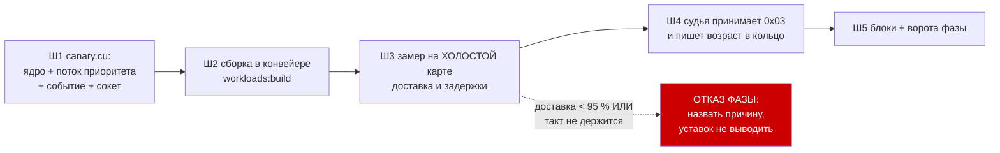

# План 96 — эпик 95, фаза 1: КАНАРЕЙКА РОДИЛАСЬ И СТУЧИТ

> **Родитель:** `plans/95` (эпик 95) · **Ворота фазы:** канарейка стучит на холостой карте чаще
> 10 мс и не теряет ударов · **Записей в GPU: 0** · **Присутствие владельца: не нужно**

---

## Вектор цели фазы

**Тип: Achieve.** Получить работающий источник сигнала «карта считает», идущий с САМОЙ карты и на
два порядка чаще, чем NVML, — и доказать его замером на холостой карте, прежде чем нести под
нагрузку.

## Критерии приёмки фазы

- **P96-AC1.** `workloads/canary.exe` собирается тем же конвейером, что и остальные нагрузки
  (`npm run workloads:build`), и попадает в манифест с суммой исходника.
- **P96-AC2.** Канарейка шлёт удары `0x03` на указанный порт петли; за 10 секунд на холостой карте
  **доставлено ≥ 95 %** ожидаемых ударов при заказанном такте 5 мс.
- **P96-AC3.** Измерено и записано: медиана, p90, p99 и максимум задержки её ядра на **холостой**
  карте. Это ПОЛ ПОЛА — числа фазы 2 будут сравниваться с ним.
- **P96-AC4.** Канарейка кончается сама по `--seconds` и по смерти родителя не остаётся сиротой;
  проверено запуском и наблюдением списка процессов.
- **P96-AC5.** Судья принимает байт `0x03` и пишет в кольцо возраст последнего удара канарейки
  ОТДЕЛЬНЫМ полем — не смешивая его с ударами живости. Наблюдение, БЕЗ трипа: взведение — фаза 4.
- **P96-AC6.** Блоки: форма строки запуска, разбор аргументов, отказ при отсутствии карты назван
  вслух (не молчаливый выход), приём `0x03` судьёй.

### Границы фазы — что она НЕ доказывает (записано ДО работы)

- **Не доказывает пол под нагрузкой.** Холостая карта — самый лёгкий случай; настоящие задержки
  будут в фазе 2, и уставка отсюда НЕ выводится.
- **Не доказывает поведение на вставшей карте.** Это фаза 3.
- **Не даёт защиты.** Вход 5 не взводится: канарейка в этой фазе только наблюдает.

## Блок-схема фазы

## Шаги

- [x] **1. `workloads/canary.cu`.** ✅ ИСПОЛНЕН 2026-09-09. Ядро в ОДИН блок и один такт — оно должно доказывать, что карта
      принимает и завершает работу, а не грузить её. Поток создаётся
      `cudaStreamCreateWithPriority` с наивысшим доступным приоритетом (диапазон спрашивается у
      карты, а не назначается). За каждым запуском — `cudaEventRecord`, затем НЕблокирующий
      `cudaEventQuery` в цикле с уступкой. Готово — датаграмма `0x03` на порт петли (winsock,
      как у пробы). Аргументы: `--port P [--tick 5] [--seconds N]`.
      🔴 **Отказ инициализации называется вслух и кодом выхода**, а не молчаливым нулём: молчащая
      канарейка неотличима от вставшей карты, и это ровно та беда, которую фаза лечит.

- [x] **2. Сборка в конвейере.** ✅ ИСПОЛНЕН. `tools/build-workloads.mjs` подхватывает `.cu` сам; проверить, что
      канарейка попала в манифест с суммой исходника и что `--verify` её видит. **P96-AC1.**

- [x] **3. ЗАМЕР НА ХОЛОСТОЙ КАРТЕ.** ✅ ИСПОЛНЕН, три прогона. Приёмник на петле считает удары и зазоры между ними 10 с при
      такте 5 мс. Записать: доставлено из ожидаемых, медиана/p90/p99/max зазора. **P96-AC2, AC3.**
      Числа ложатся в шапку `canary.cu` рядом с кодом — как у всех измеренных величин проекта.

- [x] **4. Судья слышит канарейку.** ✅ ИСПОЛНЕН. Байт `0x03` в разборе датаграмм; отдельные `lastCanaryMs` и
      поле `canarySilenceMs` в строке кольца. **Трипа нет** — только наблюдение. **P96-AC5.**

- [x] **5. Блоки и ворота.** ✅ ИСПОЛНЕН, 9 блоков, 5 мутаций. Блоки формы строки и разбора аргументов; блок судьи на приём `0x03`
      (фикстурой, без карты); мутация «снять обработку 0x03» обязана краснеть. Ворота фазы:
      `npm run check` и `npm run selftest:all` зелёные. **P96-AC6.**

## Проверка — какими артефактами

| что доказываем | артефакт |
|---|---|
| канарейка собрана | `workloads/canary.exe` + строка в `workloads/MANIFEST.json` |
| она стучит и держит такт | вывод замера шага 3, числа в шапке `canary.cu` |
| судья её слышит | строка кольца с непустым `canarySilenceMs` |
| ничего не сломано | `check` + `selftest:all` зелёные, матрица отказов без новых дыр |

## Риски фазы

| риск | реакция |
|---|---|
| Нет тулчейна/nvcc под рукой | сборка тем же конвейером, что уже собирает три нагрузки — если он жив, жива и она; отказ называется вслух |
| Приоритет потока недоступен на этой карте | спрашиваем диапазон у карты и печатаем, что получили; если приоритетов нет — это ФАКТ фазы, а не повод молчать |
| Канарейка мешает горну уже на холостом ходу | на холостой карте мерить нечего; влияние — фаза 2, **E95-AC6** |
| Сокет в `.cu` — новая для проекта машинерия | форма взята у пробы (тот же порт, тот же однобайтный протокол), а не изобретается |

---

## ✅ ЗАПИСЬ ФАЗЫ — ЗАКРЫТА 2026-09-09 (сессия 96). Записей в GPU: 0

Карта холостая всё время фазы: 0 % загрузки, 31,9 Вт, предел 300 Вт заводской. Ни одной записи
смещения, ни одного изменения предела.

### Приёмка по критериям

| критерий | чем закрыт |
|---|---|
| **P96-AC1** | `npm run workloads:build` подхватил `canary.cu` **без единой правки конвейера**; в манифесте `run_checksum=315486a086a29df3`. Три боевые нагрузки сохранили суммы бит в бит: `67e95c85bb6299a2` · `2fa22073660f99b5` · `e27ec24a82d509d7` |
| **P96-AC2** | три прогона 10 с, такт 5 мс: **2001 из 2001 в каждом = 100 %** при пороге 95 %. Считал НЕЗАВИСИМЫЙ приёмник на петле, а не сама канарейка |
| **P96-AC3** | задержка ядра, мкс: медиана 42 · 51 · 43 · p90 121 · 129 · 124 · p99 273 · 272 · 270 · max 1703 · 679 · 629. Зазор удара: медиана 5000 · 5000 · 4999 · p90 5063 · 5065 · 5066 · p99 5180 · 5156 · 5161 · max 6550 · 5582 · 5541. Числа стоят в шапке `canary.cu` |
| **P96-AC4** | родитель убит на 3-й секунде, канарейка заказана на 30 — вышла на **3,1 с**, код 0, причина названа строкой. Сирот: `Get-Process canary` → 0 |
| **P96-AC5** | `canarySilenceMs` отдельным полем в кольце судьи; проведено в ЧЕТЫРЁХ местах сразу — приём датаграммы, `judgeLiveness`, строка кольца, проигрыватель записи. Трипа нет |
| **P96-AC6** | 9 блоков в `fuse --selftest` (174 зелёных, 0 красных); отказы прибора наблюдены: неизвестный аргумент → 4 · аргумент вне диапазона → 4 · мёртвый родитель → 4 · **нет карты → 2 с названной причиной**, в обоих режимах |

### Пять мутаций, каждая покрасила ровно свои блоки

| мутация | покраснело |
|---|---|
| снять у судьи разбор `0x03` | 2 блока (приём и обновление возраста) |
| подмешать `0x03` к ударам живости | 1 блок (вход 1 остаётся без источника) |
| дать канарейке право трипать | 2 блока (граница фазы: наблюдение без взведения) |
| непроведённая канарейка отвечает нулём | 2 блока («источника нет» ≠ «застыл») |
| проигрыватель теряет канарейку | 1 блок (восстановление из строки) |

Целый код не покрасил ни одного. Ворота: `npm run check` зелёные, новых нарушений 0;
`npm run selftest:all` — **53 набора, 0 красных, 2697 зелёных блоков** (было 2688; рост объяснён
поимённо девятью блоками фазы).

### 🔴 ТРИ НАХОДКИ ФАЗЫ, И ВСЕ ТРИ НАЙДЕНЫ ПРОГОНОМ, А НЕ ЧТЕНИЕМ

1. **ПЕРВЫЙ ЗАПУСК СТОИТ 97 МИЛЛИСЕКУНД.** Самый первый прогон дал медиану 10 мкс и максимум
   **97 142 мкс** на 64 запусках при стенке 99 мс: инициализация контекста CUDA целиком лежит в
   запуске №1. Канарейка без прогрева молчит 97 мс **в момент рождения** — на три порядка дольше
   своего такта, — и взведённый судья убил бы прогон на здоровой карте. Лечение: прогрев вне часов
   и вне гистограммы, `CANARY_WARMUP_LAUNCHES = 2`. После него максимум **32 мкс**.
2. **ДОСТАВКА 100 % И ТАКТ ВТРОЕ МИМО — ЭТО ДВА РАЗНЫХ ФАКТА.** Первая редакция ожидания доставила
   2001 удар из 2001 (то есть прошла бы `P96-AC2` как есть) при зазоре **p90 15 238 · p99 16 055 ·
   max 20 372 мкс** — штатный квант Windows байт в байт, подпись `bugs/128`, и это при
   `timeBeginPeriod(1)`, вернувшем успех. Прибор, отчитывающийся только доставкой, был бы зелёным и
   бесполезным для миллисекунд.
   **Механизм выбран замером пяти форм, по 600 проб, дважды** (`Sleep` · `Sleep`+спин · таймер
   высокого разрешения · он же со спином · он же с `TIME_CRITICAL`): на обычном приоритете хвост
   ЛЮБОЙ формы гуляет между прогонами от 5,5 до 25 мс, и устойчивость покупает **приоритет потока**,
   а не таймер; спин-хвост добирает последние полмиллисекунды. Единственная форма, выстоявшая на
   обоих прогонах, — `CREATE_WAITABLE_TIMER_HIGH_RESOLUTION` + спин + `THREAD_PRIORITY_TIME_CRITICAL`
   (p99 5,040 / 5,000 мс, max 5,107 / 5,137). Цена названа: до 1 мс спина на каждые 5 мс такта,
   то есть до 20 % ОДНОГО потока из шестнадцати; её влияние на прожиг — **E95-AC6**, фаза 2.
3. **ДВА БЛОКА БЫЛИ УКРАШЕНИЕМ, И ЭТО НАШЛА МУТАЦИЯ, А НЕ ВЫЧИТКА.** Блоки проигрывателя проверяли
   длину списка тактов — истина и на проигрывателе, который канарейку игнорирует вовсе; ни одна из
   четырёх мутаций их не покрасила. Класс `bugs/106`. Вылечено не усилением утверждения, а тем, что
   восстановленная величина стала НАБЛЮДАЕМОЙ (поле в такте проигрывателя); пятая мутация красит.

### Решения, принятые без владельца

- **Канарейка удовлетворяет действующий контракт конвейера, а конвейер не трогается.** Он берёт
  каждый `.cu` из `workloads/` и требует `KAGO-WORKLOAD … checksum=`, одну сумму на пять прогонов и
  совпадение под `--sustain 2`. Варианты были: (A) подчиниться контракту · (B) учить конвейер
  второму классу артефактов · (C) вынести канарейку из `workloads/`. **Выбран A:** B правит ворота,
  через которые проходят все три боевые нагрузки, и открывает новый контур машинерии под
  действующим мораторием (`interviews/017` Q1 = A); C теряет манифест и ломает `P96-AC1`.
  Проверка детерминизма при этом не формальность: недетерминированная канарейка — сломанный прибор.
- **`--seconds` и `--sustain` — два написания ОДНОГО числа**, а не две сущности: конвейер пишет
  одно, проба проекта другое, и заводить две переменные значило бы завести пару, которая разойдётся.
- **`--parent-pid` добавлен** как дешёвый способ закрыть `P96-AC4` без второго механизма
  жизненного цикла: по умолчанию выключен, границей остаётся `--seconds`, как у пробы.
- **Библиотеки просятся из исходника** (`#pragma comment(lib, …)`), а не из командной строки:
  `buildCuda` зовёт nvcc с фиксированным `-O2`, и флаг под одну нагрузку означал бы правку общей
  машинерии.

### Что фаза НЕ доказала — названо, а не умолчано

- **Пол под нагрузкой не измерен.** Все числа сняты на ХОЛОСТОЙ карте, самом лёгком случае.
  Уставка входа 5 отсюда НЕ выводится — это фаза 2, иначе повторяется `bugs/131` (вход с порогом
  без родословной).
- **Поведение на РЕАЛЬНО вставшей карте не наблюдено.** Различие «доложила о неготовности» против
  «замерла в драйвере» решает время обнаружения, и оно берётся замером фазы 3, а не из документации.
- **Защиты канарейка не даёт.** Вход 5 не взведён и в `tripped` не входит ни одним слагаемым;
  это проверено блоком и покраснено мутацией, а не объявлено.
- **Цена для прожига не измерена** — `E95-AC6`, фаза 2.
