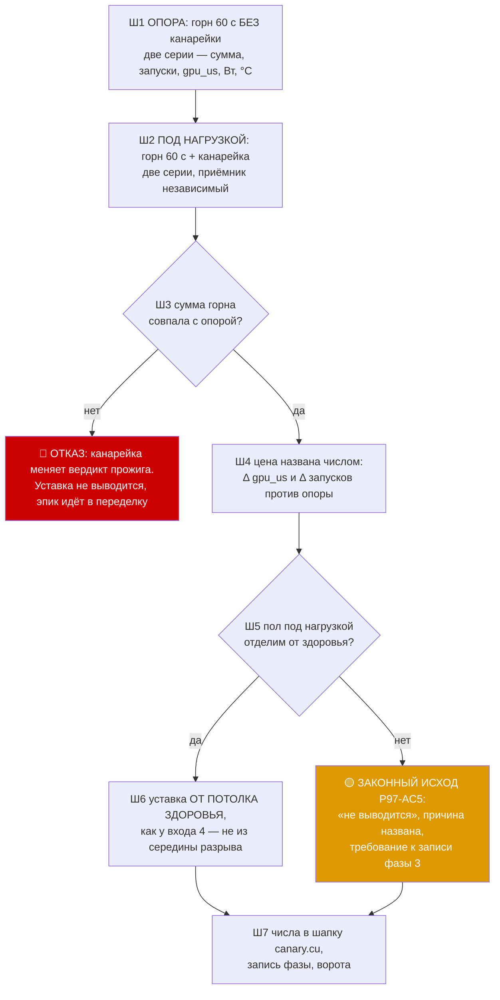

# План 97 — эпик 95, фаза 2: ПОЛ КАНАРЕЙКИ ПОД ПОЛНОЙ НАГРУЗКОЙ

> **Создан:** 2026-09-09 (сессия 96), сразу после закрытия фазы 1 · **Родитель:** `plans/95` (эпик 95) ·
> **Вход:** `plans/96` — канарейка стучит, судья её слышит, вход 5 НЕ взведён ·
> **Ворота фазы:** пол под нагрузкой измерен, уставка ВЫВЕДЕНА из него, цена для прожига названа числом ·
> **Записей в GPU: 0** · **Присутствие владельца: не нужно** · **Поиска края НЕТ**

---

## Вектор цели фазы

**Тип: Achieve.** Узнать, насколько канарейка опаздывает, когда карта занята нашим же горном на
полном конверте, — и вывести из этого пола уставку входа 5. Плюс назвать числом, сколько канарейка
у прожига крадёт.

**Почему это следующий шаг, а не взведение.** Уставка, взятая с холостой карты, — это `bugs/131`
повторно: вход с порогом без родословной. Все числа фазы 1 сняты в самом лёгком случае, какой
существует; настоящий пол лежит там, где карта занята, и очередь к ней — не пуста.

## Критерии приёмки фазы

- **P97-AC1.** Снята опора: горн `--sustain 60` БЕЗ канарейки, две серии. Записаны контрольная
  сумма, число запусков, `gpu_us`, `wall_us`, ватты и температура на плато.
- **P97-AC2** (= **E95-AC2**). Снято распределение задержки ядра канарейки и зазора её ударов, пока
  карта занята горном 60 с, — медиана, p90, p99, максимум, доставка. Две серии, приёмник независимый.
- **P97-AC3.** Уставка входа 5 **выведена из ПОТОЛКА ЗДОРОВЬЯ**, а не из середины разрыва, — тем же
  правилом, которым выведен вход 4 (цена ложного — прерванная ступень, цена пропуска — мёртвая
  машина). Число записано вместе со способом его получения.
- **P97-AC4** (= **E95-AC6**). Цена канарейки для прожига названа числом: контрольная сумма горна
  ОБЯЗАНА совпасть, а `gpu_us` и число запусков сравниваются с опорой P97-AC1. Просадка сверх
  собственного разброса прибора — находка, а не шум.
- **P97-AC5.** Законный исход «уставка НЕ выводится, причина названа» — принимается наравне с
  числом. Прямая защита от ошибки, которой оплачен `bugs/130`.

### Границы фазы — записаны ДО работы

- **Поиска края НЕТ, андервольта НЕТ, записей в карту НЕТ.** Машина выживает по построению: горн
  греет карту на заводской кривой, то есть ровно то, что она делает в любой игре.
- **Не доказывает поведение на ВСТАВШЕЙ карте** — это фаза 3, и она единственная отвечает на
  вопрос «доложила о неготовности или замерла в драйвере».
- **Не взводит вход 5.** Взведение — фаза 4, после того как у уставки появится родословная.
- **Один вечер — не распределение.** Сколько серий хватит, решает собственный разброс: если две
  серии расходятся шире, чем ожидаемый эффект, серий берётся больше или уставка не выводится (AC5).

## Блок-схема фазы



## Шаги

- [x] **1. ОПОРА БЕЗ КАНАРЕЙКИ.** OK `furnace.exe 2400 8192 256 64 --sustain 60`, две серии, телеметрия
      отдельным процессом. Записать сумму, `launches`, `gpu_us`, `wall_us`, ватты и температуру.
      **P97-AC1.**
- [x] **2. ПОД НАГРУЗКОЙ.** OK Тот же горн + `canary.exe --port P --tick 5 --seconds 90`, канарейка
      стартует ПЕРВОЙ (прогрев её контекста не должен попасть в окно горна) и переживает его конец.
      Две серии, удары считает независимый приёмник. **P97-AC2.**
- [x] **3. СУММА ГОРНА.** OK Совпала с опорой — идём дальше; разошлась — канарейка меняет вердикт
      прожига, и это ОТКАЗ фазы, а не помеха: эпик тогда переделывается, а не «настраивается».
- [x] **4. ЦЕНА ЧИСЛОМ.** OK `Δ gpu_us` и `Δ launches` против опоры, рядом с собственным разбросом
      двух опорных серий. **P97-AC4.**
- [x] **5-6. УСТАВКА ИЛИ ЧЕСТНЫЙ ОТКАЗ.** OK Потолок здоровья под нагрузкой × запас, тем же правилом,
      что у входа 4. Не отделяется — **P97-AC5**, и это законный исход.
- [x] **7. ЗАПИСЬ.** OK Числа в шапку `canary.cu`, запись фазы сюда, ворота `check` + `selftest:all`.

## Риски

| риск | ярус | реакция |
|---|---|---|
| Канарейка крадёт у горна и меняет его сумму | **высокий** | Ш3 — это ворота, а не наблюдение: расхождение суммы останавливает фазу |
| Пол под нагрузкой перекрывается со здоровьем, уставка не выводится | **высокий** | AC5 объявляет это законным исходом ЗАРАНЕЕ — ровно защита от `bugs/130`, где вывод сделали через силу |
| Две серии разойдутся шире эффекта | средний | серий берётся больше либо уставка не выводится; «одно наблюдение» уставкой не становится |
| Горн греет карту до троттлинга и меняет очередь | средний | температура и ватты пишутся рядом с каждой серией, чтобы это было видно, а не подразумевалось |
| Приоритет потока канарейки не соблюдается под нагрузкой | средний | именно это и меряется: если приоритет не работает, пол покажет очередь горна |

---

## ✅ ЗАПИСЬ ФАЗЫ — 2026-09-09 (сессия 96). Записей в GPU: 0, поиска края нет, машина жива

Карта заводская всё время фазы: предел 300 Вт заводской, смещений не писалось. Горн греет её на
СТОКОВОЙ кривой — то же, что делает любая игра.

### Ш1 — опора без канарейки, две серии по 60 с

| серия | запусков | `gpu_us` | `wall_us` | доля GPU | Вт | °C | МГц | вентилятор |
|---|---|---|---|---|---|---|---|---|
| 1 | 212 | 56 653 783 | 59 228 252 | 95,65 % | 299,91 | 79 | 2752 | 80 % |
| 2 | 213 | 57 518 183 | 59 783 293 | 96,21 % | 300,07 | 80 | 2797 | 83 % |

Карта на ПОЛНОМ конверте — 300 Вт, то есть та самая область, про которую факт 16 говорит, что вся
прежняя база снята при половинном. **Собственный разброс прибора: 0,462 %** по запускам в секунду
(3,5794 против 3,5629). Это число — мерка, ниже которой ни один эффект называть эффектом нельзя.

### Ш2 — под нагрузкой, две серии; удары считал НЕЗАВИСИМЫЙ приёмник

| серия | запусков горна | Вт | °C | ударов канарейки | доставка |
|---|---|---|---|---|---|
| 1 | 208 | 302,30 | 79 | 18 001 | **18 001 из 18 001 = 100 %** |
| 2 | 207 | 299,78 | 79 | 18 001 | **18 001 из 18 001 = 100 %** |

Приёмник и канарейка сошлись до десятка микросекунд (max 11,281 против 11,289 мс).

### Ш3 — ВОРОТА ВЗЯТЫ: канарейка НЕ меняет вердикт прожига

Контрольная сумма горна **`2fa22073660f99b5` во всех ЧЕТЫРЁХ прогонах**, `distinct=1`,
`bad_launches=0`. То есть оракул видит ровно то же, что и без канарейки.

### Ш4 — ЦЕНА НАЗВАНА ЧИСЛОМ, И ОНА НЕ НОЛЬ

| | запусков в секунду | прочитано из VRAM |
|---|---|---|
| опора | 3,5794 · 3,5629 → **3,5711** | 31 800 · 31 950 ГБ |
| с канарейкой | 3,4686 · 3,4645 → **3,4666** | 31 200 · 31 050 ГБ |
| **разница** | **−2,93 %** | **−2,35 %** |

**−2,93 % — это в 6,3 раза больше собственного разброса прибора (0,462 %), значит эффект настоящий,
а не шум.** Две независимые величины (запуски и прочитанные гигабайты) называют одно и то же.
Ватты и температура не сдвинулись: 299,8…302,3 Вт, 79…80 °C.

🔴 **СЛЕДСТВИЕ ДЛЯ ФАЗЫ 4, И ОНО ВАЖНЕЕ САМОГО ЧИСЛА.**

✏️ **ЗДЕСЬ СТОЯЛО «оракул увидит проседание частоты, ложный SDC», И ЭТО БЫЛО НЕВЕРНО — снято
чтением исходника, а не рассуждением.** `verdictFor` и `judgeBursts` строят вердикт из ДВУХ вещей:
контрольной суммы против эталона и журнала событий Windows. **`opsPerSecond` не сравнивается с
порогом НИГДЕ** — он записывается в журнал, храповик и записи движка, но ни одного PASS/SDC/CRASH
не решает. Значит вердикт стабильности канарейка не трогает вовсе, и это следовало проверить до
того, как писать предупреждение.

🔴 **НО ОНА ПОПАДАЕТ В ЦЕНУ, И ТАМ ПОСЛЕДСТВИЕ СЕРЬЁЗНЕЕ.** `opsPerSecond` кормит `priceRow`
(`ladder-descent.mjs:375`), а тот объявляет эффектом всё, что превышает `floorPriceFraction` —
собственный разброс прибора, **0,0018 = 0,18 %** в записанной опоре. Наши **−2,93 % это 16 таких
полов**. То есть спуск, померенный С канарейкой против опоры, снятой БЕЗ неё, отчитается о цене в
2,93 % производительности, которой карта не платила, — а цена это ВАЛЮТА формулы владельца
«снижаем потребление, пока не платим больше, чем N» (`GOAL.md`). Ложная цена искажает выбор режима
напрямую.

**Правило для фазы 4, выведенное из этого:** любой замер ЦЕНЫ, идущий вместе с канарейкой, обязан
иметь опору, снятую С НЕЙ. Замер вердикта — не обязан. Две разные величины, и различает их не
осторожность, а то, что порог есть только у одной.

### Ш5–6 — ПОЛ ПОД НАГРУЗКОЙ И ВЫВЕДЕННАЯ УСТАВКА

| величина, мкс | холостая карта (3 серии) | **под полной нагрузкой (2 серии)** |
|---|---|---|
| задержка ядра, медиана | 42 · 51 · 43 | **150 · 152** |
| задержка ядра, p90 | 121 · 129 · 124 | **300 · 356** |
| задержка ядра, p99 | 270 · 272 · 273 | **2 307 · 2 793** |
| задержка ядра, max | 629 · 679 · 1 703 | **6 470 · 5 568** |
| зазор удара, медиана | 5 000 | **4 999 · 5 000** |
| зазор удара, p90 | 5 063…5 066 | **5 101 · 5 141** |
| зазор удара, p99 | 5 156…5 180 | **7 009 · 7 138** |
| зазор удара, max | 5 541…6 550 | **11 289 · 9 872** |

**Приоритет потока РАБОТАЕТ, и это главный ответ фазы.** Карта занята горном на 300 Вт, а медиана
зазора не сдвинулась вовсе: 5 000 мкс против 5 000. Если бы приоритет не соблюдался, канарейка
стояла бы в очереди за запусками горна длиной 280 мс, и медиана уехала бы туда же. Хвост при этом
вырос честно: p99 5,17 → 7,07 мс, максимум 6,55 → 11,29 мс.

**УСТАВКА ВЫВЕДЕНА ТЕМ ЖЕ ПРАВИЛОМ, ЧТО У ВХОДА 4 — ОТ ПОТОЛКА ЗДОРОВЬЯ, А НЕ ИЗ СЕРЕДИНЫ РАЗРЫВА**
(цена ложного — прерванная ступень, цена пропуска — мёртвая машина):

```
потолок здоровья под полной нагрузкой = 11,289 мс   (худший зазор на 36 002 удара двух серий)
уставка = 3 x потолок = 33,9 мс                      (тот же множитель, что у входа 4: 3 x 515 = 1500)
```

| | обнаружение | + руки (замерено 282 мс) |
|---|---|---|
| вход 4 — телеметрия замерла | ~1 500 мс | ~1 782 мс |
| **вход 5 — канарейка** | **~34 мс** | **~316 мс** |
| выигрыш | **44x** | **5,6x** |

🎯 **И ВОТ ЧТО ЭТО МЕНЯЕТ В ЭПИКЕ: УЗКОЕ МЕСТО ПЕРЕЕЗЖАЕТ С ОБНАРУЖЕНИЯ НА РУКИ.** До канарейки
обнаружение стоило 1 500 мс против 282 мс на руки — руки были мелочью. После неё 34 против 282:
**восемьдесят девять процентов времени спасения теперь тратят руки, а не глаза.** Заказ владельца
(«миллисекунды») достигается на входе, но не сквозь весь контур, и следующая точка роста названа
числом, а не ощущением. Это материал для фазы 4 и, возможно, для отдельного шага эпика 51.

### 🔴 ЧЕГО ЭТА ФАЗА НЕ ДОКАЗАЛА — названо, а не умолчано

- **Уставка 33,9 мс — КАНДИДАТ, а не решение.** Она стоит на ДВУХ сериях одного вечера и одной
  форме нагрузки (горн). Худший зазор 11,289 мс — ОДНА проба, а не распределение; проект за
  «уставку из одного наблюдения» уже платил (`bugs/126`, 455 мс). Перед взведением фазе 4 нужны
  ещё серии и другая форма нагрузки.
- **Поведение на РЕАЛЬНО вставшей карте не наблюдено** — фаза 3. Пока неизвестно, доложит опрос о
  неготовности или замрёт в драйвере, и это решает, будет ли обнаружение 34 мс на самом деле.
- **Цена 2,93 % измерена ТОЛЬКО на горне.** На другой форме нагрузки она своя.
- **Вход 5 по-прежнему НЕ взведён.** Взведение — фаза 4.

### Решения, принятые без владельца

- **Множитель запаса взят 3x — тот же, что у входа 4**, а не подобран заново: два входа одного
  предохранителя, судящие «потолок здоровья», обязаны считать одним правилом, иначе в машинерии
  появляется второе, ничем не обоснованное число. Это применение уже принятого решения, а не новое.
- **Мерой цены выбраны ЗАПУСКИ В СЕКУНДУ и прочитанные гигабайты, а не `gpu_us`.** `gpu_us` меряется
  событиями вокруг каждого запуска, и ядра канарейки попадают ВНУТРЬ этих окон — величина растёт
  при падении настоящей производительности. Прибор, который меряет не то, что называет, — класс
  `bugs/124`, и здесь он был бы выбран по невнимательности.
