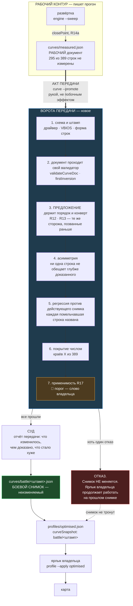

# Эпик 98 — БОЕВОЙ СНИМОК И ВОРОТА, ЧЕРЕЗ КОТОРЫЕ КРИВАЯ В НЕГО ПОПАДАЕТ

> **Создан:** 2026-09-09 (сессия 97) · **Родитель:** приказ владельца, `GOAL.md` → «📸 БОЕВОЙ РЕЖИМ
> СТОИТ НА СНИМКЕ»; тикет `bugs/134`; разведка `researches/37` · **Статус:** 🔲 расписан, фаза 1 не
> начата · **Исходящее:** одна развилка владельцу (`/interview`) — чем валидатор судит «адекватность»;
> пишется после фазы 1, когда цена каждого варианта посчитана.

---

## 1. Вектор цели

**Боль.** Между записью прогона в рабочий документ кривой и кликом владельца по ярлыку на рабочем
столе **не стоит ничего**. Все три режима несут `curveRef: measured` — ссылку на живой рабочий
документ. Единственное, что стоит на пути, — сторожа в момент записи в карту: аварийный тормоз на
самом краю, а не правило перехода.

**Куда хотим.** Профиль указывает на неизменяемый снимок. Передача рабочей копии в снимок — отдельный
акт, проходящий валидатор и суд. Кривая, не прошедшая ворота, в боевой снимок не попадает, а
владелец продолжает работать на прошлом снимке.

**Тип цели: Maintain** — держать инвариант «то, что применяет ярлык, прошло ворота», а не достичь
разового состояния.

**Слово владельца, дословно:**

> *«должны указывать на снимок, и передача рабочей копии в снимок - должна проходить суд и валидатор.
> который проверяет адекватность и корректность передаваемой кривой из рабочего слепка в боевой снимок»*

---

## 2. Механизм — что двигается и в каком порядке

**Что в этой схеме главное — три вещи:**

1. **Стрелка `REFUSE ⇢ PROFILE` пунктиром.** Отказ ворот НЕ ломает боевой режим: снимок остаётся
   прежним, ярлык продолжает работать. Это свойство чемпиона/претендента (`researches/37` §2.2), и
   ровно его отсутствие стоило владельцу вечера 09.09.
2. **Сторожа 1–3 не строятся.** Они уже написаны и сегодня стоят на последнем краю — в момент записи
   в карту. Ворота их ПЕРЕНОСЯТ, а не дублируют. Это Оккам, и это же делает эпик дешёвым.
3. **Жёлтая ступень 7 — единственная, которой я не имею права назначить порог.**

---

## 3. Фазы, ворота и порядок

| Фаза | Что делает | Ворота ВЫХОДА |
|---|---|---|
| **1 — снимок как формат** | `curves/battle/<штамп>.json` · поле `curveSnapshot` в профиле · применитель читает снимок, а `curveRef` объявляется устаревшим с датой | профиль применяется со снимка · откат к `curveRef` возможен одной строкой · наборы зелёные, мутации краснят свои |
| **2 — акт передачи и валидатор** | `curve --promote` · проверки 1–6 · отказ печатает ПРИЧИНУ и НЕ трогает снимок | передача отказывает на подложенной битой кривой · отказ оставляет прошлый снимок нетронутым, доказано блоком |
| **3 — развилка владельца** | `/interview`: чем судить применимость (проверка 7), с числами и ценой каждого варианта | ответ получен и записан в канон |
| **4 — суд передачи** | отчёт: что изменилось против действующего снимка, что стало мельче, покрытие до и после | владелец читает отчёт и принимает передачу |

**Правило лестницы соблюдается:** операционный план пишется только для СЛЕДУЮЩЕЙ фазы. Здесь —
скелеты; план фазы 1 пишется отдельным документом перед началом работы.

**Фаза 3 не блокирует 1 и 2.** Проверки 1–6 не зависят от ответа владельца, поэтому работа идёт, а
развилка вызревает с посчитанной ценой — как того требует правило самодостаточного вопроса.

---

## 4. Критерии приёмки эпика

Каждый — сценарием, по `REQUIREMENTS_FRAMEWORK.md`.

**E98-AC1 — профиль стоит на снимке.**
- Ситуация. `profiles/optimised.json` несёт `curveSnapshot`, рабочий документ содержит 389 строк.
- Действие. Прогон дописывает в рабочий документ новую строку.
- Результат. Вектор, который применяет ярлык, НЕ изменился.
- Проверка. `node tools/...` печатает одинаковый вектор до и после записи в рабочий документ.

**E98-AC2 — отказ ворот не ломает боевой режим.**
- Ситуация. Действующий снимок применяется, кандидат содержит строку, ломающую конверт.
- Действие. Оператор запускает акт передачи.
- Результат. Передача отказывает и называет строку; файл снимка не изменён по контрольной сумме.
- Проверка. `curve --promote` выходит кодом 1; `sha256` снимка до и после совпадают.

**E98-AC3 — сторожа перенесены, а не продублированы.**
- Ситуация. В кодовой базе одна реализация R12 и R13.
- Действие. Мутация ломает реализацию.
- Результат. Краснеют И блок ворот передачи, И блок записи в карту.
- Проверка. Одна мутация — два красных блока в разных наборах.

**E98-AC4 — цена передачи названа числом.**
- Ситуация. Кандидат мельче действующего снимка на N строках.
- Действие. Передача проходит.
- Результат. Отчёт называет N и перечисляет строки поимённо.
- Проверка. Вывод содержит число и список, включая ноль строк.

**E98-AC5 — применимость судится порогом владельца.**
- Ситуация. Покрытие 5 из 389 частот.
- Действие. Передача запускается.
- Результат. Поведение ровно то, которое владелец назвал в развилке фазы 3.
- Проверка. 🔴 **Наполняется после ответа владельца** — сейчас пуста ЧЕСТНО, а не забыта.

---

## 5. Риски, разложенные по ярусам (Мёрфи)

**(а) Высокий — валидатор откажет режиму, которым владелец играет прямо сейчас.** 295 строк из 389 не
измерены; строгое чтение R17 отвергает текущий `optimised`. **Управление:** это и есть развилка фазы
3, и она вынесена владельцу ДО того, как проверка станет обязательной.

**(б) Средний — снимок разрывает связь «прогон углубляет документ → режимы улучшаются сами».** Каждое
улучшение становится актом владельца. **Управление:** названо ему на входе; это цена его же решения,
а не побочный ущерб.

**(в) Средний — эпик двигает тюнинг, а мерка стоит на 5/389.** Мораторий владельца (`интервью 017`
Q1 = A) замораживает новые контуры машинерии до 195/389. **Управление:** это прямой приказ владельца,
который старше его же моратория; и по форме это НЕ новый контур — сторожа переносятся, а не строятся
(`researches/37` §1, R17 назначил эту проверку ещё 16.08). Цена названа: ~2 вечера + ~1 на суд.

**(г) Низкий — снимок начнут путать со снимком таблицы карты.** EXP-0082: снимок движущейся величины
есть ложь, растущая со временем. **Управление:** граница записана в `researches/37` §1.5 и в схеме
выше — снимается ДОКУМЕНТ (у него один автор), никогда живая таблица карты.

---

## 6. Чего этот эпик НЕ закрывает — названо, а не спрятано

- **`bugs/133` он бы не предотвратил.** Отказ 09.09 рождается при применении, из разницы опоры и
  живой таблицы; кривая состояния 31.08 ломает порядок так же — замерено. Снимок лечит «боевой режим
  меняется под ногами», а не «вектор не ложится на холодную карту».
- **`bugs/135`** — молчащий ярлык — отдельная работа.
- **Немонотонность самой опоры** в нижней полосе (точки 52→53: 1980 → 1455 МГц) — отдельная работа.

---

## 7. Связи

`bugs/134` (тикет) · `researches/37` (разведка) · `GOAL.md` → «📸 БОЕВОЙ РЕЖИМ СТОИТ НА СНИМКЕ» ·
R16 · R17 · `plans/13` §4 ворота фазы 5 (куда эта проверка была назначена в августе) · EXP-0057 ·
EXP-0082 · `bugs/133`
