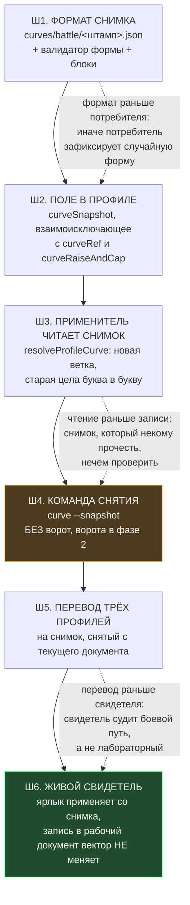

# План 99 — эпик 98, фаза 1: СНИМОК КАК ФОРМАТ

> **Создан:** 2026-09-09 (сессия 97) · **Родитель:** `plans/98` эпик 98, фаза 1 · **Статус:** 🔲 не
> начата; писать код в новом чате · **Исходящее:** —

**Цитата якоря из мета-плана, которую исполняет этот план** (`plans/98` §3, фаза 1):
> *«`curves/battle/<штамп>.json` · поле `curveSnapshot` в профиле · применитель читает снимок, а
> `curveRef` объявляется устаревшим с датой»*

---

## 1. Вектор цели

**Боль.** `profiles/optimised.json` несёт `curveRef: "measured"` — ссылку на ЖИВОЙ рабочий документ.
Любая запись прогона немедленно меняет то, что применит ярлык владельца.

**Куда хотим.** Профиль несёт `curveSnapshot` — путь к неизменяемому снимку. Запись прогона в рабочий
документ больше не меняет вектор, который уедет в карту.

**Тип цели: Achieve.** Фаза 1 НЕ строит ворота передачи (это фаза 2) — она строит то, ЧЕРЕЗ ЧТО
ворота будут пускать.

**🔴 Граница фазы, названная заранее:** снимок создаётся в этой фазе **вручную, одной командой без
валидатора**. Это осознанно: формат и ворота — разные работы, и склеить их значит не суметь доказать
ни одну. Ворота приходят в фазе 2 и встают ПЕРЕД той же командой.

---

## 2. Порядок шагов и почему он такой

**Порядок ВЫВЕДЕН, а не назначен.** Формат раньше потребителя — иначе потребитель зафиксирует
случайную форму, и менять её придётся в двух местах. Чтение раньше записи — снимок, который некому
прочитать, нечем проверить, кроме глаз. Перевод профилей раньше свидетеля — свидетель обязан судить
боевой путь (ярлык владельца), а не лабораторный вызов.

---

## 3. Шаги

### Ш1. Формат снимка

- **Что:** `curves/battle/<ISO-штамп>.json`. Поля: `kind: "battle-snapshot"` · `takenAt` ·
  `sourceDoc` (имя рабочего документа) · `sourceCommit` (SHA рабочего документа на момент снятия) ·
  `stamp` (драйвер · VBIOS — R6) · `frequencies` (та же форма строк, что у рабочего документа) ·
  `coverage` (краёв X из 389, снято при снятии, а не пересчитываемо на лету).
- **Неизменяемость — свойством, а не обещанием:** имя файла несёт штамп, снятие НИКОГДА не
  перезаписывает существующий файл (отказ, если файл есть). Перезапись снимка есть подмена улики.
- **Валидатор формы** `validateSnapshot` — по образцу `validateReferenceTable`: неизвестное поле есть
  отказ, а не предупреждение (правило `ROW_KEYS`, R14).
- **Проверка:** `curve --selftest` растёт на блоки формата; враждебные фикстуры, каждая с ОДНИМ
  дефектом и названием поля, на которое валидатор обязан указать (конвенция `profiles --selftest`).
  ⚠️ EXP-0089: если на одно поле отказывают несколько правил, фикстура требует слово, уникальное для
  ЭТОГО отказа.

### Ш2. Поле в профиле

- **Что:** `settings.curveSnapshot` в `profile-store`. **Взаимоисключающее** с `curveRef` и
  `curveRaiseAndCapMhz` — кривая, заданная дважды, уже отвергается форматом, новое поле входит в то же
  правило.
- **`curveRef` НЕ удаляется, а объявляется устаревшим с датой** — в комментарии поля и в README
  профилей. Причина: откат фазы должен стоить одну строку в JSON, а не ревертов кода.
- **Проверка:** `profiles --selftest` растёт на фикстуры «оба поля сразу» и «снимка нет на диске».

### Ш3. Применитель читает снимок

- **Что:** ветка в `resolveProfileCurve`: `curveSnapshot` → загрузить снимок → дальше ТА ЖЕ
  арифметика, что у `curveRef` (опора · `offsetsFor` · заявления `__intentTopMhz` и
  `__intentMonotone`).
- **🔴 ОДНА арифметика, а не вторая копия.** Ветка отличается ТОЛЬКО источником строк. Вторая копия
  здесь была бы парой «правда↔зеркало» ровно на пути записи в карту владельца.
- **Проверка:** блок «снимок и рабочий документ с ОДИНАКОВЫМИ строками дают ПОБАЙТНО один вектор» —
  это и есть доказательство, что копии нет. Мутация «считать в ветке снимка иначе» краснит его.

### Ш4. Команда снятия

- **Что:** `npm run curve -- --snapshot [--from <документ>]`. Читает рабочий документ, пишет снимок,
  печатает покрытие и путь. **Ворот НЕ содержит** — это фаза 2.
- **Говорит вслух, что ворот нет:** строка вывода «⚠️ СНЯТО БЕЗ ВОРОТ ПЕРЕДАЧИ (фаза 2 эпика 98)».
  Молчание здесь читалось бы как «проверено» (R4b).
- **Проверка:** блок на отказ перезаписи существующего снимка; блок на печать предупреждения.

### Ш5. Перевод трёх профилей

- **Что:** снять снимок с текущего рабочего документа, перевести `optimised`, `max-performance`,
  `silent-cold` на `curveSnapshot`.
- **⚠️ ЖИВОЙ ШАГ — ТОЛЬКО ПРИ ВЛАДЕЛЬЦЕ.** Меняется то, что применяет его ярлык. Откат назван до
  правки: вернуть `curveRef: "measured"` в трёх файлах.
- **Доказательство равенства ДО перевода:** вектор из снимка и вектор из рабочего документа должны
  совпасть побайтно (Ш3). Если не совпали — перевод НЕ делается, а разница разбирается.

### Ш6. Живой свидетель

- **Что:** применить `optimised` ярлыком · дописать строку в рабочий документ · применить ЕЩЁ РАЗ ·
  показать, что вектор не изменился.
- **Это и есть ворота 6a** («двигатель на ракете»): фаза закрыта не блоками, а наблюдением на пути,
  которым ходит владелец.

---

## 4. Критерии приёмки — сценариями

**P99-AC1 — снимок неизменяем.**
- Ситуация. `curves/battle/2026-09-10T...json` существует.
- Действие. Оператор запускает снятие со ТЕМ ЖЕ штампом.
- Результат. Команда отказывает и называет существующий файл.
- Проверка. Код выхода 1; `sha256` файла до и после совпадают.

**P99-AC2 — вектор со снимка и с документа тождественны при одинаковых строках.**
- Ситуация. Снимок снят с рабочего документа, ни один не менялся.
- Действие. Вектор вычисляется обоими путями.
- Результат. Массивы сдвигов совпадают побайтно.
- Проверка. Блок `profile --selftest`; мутация «своя арифметика в ветке снимка» краснит его.

**P99-AC3 — запись прогона не меняет боевой вектор.**
- Ситуация. Профиль несёт `curveSnapshot`.
- Действие. `closePoint` дописывает строку в `curves/measured.json`.
- Результат. Вектор профиля не изменился.
- Проверка. Вектор снят до и после; массивы равны. **Это главный критерий фазы.**

**P99-AC4 — команда снятия говорит, что ворот нет.**
- Ситуация. Фаза 2 не начата.
- Действие. Оператор снимает снимок.
- Результат. Вывод содержит предупреждение об отсутствии ворот.
- Проверка. grep по выводу находит строку; блок краснит на её удаление.

**P99-AC5 — живой свидетель на пути владельца.**
- Ситуация. Три профиля переведены на снимок, владелец у машины.
- Действие. Клик по ярлыку `⚖️ Optimised`.
- Результат. Режим применяется; иконка в трее появляется.
- Проверка. Задача `\KAGO\apply-optimised` возвращает 0 · 65 ненулевых сдвигов · **глаз владельца**.

---

## 5. Риски

**(а) Высокий — перевод профилей ломает работающий режим.** Управление: Ш5 не делается, пока Ш3 не
доказал побайтное равенство векторов; откат — три строки JSON; живой шаг только при владельце.

**(б) Средний — вторая копия арифметики.** Управление: P99-AC2 существует ровно против этого, и его
краснит мутация.

**(в) Низкий — снимков накопится много.** Управление: не решать сейчас. Уборка старых снимков — это
политика хранения улик, а улики этот проект предпочитает КОПИТЬ (слово владельца по `bugs/94`).

---

## 6. Чего фаза 1 НЕ делает

- **Не строит валидатор передачи** — фаза 2.
- **Не отвечает на вопрос применимости** — развилка владельца, `interviews/029`.
- **Не чинит `bugs/133`, `bugs/135`, `bugs/136`** — три отдельных работы.

---

## 7. Решения, принятые без владельца

*(Заполняется при закрытии. Сейчас — те, что уже приняты при планировании.)*

1. **Снимок в отдельном каталоге `curves/battle/`, а не рядом с рабочим документом.** Причина:
   каталог — самая дешёвая граница между «рабочим» и «боевым», и она видна в `ls`.
2. **`curveRef` не удаляется, а помечается устаревшим.** Причина: откат фазы должен стоить строку
   JSON, а не реверт кода.
3. **Ворота НЕ включаются в фазу 1.** Причина: формат и ворота — разные работы; склеенные, они не
   дают доказать ни одну.
