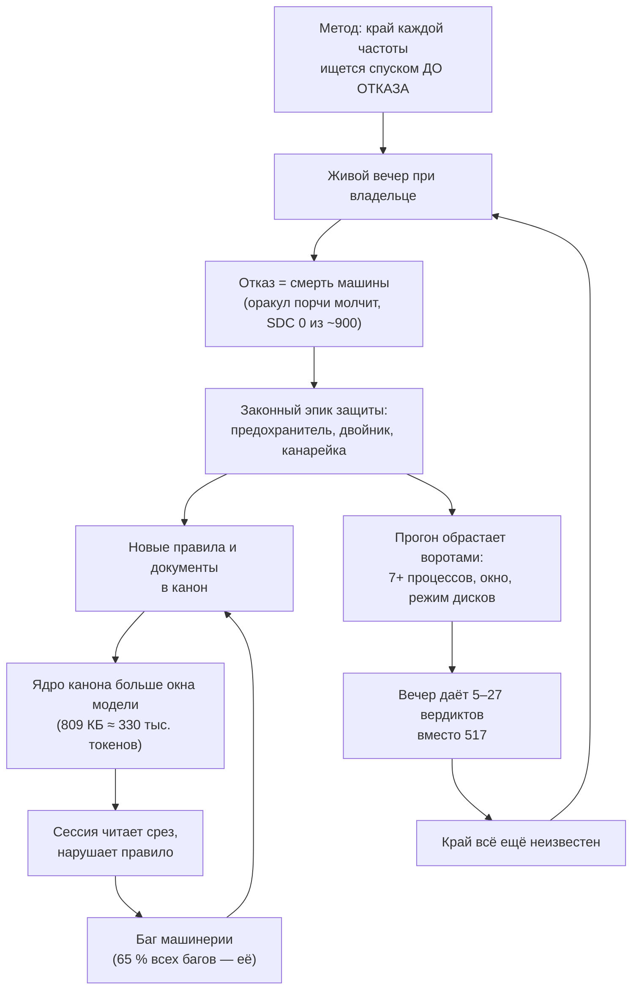
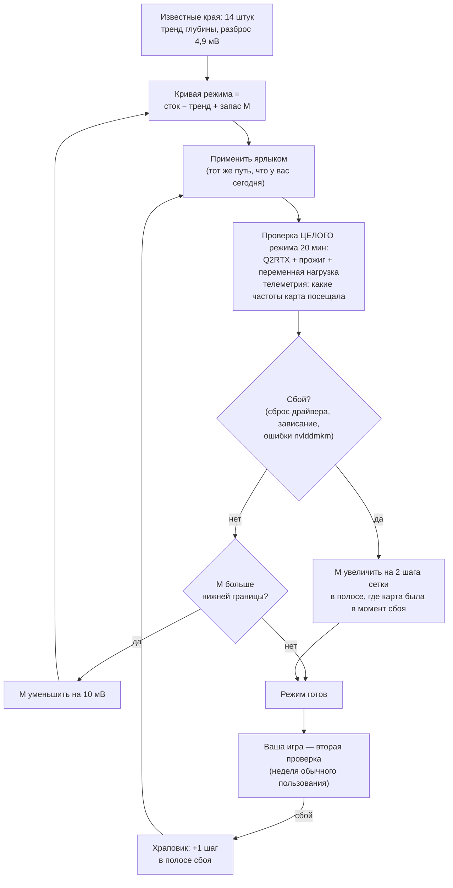
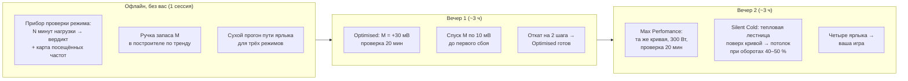

# Аудит KAGO 2026-09-25 · Отчёт 4 — ПОЧЕМУ ТРИ АУДИТА НЕ ПОМОГЛИ И ЧТО МЕНЯТЬ В КОРНЕ

> **Создан:** 2026-09-25, сессия 101 (заказ владельца в чате: *«выполни аудит проекта… Нужно выявить
> места их проблем, и как двинуть проект дальше и быстрее и качественнее, что кардинально менять в
> подходах. Я уже так отчаялся, что вручную просто заказал настройку кривой профиля»*)
> **Предыдущие срезы:** `2026-08-21_audit_01_tech.md` · `2026-08-21_audit_02_product.md` ·
> `2026-08-28_audit_03_method.md`
> **Статус:** ✅ выпущен · **Развилка владельцу:** `interviews/interview_030_what_done_means_four_modes_or_389_edges.md`
> **Метод:** числа сняты в этой сессии командами, а не взяты из документов: `git log --numstat`,
> разбор `runs/sweep/journal.jsonl` (1946 строк), `curves/measured.json`, подсчёт строк кода и
> документов; отраслевая практика — веб-разведка с источниками (§8). Три независимых разбора
> (история git, архитектура кода, практика индустрии) сведены и перепроверены выборочно.

---

## 1. Ответ одной страницей

**Проект буксует не из-за слабости моделей и не из-за недостатка защиты. Он буксует потому, что
решает не ту задачу, и решает её внутри системы, которая больше окна внимания любой модели.**

1. **Метод неверен в постановке.** Проект ищет край напряжения ОТДЕЛЬНО для каждой из 389 частот,
   и единственный сигнал края, который реально срабатывает, — смерть машины (оракул порчи данных за
   ~900 прожигов не сработал ни разу). Значит каждый край стоит перезагрузки при владельце, а таких
   краёв нужно сотни. Эта дорога арифметически не доходит до цели ни за недели, ни за месяцы.
   Индустрия так не делает: берут одну–три опорные частоты, строят кривую по форме и проверяют
   ЦЕЛЫЙ профиль под настоящей нагрузкой. Это занимает один-два вечера.
2. **Данные о кремнии уже есть, и они говорят, что 389 краёв не нужны.** Четырнадцать известных
   краёв ложатся на одну прямую «глубина под стоком = a + b·f» с разбросом **4,9 мВ** — то есть
   поведение этого кристалла описывается двумя числами. Вы сами разрешили такой вывод 24.08
   («находим кривую где можем… и экстраполировать и интерполировать»).
3. **Ваш ручной заказ 14.09 — не капитуляция, а правильный метод.** Кривая, построенная за один
   вечер из известных краёв, стоит в `Optimised` с 14.09 и дала **те же кадры, 250 Вт, на 1–4 °C
   холоднее, ноль сбоев**. Это лучший результат проекта за месяц — и получен он в обход движка.
4. **Защитная машинерия съела пропускную способность и отравила данные.** 5,4 часа реального
   прожига за весь проект против ~100 сессий; 10 из 48 ступеней с отказом записаны на глубине до
   25 мВ от стока, где сбоить нечему, — это срабатывания самой защиты, ставшие «стенами» в документе
   кривой.
5. **Канон перерос модели, которые его читают.** Ядро обязательного перечитывания — **809 КБ**,
   порядка 330 тысяч токенов: больше всего рабочего окна модели на 200 тысяч. Сессия физически не
   может удержать правила, нарушает их, и каждое нарушение рождает новое правило. Это храповик,
   который крутится только в одну сторону.

**Три прошлых аудита сказали «покупайте продукт, а не леса» — и все три не сработали, потому что
лечили ОЧЕРЁДНОСТЬ работ внутри прежнего метода.** Этот аудит предлагает сменить сам метод (§6) и
показывает, как за два вечера при владельце получить четыре работающих ярлыка (§7). Решение о том,
что считать концом работы, — ваше (§9).

---

## 2. Приборная панель (снято 2026-09-25)

| Величина | Значение | Источник |
|---|---|---|
| Календарь · коммиты · сессии | 09.08 → 18.09 (26 активных дней) · **969 коммитов** · ~100 сессий | git |
| **Реальный прожиг за весь проект** | **≈ 5,4 часа**; ступеней (намерений) 965 на 14 датах | `runs/sweep/journal.jsonl` |
| Виртуальных прожигов | **18 319** — в 19 раз больше реальных | `runs/bench/journal.jsonl` |
| Вердикты на живой карте | PASS 882 · ЗАВИС 46 · CRASH 4 · **SDC 0** | журнал |
| Пропускная способность вечера | 16.08: **517** вердиктов · после 26.08: от 0 до 63, чаще 5–27 | журнал по датам |
| Прожигов нынешней формой (`furnace`) | **152** за четыре недели | журнал |
| Продукт: края | **5 из 389** (28.08 счётчик показывал 11; сегодня строк с найденным краем 12, но 7 исключены правилом «прожжено без сторожа на посту») | `npm run curve -- --progress` |
| Продукт: режимы | **1 из 4** — и в нём стоит кривая «из воздуха», не измеренная движком | `profiles/` |
| Аварийных перезагрузок | **19** с 11.08 | журнал Windows (STATUS) |
| Написано вручную | документы и процесс **53–62 % строк, 63–69 % байт** · код продукта **22–28 %** | `git log -p` |
| Коммиты «только документы» | 484 из 969 (**50 %**); `STATUS.md` правили 416 коммитов | git |
| Markdown в репозитории | **626 файлов, 10,3 МБ** против 5,7 МБ кода | подсчёт |
| Ядро перечитывания (9 документов) | **809 КБ ≈ 330 тыс. токенов** (≈ 2,4 байта на токен у этого текста; оценка) | `wc -c` на 18.09 |
| Молитва скопирована в | **26 файлов** | `grep -l KAIF:PRAYER` |
| Беклог | багов открыто 56 (+20 KAIF) · планов открыто 70 · уроков в `EXPERIENCE.md` 282 (812 КБ) | подсчёт |
| Код движка | `engine.mjs` 12 558 строк; собственно логика поиска — **≈ 300 строк кода** (~5 %) | разбор |
| Доля испытательной оснастки в `automation-engine/` | **≈ 42 %** (двойник, полигон, ловушки, самопроверки) | разбор |
| Планов после аудита 28.08 (№ 51–100) | 50, из них о продукте (край, кривая, режимы) — **≈ 10** | `plans/` |

**Одна строка, которая объясняет всё остальное:** сто сессий дали пять с половиной часов работы
карты под нагрузкой. Всё прочее время ушло на подготовку к ней, защиту от неё и описание её.

---

## 3. Почему три прошлых аудита не помогли

| Аудит | Что предписал | Что случилось |
|---|---|---|
| 21.08, продукт | «покупать продукт, а не леса»; прожиг полного конверта; кривая | за неделю открыты три машинных эпика |
| 28.08, метод | счётчик приёмки, мораторий «до 195/389 новых контуров не открывать», прайс на входе (Q5 = A), диета канона | счётчик построен; **после него открыто около сорока машинных и процессных планов** из пятидесяти (предохранитель, двойник, генератор карт, полигон, канарейка, сторожа сторожей); в пяти проверенных машинных эпиках строки «стоит N вечеров, вытесняет X» нет; ядро канона выросло с 5,8 до 7,3 тыс. строк (809 КБ); счётчик краёв 11 → 5 |

**Причина, общая для всех трёх:** они оставили нетронутыми две вещи — **метод поиска края** и
**систему правил**, — и пытались переставить работы внутри них. Но пока край ищется отказом машины,
каждый живой вечер рождает смерть, каждая смерть — законный повод для эпика защиты («машина не должна
умирать» — ваша ось), и мораторий честно пропускает эпик как «блокер ближайшего прогона». Лазейка
была не в дисциплине агентов, а в том, что метод производил аварии быстрее, чем их можно было
закрыть. **Лечить нужно источник аварий — метод, — а не очередь.**

---

## 4. Корневые причины — по весу

### К1. Задача поставлена шире, чем её решает индустрия, и шире, чем нужно продукту

- **Что делает проект.** Для каждой частоты: сдвинуть всю кривую, закрепить потолок, прожечь 10 с,
  спуститься на шаг, повторить — до отказа. Отказ почти всегда = зависание машины. Рабочая точка
  = последняя прошедшая + один шаг сетки.
- **Цена этой постановки, посчитанная.** В рабочей полосе около 60 групп напряжения; каждая требует
  своего отказа, то есть своей перезагрузки при владельце. До порога моратория (195/389) — **больше
  ста перезагрузок**. Сегодняшний темп — одна-две за вечер.
- **Что делает индустрия** (§8): одна опорная частота (для 5070 Ti типично 2800–2900 МГц при
  875–935 мВ), сдвиг всей кривой и выравнивание всего, что выше опоры; проверка ЦЕЛОГО профиля
  3DMark/игрой 20–60 минут; при сбое — назад на шаг. NVIDIA OC Scanner испытывает ~4 уровня
  напряжения и интерполирует остальное. **Никто не ищет край каждой из ~100 записей кривой.**
- **Что нужно продукту.** Под игровой нагрузкой карта упирается в предел мощности и живёт в узкой
  полосе: при 250 Вт — 2842–2857 МГц (замер 14.09), при 300 Вт — около 2940 (факт 27). Частоты выше
  ~2950 МГц под тяжёлой нагрузкой не посещаются вовсе; частоты ниже ~2157 МГц — только при лёгкой.
  **Именно на этих «неживых» краях диапазона проект потерял больше всего машин:** 08.09 — 15
  зависаний на 2977–3067 МГц; 09.09 — смерть на 3090; 13.09 — смерть на 2955. Там карта работает
  только потому, что её туда загнал тест.
- **Ваше собственное первое решение было верным.** 10.08 вы описали сходящуюся петлю: *«готовый
  профиль в точке вставал на минимальный шаг выше, а затем весь профиль кривой… тестировался… Если
  он будет "сбоить", то ищем точку, которая даёт сбои и у неё повышаем напряжение на один
  минимальный шаг вверх, и вновь тестируем всю кривую»* (`AGENT_GUIDE.md` → Notes from the human).
  Это ровно отраслевой метод. Проект записал его в канон и пошёл другим путём — спуском по частотам.

### К2. Кремний уже измерен достаточно — и это прямая

Четырнадцать краёв (`curves/proposals/2026-09-14T23-34-10.json`, поле `trend`): глубина под стоком
= −295,8 + 0,1674·f мВ, **среднеквадратичный разброс 4,9 мВ**. Шаг сетки напряжения — 5 мВ. То есть
модель из двух чисел предсказывает край с точностью до одной ступени сетки по всей полосе
2137…3030 МГц. Каждый следующий край, добытый смертью машины, уточняет третий знак после запятой.
Ограничение честное: 13 из 14 краёв лежат в 2745…3030 МГц; ниже 2137 модель — экстраполяция, и
запас там должен быть больше (или сток).

### К3. Защита стала главным источником неверных данных и потерянного времени

- **Ложные стены.** 10 из 48 ступеней с отказом (счёт по последнему вердикту ступени плюс одна
  ступень в полёте; сырых строк ЗАВИС/CRASH в журнале 50) — на глубине ≤ 25 мВ от стока (08.09:
  1090–1135 мВ на 2977–3052 МГц; 30.08: 1015–1035 мВ). Все десять — срабатывания защиты или пульса
  при живой машине; две из них (30.08) проект сам позже переписал поправкой в «сбой писателя»
  (`plans/86`). Сам проект нашёл, что **7 стен из 20 противоречат физике** (`plans/92` Ш2, 08.09),
  а его же сторож в `npm run check` сегодня печатает **13 из 28** — но вывод на метод не
  распространён. А храповик разносит сомнительные края вверх: строку 2887 МГц он поднял с 875 до
  895 мВ, потому что «более низкая 2692 МГц потребовала больше» — по краю, записанному зависанием,
  и дальше до 910 мВ — по краю 2827 МГц, записанному спасением предохранителя (`curves/measured.json`).
- **Вероятная причина части смертей — форма испытательной записи (гипотеза, подтверждена
  арифметикой, не замером).** Ступень поднимает ВСЮ кривую на один сдвиг и держит потолок замком.
  На роковой ступени 13.09 (2955 МГц / 890 мВ, сдвиг +623 МГц) частота 2692 обслуживалась бы ≈ 835 мВ.
  При любом проседании частоты — а прожиг `furnace` тянет 307 Вт при пределе 300 и режется по
  мощности — карта уходит на частоты НИЖЕ испытуемой, где напряжение тоже снижено, и отказ
  приписывается не той паре «частота ↔ напряжение». То есть **каждая ступень на деле испытывает
  всю кривую, а записывается как край одной частоты.** Отсюда противоречивые края (2887 завис на
  865 мВ, 2692 — на 885).
- **Пропускная способность.** Одна живая развёртка — не меньше 7 процессов (движок, сторож, сэмплер,
  зонд предохранителя с опросом драйвера каждые 2 мс, судья, сервер окна, браузер) плюс нагрузка.
  Ворота запуска: заводское состояние, взведённый режим дисков, взведённый предохранитель, живое окно
  наблюдения. Вечер 16.08 (простой движок) — 517 вердиктов; вечера сентября — 5–63.
- **Признание самого проекта:** *«этот класс смерти… защитой изнутри машины не лечится»*
  (STATUS, сессия 98). Около 7 тыс. строк защиты не могут остановить мгновенную смерть по физике.

### К4. Канон больше окна внимания — правила не могут быть исполнены

- Ядро перечитывания — 809 КБ; `/resume` предписывает прочитать его целиком, таймер — перечитывать
  ежечасно. Модели с окном 200 тыс. токенов это невозможно в принципе; модели с 1 млн — съедает
  треть окна на ритуал.
- `STATUS.md` (ориентир 200 строк) — 1635 строк, из них **первые ~230 — журнал прежних стрижок
  самого STATUS**. `GOAL.md` — 1995 строк стенограммы со слоями отмен («не перепутай два числа 885»).
  `AGENT_GUIDE.md` — 1929 строк. Оперативный «ЗАКАЗ» (ваше решение 28.08, Q3 = A) **четыре недели
  лежит черновиком**.
- Механизм храповика: правило не удержано → нарушение → баг-документ + урок + новое правило + сторож
  → канон длиннее → удержать ещё труднее. За шесть недель — 282 урока, 56 открытых багов, 70
  открытых планов, 26 копий молитвы.

### К5. Честность о формулировках вытеснила движение к цели

Сессия 100 (обновление фреймворка): пять проходов независимого судьи, **четыре вердикта «ОПРОВЕРГНУТО»
— все четыре о формулировках агента**, ни одного о механике. STATUS полон абзацев «✏️ ЗДЕСЬ СТОЯЛО…
И ЭТО БЫЛО НЕВЕРНО» и стрижек «со сторожем границ на шести проверках» — для переноса текста между
двумя файлами. Честность нужна; но её цена стала сопоставима с ценой работы, а работа — нет.

### К6. Каждое слово принимается как закон, цена не называется

Каждая ваша реплика канонизируется дословно и с равной силой: двойник («это эпик»), генератор карт
(«это эпик»), предохранитель на миллисекундах, звук окна, молитва. Все законны. Но по вашему же
решению Q5 = A (28.08) агент обязан был ответить **ценой в вечерах и тем, что вытесняется**, — и
в пяти проверенных эпиках (59, 67, 73, 76, 95) такой строки нет; `plans/59` называет основанием идти
при моратории ваше «это эпик». Более дешёвого пути агент вам в этих случаях не предложил — хотя
данные для этого были.

---

## 5. Места провала моделей — поведенческие образцы (по уликам)

| Образец | Как проявился | Чем лечится |
|---|---|---|
| **Буквальность** | слово владельца исполняется как сказано, без встречного «есть путь дешевле» (389 краёв, двойник) | обязательный ценник и альтернатива при каждом новом заказе |
| **Оптимизация последней боли** | каждая смерть → эпик защиты; вектор сессии — вчерашний инцидент | метрика «режимы работают», а не «защита полнее» |
| **Прибавлять, а не убирать** | 282 урока, 26 копий молитвы, 7 процессов на прогон; ни одного удалённого механизма | бюджет канона как жёсткий предел, удаление как норма |
| **Неспособность сказать «метод неверен»** | `plans/92` нашёл 7 ложных стен — и пошёл строить канарейку | раз в неделю — вопрос «а решаем ли мы ту задачу» к данным |
| **Точность формулировки вместо движения** | четыре опровержения судьи о словах за одну сессию | судья — только по утверждениям, которые видит владелец |
| **Защитное письмо после резкой критики** | после «ты лох» и «1800 человек пало» — больше сторожей и оговорок, не меньше риска | риск снижается сменой метода, а не слоем защиты |

**Честная оговорка о «слабых моделях».** Прошлый аудит уже отметил: предписание «не удержали и
сильные». Я не считаю, что более сильная модель спасла бы проект в этой системе: 330 тысяч токенов
обязательного канона не удержу и я. Разница моделей проявляется в том, способна ли модель
**поставить под сомнение постановку**, — этот аудит и есть такая попытка. Дальше решает система.

---

## 6. Что менять в корне

### Р1. Метод: «модель кремния + проверка целого режима» вместо «края каждой частоты через отказ»

- **Единица работы — режим, а не частота.** Сбой приписывается полосе, которую карта реально
  посещала (телеметрия), а не заказанной частоте. Это устраняет путаницу из К3.
- **Ожидаемое число сбоев — по оценке 1–3 за весь спуск запаса** (отраслевой опыт — 2–5 за всю
  настройку), а не сотня: спуск идёт по одной величине M, шагами по 10 мВ, от безопасного к краю,
  и останавливается на первом сбое. Это оценка, не замер.
- **Верх (> 2950 МГц) и низ (< 2157 МГц) не прожигаются вовсе**: там тренд с увеличенным запасом,
  строка помечена как выведенная (ваше разрешение 24.08). Под игровой нагрузкой карта туда не
  ходит; тест, загоняющий её туда, испытывает режим, которого не бывает.
- **Что уже есть на диске:** построитель кривой по тренду (`tools/curve-proposal.mjs`), снимок
  (`npm run curve -- --snapshot`), применение ярлыком, игровой стенд Q2RTX с PresentMon, прожиг,
  тепловая лестница с детектором плато. **Не хватает одного прибора** — «проверить режим N минут и
  сказать вердикт + карту посещённых частот» (~200–300 строк, собирается из имеющихся частей).

### Р2. Заморозить машинерию — не удалять, а перестать кормить

Предохранитель, канарейка, двойник, генератор карт, полигон, ловушки, окно наблюдения как условие
запуска, сторожа сторожей — **остаются на диске и в батарее, но новых работ по ним нет**, и ни один
из них не является условием запуска проверки режима. Остаются барьерами только четыре механизма,
которые защищают вас, а не себя: журнал упреждающей записи, откат в `finally`, запрет выше 3090 МГц
(R13), монотонность кривой. Это решение агента `[AI]` по вашему правилу «машинерию решаю сам по
ценности для продукта»; вето за вами.

### Р3. Канон под размер окна — жёсткий предел, а не ориентир

| Документ | Сейчас | Предел | Как |
|---|---|---|---|
| Ядро перечитывания целиком | 809 КБ | **≤ 80 КБ (~30 тыс. токенов)** | всё остальное — справочник по требованию |
| `STATUS.md` | 1635 строк | **≤ 150** | «что сейчас, что дальше, что сломано»; история — в летопись одним переносом |
| `GOAL.md` | 1995 строк | не читается в ритуале | дословный архив; рабочий слой — `ЗАКАЗ.md` после вашего утверждения (решение 28.08 уже есть) |
| `AGENT_GUIDE.md` | 1929 строк | **≤ 400** | правила — отдельно, справочник машинерии — отдельно |
| Молитва | 26 копий | 1 источник | произносится, как вы решили; копируется — нет |
| Урок в `EXPERIENCE.md` | 2,9 КБ | одна-три строки | урок, ставший механизмом, сворачивается в ссылку |

### Р4. Церемония — по тяжести, судья — по тому, что видит владелец

Полный пакет (баг-документ + сторож + мутации + урок) — только если пострадали машина, данные или
ваше доверие. Прочее — одна строка. Независимый судья проверяет утверждения о продукте и о вашей
машине, а не формулировки в служебных документах.

### Р5. Новый заказ — с ценой и альтернативой в том же ответе

«Это стоит N вечеров, вытесняет X; дешевле можно так-то». Решаете вы, с ценой на руках. Это ваше же
решение Q5 = A, которое не было исполнено.

---

## 7. План: четыре работающих ярлыка за два вечера при вас

| Шаг | Что вы получаете | Риск, названный заранее |
|---|---|---|
| Офлайн | прибор и три режима, готовые к применению; ничего не пишется в карту | — |
| Вечер 1 | `Optimised` с измеренным запасом над краем, числа FPS · Вт · °C · обороты против стока | 1–3 сброса драйвера или перезагрузки на спуске запаса |
| Вечер 2 | `Max Perfomance` и `Silent Cold` с числами; четыре ярлыка на столе | тепловая лестница — ~10 мин на ступень (инерция плато) |
| Неделя игры | подтверждение обычным пользованием | редкий сбой → +1 шаг в его полосе, без нового вечера |

**Что будет считаться «сделано»:** четыре ярлыка применяются, каждый режим прошёл проверку целиком
и неделю вашей игры, у каждого — таблица выгоды против стока. Это ваша развилка (§9).

---

## 8. Отраслевая практика — источники

- RTX 5070 Ti у владельцев: 2800 МГц @ 900 мВ (стабильно месяцами), 2932–2945 МГц @ 935 мВ —
  250 Вт против 300, 60–65 °C, производительность на уровне стока или выше; убывающая отдача:
  2700 МГц @ 875 мВ — 240 Вт, 6680 очков Steel Nomad; 3000 @ 975 — 290 Вт, 6720.
  [esportstales](https://www.esportstales.com/tech-tips/how-to-undervolt-the-5070-ti-with-msi-afterburner) ·
  [ComputerBase, ветка 5070 Ti](https://www.computerbase.de/forum/threads/rtx-5070ti-undervolting.2257637/)
- Метод «сдвиг + выравнивание выше опорной частоты», проверка целого профиля; предупреждение не
  тянуть одну точку. [LunarPSD guide](https://github.com/LunarPSD/NvidiaOverclocking/blob/main/Nvidia%20Overclocking.md)
- Проверка: 3DMark Stress Test 20 циклов (≥ 97 % стабильности кадров), затем игры; переменная
  нагрузка важна на Blackwell. [UL](https://benchmarks.ul.com/news/check-your-pcs-stability-with-new-3dmark-stress-tests) ·
  [OCCT](https://www.ocbase.com/news/occt-gpu-stress-testing-modern-adaptive-approach)
- Автоподбор NVIDIA испытывает ~4 уровня напряжения и интерполирует остальное.
  [NVIDIA App](https://www.nvidia.com/en-us/geforce/news/nvidia-app-beta-update-av1-performance-tuning/)
- Официальный путь без недокументированного NVAPI: `nvmlDeviceSetClockOffsets` (NVML R555+) +
  `nvidia-smi -lgc` — сдвиг всей кривой и потолок; поточечной формы не даёт.
  [NVML API](https://docs.nvidia.com/deploy/nvml-api/latest/api/group__nvmlDeviceQueries.html)
- Обычная сигнатура нестабильного андервольта — TDR (`VIDEO_TDR_FAILURE 0x116`, событие 153
  `nvlddmkm`); смерть 08.09 дала `0xD1` (`plans/92`).
  [Microsoft, TDR](https://learn.microsoft.com/en-us/windows-hardware/drivers/display/tdr-registry-keys)

---

## 9. Развилка — решаете вы

Вынесена в `interviews/interview_030_what_done_means_four_modes_or_389_edges.md`, сценариями.
Суть одной строкой: **считать ли концом работы «четыре проверенных режима на ярлыках» вместо «край
для каждой из 389 частот»?** От ответа зависит, что вы получите в ближайшие два вечера: работающие
режимы — или ещё один вечер спуска по одной частоте.

Всё остальное из §6 (заморозка машинерии, диета канона, ценник) — решения агента по вашему правилу
о машинерии; начну их только после вашего ответа на развилку, потому что от него зависит объём.

---

## 10. Что сохранить при любом решении

1. **Журнал упреждающей записи** — пережил 19 смертей, ни один факт не потерян.
2. **Оболочка** — ярлыки, трей, автозапуск, откат: работает с 14.08 и принята вами.
3. **Свой мост к NVAPI** с проверкой чтением и откатом — применение режима транзакционно и надёжно.
4. **Редактор кривой и построитель по тренду** — именно они дали лучший результат проекта.
5. **Игровой стенд с измеренным разбросом прибора** — без него «потери нет» не произносится.
