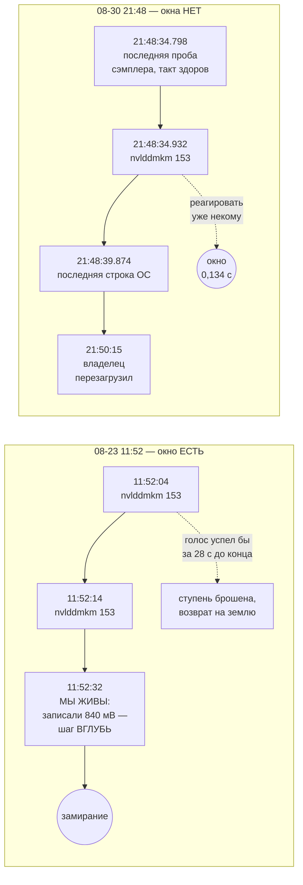

# Разведка 30 — что делать с криком драйвера: как эту задачу решают те, кто решал её до нас, и что говорит наш собственный архив

> **Создан:** 2026-08-31 01:2x +03:00 · **Родитель:** `bugs/79` (голос драйверу) · `plans/73` фаза 3 ·
> открытый пункт `researches/26` §6 («отраслевая половина не сделана») · механизм М4 канона
> («на развилке — не решать самому, а учиться у лучших») · **Статус:** 🟢 разведка снята: отраслевая
> половина закрыта тремя источниками, архив пересчитан заново на 179 событиях и 24 020 строках
> журнала Windows · **Вовне:** 🔴 владельцу — опровергнутое число «110 секунд» и честная граница
> того, что фаза 3 способна обещать; в `bugs/76`, `bugs/79`, `plans/73`, `STATUS.md` — исправление
> этого числа

---

## 0. Главное, до всех рассуждений: «110 секунд» не было

Тикеты `bugs/76` и `bugs/79`, эпик `plans/73` и эстафета в `STATUS.md` стоят на числе **110 секунд** —
столько прошло от первого крика `nvlddmkm` до `Kernel-Power/41`. Из этого числа выведено «у машинерии
БЫЛО ВРЕМЯ действовать», и на нём же построено обещание фазы 3.

**Число измерено верно, а истолковано неверно.** `Kernel-Power/41` — это не смерть машины: это запись,
которую Windows делает ПРИ СЛЕДУЮЩЕЙ ЗАГРУЗКЕ, обнаружив, что прошлое выключение было нештатным. Её
штамп — время перезагрузки, а перезагрузку делал владелец руками. Сто десять секунд — это время
реакции ЧЕЛОВЕКА, а не окно для машинерии.

**Настоящее окно измеряется по последнему вздоху наших собственных приборов, и оно снято точно,**
потому что сэмплер телеметрии `fsync`-ает каждую строку с 2026-08-23 (`bugs/37`): последняя строка
файла — это факт, а не остаток кэша страниц. Файл `runs/dashboard/telemetry.jsonl` заканчивается
целой строкой с переводом строки, без NUL-хвоста, то есть цел.

| время (+03:00) | событие | источник |
|---|---|---|
| 21:48:21.0 | наше намерение: 825 мВ на 2752 МГц | `runs/sweep/journal.jsonl` |
| 21:48:33.102 · 34.097 · **34.798** | три последние пробы сэмплера, такт 0,995 и 0,701 с — **прибор здоров до самого конца** | `runs/dashboard/telemetry.jsonl`, `fsync` на строку |
| **21:48:34.932** | **`nvlddmkm` id 153 — первый крик** | журнал Windows |
| 21:48:39.874 | `nvlddmkm` id 14 — **последняя строка, которую машина вообще записала** | журнал Windows |
| 21:50:15 | загрузка ОС — владелец перезагрузил | `Kernel-General` id 12 |
| 21:50:24 | `Kernel-Power` id 41 — Windows ОБНАРУЖИЛ нештатное выключение | журнал Windows |

**Окно между первым криком драйвера и последним вздохом нашего процесса: 0,134 секунды. Отрицательное
по смыслу — наш сэмплер замолчал РАНЬШЕ, чем драйвер закричал.** Ядро продолжало писать в журнал ещё
пять секунд после того, как пользовательская часть системы встала.

Это не отменяет фазу 3 — §3 показывает случай, где окно было настоящим и составило 28 секунд. Это
отменяет ОБЕЩАНИЕ фазы 3 в прежней редакции: «каждое зависание с предупреждением встречается
остановкой» на этом инциденте недостижимо ни при какой скорости реакции.

---

## 1. Отраслевая половина: как эту задачу решили те, кто решал её до нас

Три источника, три разных ответа на три разных вопроса. Ни один не выдуман — все три проверяемы по
ссылкам в §6.

### 1.1. Сама Windows: повторяющийся сброс драйвера превращается в решение СЧЁТОМ В ОКНЕ

Windows держит ровно тот механизм, который нам нужен, и держит его давно. Ключи реестра
`HKLM\System\CurrentControlSet\Control\GraphicsDrivers`:

- **`TdrLimitCount`** — сколько сбросов драйвера (0x117) разрешено, **по умолчанию 5**;
- **`TdrLimitTime`** — за какое окно они считаются, **по умолчанию 60 секунд**.

Превышение — не восстановление, а `bugcheck`. То есть **вопрос «когда повторяющиеся ошибки драйвера
становятся решением» отрасль решила однозначно: счётом в скользящем окне**, а не по одному событию и
не накоплением без срока.

**Почему это лучшая практика (первая половина рефлексии).** Она оплачена тем же, чем платим мы:
одиночный сброс драйвера — штатное событие исправной машины (драйвер для того и восстанавливается),
а серия за минуту — признак, что восстановление не работает. Порог отделяет «ошибку» от «отказа
механизма исправления ошибок», и это разные предметы.

**Как это служит целям ЭТОГО проекта (вторая половина).** Наш архив (§2) даёт ту же картину с другой
стороны: одиночное событие не предшествовало замиранию ни разу из девяти, а серия предшествовала
шесть раз из шести. Форма правила подтверждается нашими данными независимо от Microsoft — но числа
Microsoft нам НЕ подходят: их порог 5 за 60 с не сработал бы на нашем инциденте 30 августа (там было
три события за пять секунд). **Берём форму, а не константы.** Это ровно то различение, которое
канон требует делать с чужими порогами (`bugs/61`: «2 × максимум фона» — форма из отрасли, число из
своего замера).

### 1.2. `CoreCycler` — ближайший отраслевой аналог нашей задачи

`CoreCycler` (sp00n) автоматически проверяет устойчивость точек кривой напряжения процессора —
то же занятие, что у нас, на другом кремнии. Он **читает канал аппаратных ошибок ОС (`WHEA-Logger`)
во время прогона** и имеет две настройки, названные прямо:

- `lookForWheaErrors` — включено по умолчанию;
- `treatWheaWarningAsError` — включено по умолчанию: **исправленная аппаратная ошибка проваливает
  проверяемую единицу.**

При этом его собственная документация оговаривает: событие «не обязательно относится к тому ядру,
которое сейчас проверяется», — то есть автор знает про неспецифичность канала и всё равно даёт ему
голос, но голос НА УРОВНЕ ПРОВЕРЯЕМОЙ ЕДИНИЦЫ, а не на уровне всего прогона.

**Почему это лучшая практика.** Она разводит два решения, которые легко слить в одно: «эта точка не
годится» и «прогон пора прекращать». Первое дёшево и обратимо, второе стоит вечера. Ошибка ОС —
достаточно веский довод для первого и недостаточный для второго.

**Как это служит целям этого проекта.** У нас есть ровно то же различение, и оно уже принято
владельцем: *«сторож должен не ронять инструмент, а подсказывать»*. `CoreCycler` показывает, что
различение — не наша местная уступка, а рабочая практика области.

### 1.3. Как наблюдать канал в реальном времени: подписка, а не опрос

Windows даёт `EvtSubscribe` (winevt.h) с двумя моделями — толкающей (обратный вызов на каждое
событие) и тянущей (объект-событие сигналит, дальше `EvtNext`). Документация Microsoft прямо
противопоставляет их периодическому опросу: `Get-WinEvent` непрерывно читать нельзя, его приходится
опрашивать и сшивать выборки вручную.

**Практическое следствие для нас:** оболочка .NET над `EvtSubscribe` — `EventLogWatcher` — доступна
в PowerShell 5.1 без единой зависимости, без прав администратора (журнал `System` здесь читается
непривилегированно — досье среды) и без собственного двоичного модуля. Долгоживущий
процесс-наблюдатель печатает по строке на событие. **Это снимает необходимость и в опросе, и в
собственном мосте.**

**Почему это лучшая практика.** Опрос выбирает между задержкой и стоимостью: такт в секунду — это
секунда задержки и порождение процесса каждую секунду (у нас уже измерено: порождение `nvidia-smi`
стоит ~60 мс на такт). Подписка не платит ни тем, ни другим.

**Как это служит целям проекта.** §3 показывает, что в двух случаях из четырёх окно составляло
10–28 секунд. Опрос на границе ступени (раз в ~30 с) ловит из них один; подписка ловит оба.

---

## 2. Свой архив: 179 событий за 41 день, пересчитано заново 2026-08-31

Прежний разбор (`researches/15` §2) считал разрывы до `Kernel-Power/41`, то есть до перезагрузки.
Здесь то же поле пересчитано до **момента замирания** — последней строки, которую машина записала
перед следующей загрузкой. Это другая величина, и она даёт другую картину.

**Что в канале вообще есть.** 179 событий, 2026-07-20 … 2026-08-30, **все уровня «Ошибка»**:
id 153 — 170 · id 14 — 8 · id 13 — 1. Событий с текстом нет: провайдер не зарегистрирован в системе
описаний, поле сообщения пусто — читаются только идентификатор, уровень и время. По дням события
лежат на днях работы с картой; дни без работы пусты.

**Вспышки.** Разбив поле разрывом в 120 секунд, получаем **21 вспышку**. Для каждой проверено, была
ли она ПОСЛЕДНИМ, что машина записала перед следующей загрузкой:

| вспышка (начало) | событий | длит., с | замирание сразу после? | ближайшая запись развёртки |
|---|---|---|---|---|
| 07-20 22:40:16 | 2 | 2 | нет | развёртки ещё не было |
| 07-31 01:12:13 | 3 | 8 | нет | развёртки ещё не было |
| 08-10 20:55:48 | 32 | 149 | нет | развёртки ещё не было |
| 08-11 00:34:24 | 5 | 7 | нет | развёртки ещё не было |
| **08-11 00:40:58** | **22** | **88** | **ДА** (`bugs/03`, перезагрузка через 5,7 ч) | развёртки ещё не было |
| **08-14 21:13:06** | **43** | **91** | **ДА** (`bugs/11`) | развёртки ещё не было |
| 08-22 14:57:50 | 5 | 5 | нет | 5 с — **внутри прогона** |
| 08-22 15:00:49 | 2 | 0 | нет | 11 с — **внутри прогона** |
| 08-22 18:24:25 | 1 | 0 | нет | 3607 с |
| 08-22 20:51:06 | 1 | 0 | нет | 95 с |
| 08-22 22:25:28 | 1 | 0 | нет | 14 с |
| 08-22 22:42:09 | 1 | 0 | нет | 13 с |
| 08-22 22:54:58 | 1 | 0 | нет | 13 с |
| **08-23 11:35:56** | **8** | **13** | **ДА** | 5 с |
| **08-23 11:52:04** | **2** | **10** | **ДА** | 8 с |
| 08-23 18:52:28 | 1 | 0 | нет | 3 с |
| 08-24 00:22:14 | 1 | 0 | нет | 32 с |
| **08-28 19:59:14** | **43** | **88** | **ДА** | 3 с |
| 08-28 21:44:41 | 1 | 0 | нет | 6329 с |
| 08-28 21:49:09 | 1 | 0 | нет | 6597 с |
| **08-30 21:48:34** | **3** | **5** | **ДА** | 14 с |

**Три вывода, и все три — счёт, а не впечатление:**

1. **Одиночное событие не предшествовало замиранию НИ РАЗУ: 0 из 9.** Правило «встать по одной
   ошибке драйвера» дало бы девять ложных срабатываний и ни одного лишнего попадания. Это
   независимое подтверждение того, что `ideas/10` §5.5 и `researches/15` §2(г) уже утверждали.
2. **Каждая из шести смертельных вспышек несла два и более события.** Порог «два в окне» имеет
   полноту 6 из 6 по всему архиву.
3. **Но не всякая серия смертельна: шесть вспышек с двумя и более событиями машину не убили.**
   Точность правила «два в окне» — 6 из 12. Как ОСТАНОВКА ПОЛОСЫ такое правило неприемлемо:
   половина срабатываний оборвала бы здоровый вечер.

**Проверяемо той же командой, что и здесь:**
`Get-WinEvent -FilterHashtable @{LogName='System'; ProviderName='nvlddmkm'}`, разбивка на вспышки
разрывом 120 с, сверка с `Microsoft-Windows-Kernel-General` id 12 (загрузки) и полной лентой журнала
`System` за период.

### 2.1. Где счёт можно проверить гейтом «мы держим не стоковое напряжение»

Журнал развёртки существует с 2026-08-16, поэтому гейт оценивается только на вспышках после этой
даты. Их одиннадцать: четыре смертельные (08-23 ×2, 08-28, 08-30) и семь нет. Из семи здоровых
две несут по два и более события (08-22 14:57 и 15:00) и обе попадают внутрь прогона.

**Итого правило «два и более события в окне 120 с, пока мы держим не стоковое напряжение» на всём
поле, где его вообще можно проверить: 6 срабатываний — 4 верных, 2 ложных за семь дней прогонов.**

---

## 3. Сколько времени голос реально успевает — по каждой смерти отдельно

Скорость реакции бессмысленно обсуждать в отрыве от того, жив ли ещё тот, кто реагирует. Для каждой
смертельной вспышки: когда закричал драйвер, когда в последний раз подала признак жизни НАША
пользовательская часть, и сколько между ними.

| смерть | первый крик | последний вздох нашей части | окно |
|---|---|---|---|
| **08-23 11:52** | 11:52:04 | **11:52:32** — журнал развёртки записал вердикт и НОВОЕ намерение на 840 мВ | **+28 с — окно настоящее, и прогон потратил его на шаг ВГЛУБЬ** |
| **08-23 11:35** | 11:35:56 | замирание в 11:36:09 (последняя строка ОС) | **+13 с** |
| **08-28 19:59** | 19:59:14 | журнал развёртки: 19:59:12 | **−2 с** (записи с шагом ~15 с, точнее по этому источнику не сказать) |
| **08-30 21:48** | 21:48:34.932 | сэмплер: 21:48:34.798, такт здоров | **−0,134 с** |
| 08-14 21:13 | 21:13:06 | ядро писало ещё 91 с; наша часть в тот вечер прогон не вела | — |
| 08-11 00:40 | 00:40:58 | ядро писало ещё 88 с | — |

**Честный итог по скорости: голос драйвера успевает не всегда, и это свойство отказа, а не
реализации.** Из четырёх смертей эпохи журнала развёртки он приходит вовремя в двух. В двух других
пользовательская часть системы замирает раньше, чем ядро успевает записать первую жалобу, и никакая
скорость подписки этого не меняет.

---

## 4. Развилка и варианты — списком, потому что список ломает ложную развилку

Вопрос: **что именно делает прогон, услышав канал драйвера.**

| # | вариант | что даёт | чем платим | что говорит архив |
|---|---|---|---|---|
| **A** | ничего (сегодняшнее состояние) | ноль ложных остановок | канал молчит там, где он единственный говорил | 4 смерти подряд без единого действия |
| **B** | одно событие → полоса встаёт | максимально рано | **9 ложных остановок за 41 день** | запрещено `ideas/10` §5.5 |
| **C** | два события в окне → полоса встаёт | ловит 6 из 6 смертельных вспышек | **6 ложных из 12; 2 ложных за 7 дней прогонов** | нарушает критерий 2 тикета (порог 0) |
| **D** | два события в окне → **ступень брошена, возврат на доказанную землю, засчитано в накопитель `bugs/80`** | ловит те же 6 из 6; ложное срабатывание стоит одной ступени, а не вечера; полоса встаёт только НАКОПЛЕНИЕМ | ступень иногда теряется зря | **ноль ложных ОСТАНОВОК на архиве**: две ложные вспышки 08-22 дали бы два счёта при пороге накопителя три |
| **E** | порог Microsoft (5 за 60 с) | чужая проверенная константа | **не сработал бы 30 августа** (3 события за 5 с) | отвергнут замером |

**Решение: D.** Обоснование — тремя независимыми доводами, и ни один из них не «мне так кажется»:

1. **Отрасль разводит эти два решения** (`CoreCycler`: ошибка ОС проваливает проверяемую единицу, а
   не прогон) — §1.2.
2. **Архив разрешает ровно это и запрещает C**: полнота у C и D одинаковая (6 из 6), а цена ложного
   срабатывания различается в вечер — §2.1.
3. **Владелец уже принял это различение** словом *«сторож должен не ронять инструмент, а
   подсказывать»* и запретом лечить строгостью (`GOAL.md` → «🏗 ЗДАНИЕ ВАЖНЕЕ ЛЕСОВ»).

**Форма порога — из отрасли (счёт в скользящем окне), число — из своего замера, не из чужого.**
Окно 120 с — та же величина, которой разбит архив в §2; два события — нижняя граница, отделяющая
девять безобидных одиночек от шести смертельных серий.

**Что в решении D остаётся собственностью владельца, а не агента:** согласится ли он, что брошенная
ступень — достаточная реакция там, где окно было настоящим (08-23: 28 секунд). Это вопрос не о
пороге, а о цене; поднимать его надо ПОСЛЕ живого прогона, когда у голоса появится первое наблюдение
на реальном пути.

---

## 5. Чего эта разведка НЕ выяснила

- **Что означают id 14 и 13** этого провайдера в отличие от 153. Описаний в системе нет, поле
  сообщения пусто; отраслевые источники разбирают 153 (сброс драйвера, класс TDR) и почти не
  разбирают остальные. Решение принято так, чтобы от этого различия не зависеть: считаются события
  ЛЮБОГО идентификатора этого провайдера.
- **Жила ли наша пользовательская часть 28 августа** после 19:59:12 — журнал развёртки пишет раз в
  ~15 с, сэмплерного файла того вечера не сохранилось. Окно «−2 с» в §3 — нижняя оценка, а не факт.
- **Порог `TdrLimitCount` на этой машине не проверялся** — ключей в реестре может не быть вовсе,
  тогда действуют умолчания. Для решения D это не нужно: поведение Windows мы не меняем.

## 6. Связи и источники

`bugs/79` (тикет) · `bugs/76` (инцидент; **число «110 секунд» в нём подлежит исправлению**) ·
`bugs/80` (накопитель — потребитель этого голоса) · `bugs/37` (`fsync` сэмплера, без которого §0
был бы недоказуем) · `plans/73` фаза 3 · `researches/15` §2 (прежний разбор по `Kernel-Power/41`) ·
`researches/26` §6 (открытый пункт, закрывается этим документом) ·
`PROJECT_ARCHITECTURE_INTERNAL_MAP.md` → R4b-signal (правило, подлежащее переписи) ·
`GOAL.md` → «🎓 НА РАЗВИЛКЕ — НЕ РЕШАТЬ САМОМУ» · [[EXP-0195]] (порог как заместитель явления).

**Источники отраслевой половины:**

- Microsoft, TDR registry keys (`TdrLimitCount` = 5, `TdrLimitTime` = 60 с) —
  `learn.microsoft.com/windows-hardware/drivers/display/timeout-detection-and-recovery` и
  `github.com/MicrosoftDocs/windows-driver-docs` → `display/tdr-registry-keys.md`.
- Microsoft, Subscribing to Events / `EvtSubscribe` (толкающая и тянущая модели) —
  `learn.microsoft.com/windows/win32/wes/subscribing-to-events`.
- `sp00n/CoreCycler` — настройки `lookForWheaErrors` и `treatWheaWarningAsError`, разбор системы
  журналирования: `github.com/sp00n/CoreCycler`,
  `deepwiki.com/sp00n/CoreCycler/6.1-event-logging-system`.
- Разбор класса `nvlddmkm` id 153 как события класса TDR — сообщества NVIDIA и Microsoft Q&A
  (`forums.developer.nvidia.com/t/event-id-153-nvlddmkm-crash-crisis/314195`).
