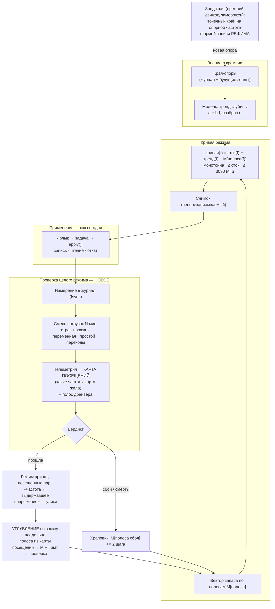

# Разведка 39 — разворот: модель кремния, проверка целого режима и углубление по полосам

**Снята:** 2026-09-25, сессия 101 · **Эпик:** `plans/101_EPIC_turnaround_silicon_model_and_whole_mode_validation.md`
· **Родители:** аудит `reports/KAIF_AUDIT/2026-09-25_audit_04_change_the_method.md` · ответ владельца
на `interviews/interview_030` · **Карта не трогалась:** всё — по журналам, коду и вебу.

---

## 0. Решение, которому служит разведка

Как получить четыре работающих режима за два вечера при владельце **и** сохранить путь, по
которому потом можно «выжимать соки» дальше, — не возвращаясь к поиску края каждой частоты через
смерть машины.

## 1. Требования — слово владельца

| когда | дословно | что обязывает |
|---|---|---|
| 25.09 | *«Мне симпатичен вариант А, но я хотел бы иметь возможность далее продовать находить более глубокие точки андервольтинга, чтобы ещу чуточку "выжимать соки" из видеокарты. Сохранить такую возможность.»* | конец работы = четыре проверенных режима; **углубление — постоянная возможность, а не отменённая ветка** |
| 25.09 | *«пересметри цель, мастерплан. Разворачивай весь проект туда, куда ты видишь по твоему аудиту»* | мандат на пересмотр цели, плана и архитектуры |
| 10.08 | *«готовый профиль в точке вставал на минимальный шаг выше, а затем весь профиль кривой… тестировался… Если он будет "сбоить", то ищем точку, которая даёт сбои и у неё повышаем напряжение на один минимальный шаг вверх, и вновь тестируем всю кривую… хочется довольно аггресивно тюнить»* | проверка ЦЕЛОЙ кривой + храповик — исходный метод владельца |
| 24.08 | *«находим кривую где можем — в середине диапазона… понять природу этого конкретного кремния, и экстраполировать и интерполировать»* | модель кремния по середине диапазона разрешена |
| 15.08 | *«Карта работает с тем же привычным ей диапазоном частот, но КАЖДУЮ точку этого диапазона мы протестировали…»* | снимается ответом 25.09 (A): каждая частота покрыта МОДЕЛЬЮ и проверкой режима, а не отдельным краем |
| 01.09 | *«для silent cold режима нужно будет max частоту так подобрать, чтобы вертушки работали в районе 40...50%»* | потолок Silent Cold — по оборотам на плато |
| 13.09 | *«Я думал мы за два вечера мне карту затюним»* | темп — требование |

Ограничения, которые не меняются: ноль сторонних GUI; никогда выше 3090 МГц (R13); фиксации частоты
в режимах нет; живые записи к краю — только при человеке у машины (интервью 017, Q4); машина
владельца — «обращайся аккуратно».

## 2. Отраслевая практика

### 2.1 Метод — одна опорная частота, выравнивание, проверка целого профиля

- **Руководство по 5070 Ti** (проверено этой сессией напрямую): старт — *«a safe range of 900 to
  950mV»*; конфигурация автора — сдвиг +450 МГц, 935 мВ при 2955 МГц, фактически 2932–2945 МГц;
  Steel Nomad 250 Вт против 300; 60–65 °C; обороты с ~50 % до 35–45 %; при нестабильности —
  *«reduce the MHz by 25-30 at a time, increase the voltage by 25mV, or both»*.
  [esportstales](https://www.esportstales.com/tech-tips/how-to-undervolt-the-5070-ti-with-msi-afterburner)
- **Метод выравнивания** (проверено напрямую): *«select all the points past the voltage you
  want… and drag them down»*; одиночную точку тянуть не советуют: *«the effective clock speed is
  lower than the clock speed displayed»*; дальше — *«lower voltage by 25 mV and retest»* до
  удовлетворения. [LunarPSD](https://github.com/LunarPSD/NvidiaOverclocking/blob/main/Nvidia%20Overclocking.md)
- **Автоподбор NVIDIA (OC Scanner)** испытывает четыре уровня напряжения и интерполирует остальное:
  *«repeats itself 4 times to cover 4 different voltage levels»* ·
  *«uses NVAPI to guess the stability of some selected points of the curve and then interpolates the
  rest»* (по выдаче поиска; страницы не открыты).
  [OverclockersClub](https://www.overclockersclub.com/guides/nvidia_rtx_2080_oc_guide/3.htm) ·
  [NVIDIA dev forum](https://forums.developer.nvidia.com/t/how-does-nvapi-test-stability-while-using-auto-oc-i-am-trying-to-bulid-an-new-oc-scanner/242920)
- **Числа владельцев 5070 Ti** (из отчёта разбора, страницы форума частично закрыты):
  2800 МГц @ 900 мВ «месяцами», 2767 @ 875, 2920 @ 890, 2950 @ 925; убывающая отдача 2700 @ 875 —
  240 Вт, 3000 @ 975 — 290 Вт при почти той же производительности.
  [ComputerBase](https://www.computerbase.de/forum/threads/rtx-5070ti-undervolting.2257637/)

**Вывод 2.1:** никто не ищет край каждой из ~128 записей кривой. Ищут одну–четыре опорные точки,
форму достраивают, проверяют целиком; дальше углубляют малыми шагами, пока проверка проходит.

### 2.2 Проверка — переменная нагрузка обязательна на современных картах

- *«peak clock speeds now occur at medium load (40% to 60%), instead of at 100%»* ·
  *«many GPUs are stable under 100% load but unstable at their peak-frequency mid-load states»*
  (проверено напрямую). [OCCT](https://www.ocbase.com/news/occt-gpu-stress-testing-modern-adaptive-approach)
- 3DMark Stress Test: 20 циклов, стабильность кадров ≥ 97 %.
  [UL](https://benchmarks.ul.com/news/check-your-pcs-stability-with-new-3dmark-stress-tests)
- Сигнатура нестабильного андервольта — сброс драйвера (TDR, событие 153 `nvlddmkm`), часто на
  лёгкой нагрузке и переключениях.
  [Microsoft, TDR](https://learn.microsoft.com/en-us/windows-hardware/drivers/display/tdr-registry-keys)
- Практика сообщества: андервольт *«может работать дни и недели, потом упасть»* — лечат шагом назад,
  повседневное использование и есть долгий тест (ComputerBase, по отчёту разбора).

### 2.3 Анти-образцы, от которых индустрия ушла

| анти-образец | почему | где он у нас |
|---|---|---|
| тянуть одну точку вместо сдвига и выравнивания | эффективная частота ниже показанной | прожиг одной частоты при равномерном подъёме всей кривой |
| проверять только полной нагрузкой (FurMark) | пики частоты — на средней нагрузке; карта уходит вниз по кривой | прожиг `furnace` 10 с упирается в 307 Вт при пределе 300 |
| принимать решения по минутным прогонам | тепловое равновесие приходит на 5–12 минуте | прожиг 10 с; «длинный» — 60 с |

## 3. Разведка на месте

### 3.1 Что уже есть и годится как есть

| часть | где | статус |
|---|---|---|
| построитель кривой по тренду краёв | `tools/curve-proposal.mjs` | работает; эксперимент №2 — `curves/proposals/2026-09-14T23-34-10.json` |
| снимок боевой кривой (неперезаписываемый) | `npm run curve -- --snapshot [--from]` | работает с 13.09 |
| применение режима (транзакция, чтение после записи, откат) | `automation-engine/lib/profile-manager.mjs` `apply()` · ярлык → `schtasks /run /tn "KAGO\apply-<режим>"` | работает с 14.08; эксперимент №1 применён этим путём 14.09 |
| игровой стенд Q2RTX + ворота прибора + разброс | `npm run gfx -- --run · --capture · --prove-not-capped · --spread` · PresentMon | работает; разброс прибора 0,90–2,28 % |
| прожиг | `npm run stress -- --workload … --sustain N` | работает |
| телеметрия с долговечной записью | `npm run mon -- --seconds N --out F` (`fsync` на пробу) | работает |
| голос драйвера (события `nvlddmkm`) | `npm run events` · `automation-engine/lib/driver-voice.mjs` | работает |
| журнал упреждающей записи (`fsync` до записи в карту) | `automation-engine/lib/sweep-journal.mjs` `appendLine` | пережил 19 смертей |
| детектор теплового плато | `npm run thermal -- --analyze` | работает |
| редактор кривой для владельца | `tools/curve-editor.mjs` | работает с 14.09 |

### 3.2 Данные о кремнии

- 14 краёв (`curves/proposals/2026-09-14T23-34-10.json`, `trend`): глубина под стоком
  = −295,75 + 0,16736·f мВ; **разброс 4,87 мВ**; 13 из 14 — в 2745…3030 МГц, один — 2137.
- Рабочая полоса под нагрузкой: 250 Вт — 2842–2857 МГц (замер 14.09); 300 Вт — ~2940 МГц (факт 27).
- Края в рабочей полосе: 2842–2887 МГц → отказ 845–865 мВ, рабочая 875–900 мВ; это совпадает с
  отраслевыми 2800–2950 МГц @ 875–935 мВ — кристалл обычный.

### 3.3 Где и отчего умирала машина — улики, меняющие архитектуру проверки

- **Смерти 08.09: по форме журнала все четыре пришли ПОСЛЕ записи кривой и ДО вердикта прожига;
  потактно доказана одна** — 10 с между записью и смертью, прожиг не стартовал (`researches/36`
  §1.2–1.3). Три остальные опираются только на форму журнала, а «вердикта нет» само по себе слабая
  улика (там же, §1.4). То есть как минимум одна смерть пришла на простое или переходе с глубоко
  сдвинутой кривой — ровно там, где отрасль и ловит нестабильность (2.2).
- Равномерный подъём всей кривой на сотни МГц при испытании одной частоты делает опасными ВСЕ
  частоты ниже неё; проседание частоты (предел мощности, старт прожига) уводит карту туда
  (аудит 4, §4 К3).
- 10 из 48 ступеней с отказом (по последнему вердикту ступени) — на глубине ≤ 25 мВ: срабатывания
  защиты или пульса, а не кремния; две из них проект позже сам переписал в «сбой писателя»
  (`plans/86`); сторож физики стен печатает 13 противоречий из 28.
- **Верх диапазона (> 2950 МГц) дал 08.09–13.09 шесть смертей** — это частоты, которых карта под
  тяжёлой нагрузкой не посещает **при 250 Вт**. ✏️ *Поправка 2026-09-25 01:3x (сессия 102), по
  записанной телеметрии Q2RTX (`npm run validate -- --hits runs/graphics/<файл>.jsonl`): при 300 Вт
  (`Max Perfomance`, `mp83_a`, 01.09) карта провела выше 2950 **20 % времени** (2900–2950 — 57 %);
  при 250 Вт (`opt83_a`, `exp0914_d`) — 0…1 %. Без оговорки о мощности утверждение было неверным.*

### 3.4 Уроки опыта, относящиеся к эпику

- EXP-0287 — сперва проверить, что МЕТОД арифметически достигает приёмки.
- EXP-0161 — предписание без носителя не живёт неделю: метрика должна печататься командой.
- EXP-0142/0143 — сторож, роняющий всю работу из-за локальной аномалии, превращает продукт в леса.

## 4. Следствия для эпика — архитектура

1. **Единица работы — проверка режима**, а не прожиг частоты. Сбой приписывается ПОЛОСЕ, которую
   карта жила в момент сбоя (последняя проба телеметрии + намерение в журнале), а не заказанной паре.
2. **Кривая = модель + вектор запаса по полосам.** Полос семь: ниже 2157 (тяжёлая нагрузка сюда не
   приходит; тренд с увеличенным запасом, не глубже нижнего края 2137) · 2157–2500 · 2500–2700 ·
   2700–2800 · 2800–2900 · 2900–2950 · выше 2950 (под тяжёлой нагрузкой при 250 Вт не посещается;
   ✏️ *при 300 Вт `Max Perfomance` живёт там 20 % времени Q2RTX — поправка 25.09, см. §3.3*; тренд с
   увеличенным запасом, не прожигается). Границы — `[AI]`, уточняются картой посещений.
3. **Углубление — сохранённая возможность владельца.** Два инструмента: (а) спуск запаса по
   посещённой полосе с проверкой целого режима — основной; (б) зонд края на опорной частоте формой
   записи режима — добавляет опору в модель, сужает σ и тем самым разрешает меньший запас везде.
   Каждый принятый шаг — новый снимок; откат — предыдущий снимок.
4. **Проверка обязана включать простой и переходы** (3.3 + 2.2): там отрасль ловит нестабильность,
   и там пришла доказанная смерть 08.09 17:53.
5. **Машинерия заморожена, но не удалена:** предохранитель, канарейка, двойник, полигон, ловушки,
   окно наблюдения — не условия запуска проверки. Барьерами остаются: журнал намерений, откат,
   R13 (≤ 3090), монотонность, храповик по полосам, снимок только после проверки.
6. **Метрика приёмки меняется вместе с ответом A:** `режимов проверено Y/4 · запас по полосам ·
   выгода против стока (Вт · °C · обороты · FPS)`; печатается командой.

## 5. Развилки уровня видения — закрыты

**Новых нет.** Ответ 25.09 (A + углубление) и мандат «разворачивай» закрывают развилку метода.
✅ Исполнено 25.09: `[OWNER]` «ЗАКАЗ принят» (порог Silent Cold уточнён: не более 50 %, желательно
40…50). Прежний текст: одно действие владельца оставалось за ним по его же решению 28.08 (Q3 = A): **утвердить новую
редакцию `ЗАКАЗ.md`** — одним словом в чате.

## 6. Решения агента `[AI]` в этой разведке — пересматриваемы, вето открыто

- Семь полос и их границы; шаг спуска запаса 10 мВ, храповик +2 шага сетки; проверка 20 минут.
- Смесь нагрузок проверки: Q2RTX-демо в цикле · прожиг · переменная ступенчатая нагрузка · простой и
  переходы; тип нагрузки — свобода агента по слову владельца 26.08.
- Заморозка машинерии и снятие её из условий запуска — по мандату 25.09 и правилу «машинерию решаю
  сам по ценности для продукта».

[NOT-TESTED] — разведка; §2 — источники со ссылками (три проверены напрямую, остальные помечены),
§3 — замеры по файлам на диске, §4 — предложение.
